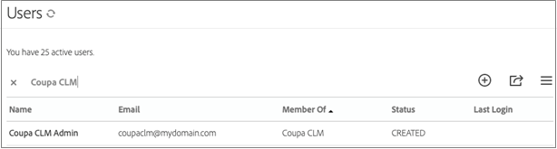

# [!DNL Coupa] Guía de instalación{#coupa-installation-guide}

[**Contactar con el servicio de soporte técnico de Adobe Sign**](https://adobe.com/go/adobesign-support-center_es)

## Información general {#overview}

En este documento se explica cómo configurar su cuenta de Adobe Sign para la integración [!DNL Coupa BSM Suite] para obtener firmas.

Requisitos previos:

* Suscripción a Adobe Sign Enterprise, [Adobe Sign Developer Edition](https://www.adobe.com/sign/developer-form.html), o [Versión de prueba de Adobe Sign Enterprise](https://www.adobe.com/sign/business.html)
* Acceso de administrador de Adobe Sign
* [!DNL Coupa BSM Suite] Instancia estándar o avanzada

Los pasos de alto nivel para completar la integración son:

* Configurar un grupo de Adobe Sign para su uso con [!DNL Coupa BSM Suite]
* Connect [!DNL Coupa BSM Suite] a Adobe Sign
* Cree un webhook de Adobe Sign para notificar a su [!DNL Coupa BSM Suite] instancia

## Configurar el grupo de Adobe Sign para [!DNL Coupa BSM Suite] {#configure-adobe-sign-for-coupa}

Tener un uso dedicado de Adobe Sign para [!DNL Coupa] dentro de una organización, los administradores deben crear un grupo de Adobe Sign específicamente para [!DNL Coupa BSM Suite] uso. Este grupo de Adobe Sign debe tener una única cuenta de usuario administrador de grupo que actúe como cuenta de servicio. Dado que esta cuenta de servicio se utiliza para todas las solicitudes de firma, debe mantenerse anónima, por ejemplo, `Legal@xyz.com`, `Purchasing@xyz.com`, o `CoupaCLM@xyz.com`, en lugar de personal, como `Bob.Smith@xyz.com`.

### Crear un grupo y un usuario en Adobe Sign {#create-sign-user-group}

Para crear un usuario en Adobe Sign:

1. Inicie sesión en Adobe Sign como administrador de la cuenta..
1. Vaya a **[!UICONTROL Cuenta]** > **[!UICONTROL Usuarios]**.
1. Para crear un nuevo usuario, haga clic en  icono.
1. En el cuadro de diálogo que se abre, proporcione los detalles del nuevo usuario:

   1. Proporcione un correo electrónico funcional al que pueda acceder.

      * Este usuario establece y mantiene la relación de OAuth.
      * La dirección de correo electrónico debe ser una dirección real para la verificación.
   1. Introduzca los valores adecuados para [!UICONTROL Nombre] y [!UICONTROL Apellidos].
   1. En la [!UICONTROL Grupo principal] , seleccione **[!UICONTROL Crear un nuevo grupo para este usuario]**.
   1. En la [!UICONTROL Nuevo nombre de grupo] , proporcione un nombre de grupo intuitivo como *[!DNL Coupa BSM Suite]*.

   

1. Seleccionar **[!UICONTROL Guardar]**.

   Una vez guardados los detalles, el [!UICONTROL Usuarios] muestra el nuevo usuario con una [!UICONTROL CREADO] estado.

   

   La [!UICONTROL CREADO] El estado indica que el usuario aún no ha verificado su dirección de correo electrónico.

1. Para verificar la dirección de correo electrónico:
   1. Inicie sesión en el correo electrónico del nuevo usuario.
   2. Busque el correo electrónico de bienvenida de Adobe Sign. Compruebe las carpetas de correo no deseado si es necesario.
   3. Haga clic donde pone **[!UICONTROL Haga clic aquí para establecer la contraseña]**.
   4. Establezca la contraseña..

   Una vez verificada la dirección de correo electrónico, el estado del usuario cambia de [!UICONTROL CREADO] para [!UICONTROL ACTIVO].

   

### Definir el usuario de autenticación {#define-authenticating-user}

Una vez que haya creado un grupo y un usuario en ese grupo, debe hacer del usuario un &quot;administrador de grupo&quot;.

Para ascender al nuevo usuario en la [!DNL Coupa BSM Suite] grupo:

1. Vaya a la [!UICONTROL Usuarios] (si aún no existe).
2. Haga doble clic en el usuario.

   Se abre un [!UICONTROL Editar] para los permisos de usuario.

3. En la sección Miembros del grupo, seleccione el **[!UICONTROL Administrador de grupo]** y **[!UICONTROL Puede enviar]** opciones.
4. Anule la selección **[!UICONTROL El usuario es administrador de cuentas]** y **[!UICONTROL El usuario puede firmar documentos]** opciones.
5. Haga clic en **[!UICONTROL Guardar]**.

   

## Configure el [!DNL Coupa BSM Suite] instancia {#configure-coupa}

Para completar la conexión entre [!DNL Coupa BSM Suite ] y Adobe Sign, debe establecerse una relación de confianza entre los servicios.

Para configurar el [!DNL Coupa BSM Suite]:

1. Conecta tus [!DNL Coupa BSM Suite] a su cuenta de servicio de Adobe Sign que haya creado anteriormente.
1. Cree una instancia de webhook de Adobe Sign para notificar a su instancia de Coupa BSM Suite las actualizaciones de los acuerdos.

Para obtener más información sobre cómo conectar el [!DNL Coupa BSM Suite] y cómo crear y registrar webhook, consulte [Documentación de soporte de instancia de Adobe Sign Coupa BSM Suite](https://success.coupa.com/Support/Docs/Power_Apps/CLM_Standard/Signing_and_Approvals/Enable_E-Signatures_Through_Adobe_Sign_and_DocuSign){target=&quot;_blank&quot;}.

## Crear [!DNL Webhook] en Adobe Sign {#create-webhook}

La integración Coupa CLM utiliza notificaciones webhook de Adobe Sign para enviar actualizaciones sobre el estado del acuerdo. Es fundamental completar la configuración del webhook; de lo contrario, los acuerdos enviados para firmar permanecen incompletos o los acuerdos firmados no se devuelven a Coupa CLM.

Para crear un webhook en Adobe Sign:

1. Inicie sesión en Adobe Sign con el usuario administrador de grupo creado anteriormente, por ejemplo `coupaclm@MyDomain.com`.

1. Vaya a **Grupos** > **Webhooks**.

   

1. Para crear una nueva conexión, seleccione la  icono.

1. En el cuadro de diálogo Crear que se abre, rellene los campos obligatorios.

   **Nota:** Necesita obtener la dirección URL del controlador webhook de Coupa.

   

1. Seleccione los parámetros de notificación necesarios.

1. Seleccionar **Guardar**.

## Soporte {#support}

### [!DNL Coupa BSM Suite] apoyo {#coupa-support}

[!DNL Coupa BSM Suite ] es el propietario de la integración y debe ser su primer punto de contacto para preguntas sobre el ámbito de la integración, solicitudes de funciones o problemas en el funcionamiento diario de la integración.

Para cualquier consulta, póngase en contacto con [Compatibilidad con Coupa](https://success.coupa.com/Support/Welcome_to_Coupa_Support){target=&quot;_blank&quot;}.

### Compatibilidad con Adobe Sign {#adobe-sign-support}

Adobe Sign es el socio de integración y se debe contactar con él si la integración no consigue obtener firmas o si falla la notificación de firmas pendientes.

Para obtener ayuda sobre el uso o la configuración de Adobe Sign, puede ponerse en contacto con su administrador de éxito de clientes (CSM) o ponerse en contacto con [Compatibilidad con Adobe Sign](https://adobe.com/go/adobesign-support-center).

Los administradores de Adobe Sign también pueden abrir tickets y obtener asistencia a través de la ayuda (?) en la parte superior derecha del portal de Adobe Sign.

