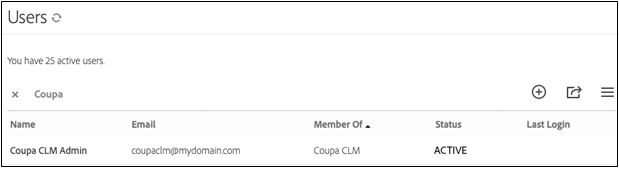

# [!DNL Coupa] Guía de instalación{#coupa-installation-guide}

[**Contactar con el servicio de soporte técnico de Adobe Sign**](https://adobe.com/go/adobesign-support-center_es)

## Información general {#overview}

Este documento explica cómo configurar su cuenta de Adobe Sign para integrar la instancia [!DNL Coupa BSM Suite] para obtener firmas.

Requisitos previos:

* Suscripción a Adobe Sign Enterprise, [Adobe Sign Developer Edition](https://www.adobe.com/sign/developer-form.html) o [Adobe Sign Enterprise Trial](https://www.adobe.com/sign/business.html)
* Acceso de administrador de Adobe Sign
* [!DNL Coupa BSM Suite] Instancia estándar o avanzada

Los pasos de alto nivel para completar la integración son:

* Configurar un grupo de Adobe Sign para utilizarlo con [!DNL Coupa BSM Suite]
* Conectar [!DNL Coupa BSM Suite] a Adobe Sign
* Crear un webhook de Adobe Sign para notificar su instancia [!DNL Coupa BSM Suite]

## Configurar Adobe Sign Group para [!DNL Coupa BSM Suite] {#configure-adobe-sign-for-coupa}

Para tener un uso dedicado de Adobe Sign para [!DNL Coupa] dentro de una organización, los administradores deben crear un grupo de Adobe Sign específicamente para [!DNL Coupa BSM Suite] uso. Este grupo de Adobe Sign debe tener una única cuenta de usuario de administrador de grupo que actúe como cuenta de servicio. Dado que esta cuenta de servicio se utiliza para todas las solicitudes de firma, debe mantenerse anónima, por ejemplo, `Legal@xyz.com`, `Purchasing@xyz.com` o `CoupaCLM@xyz.com`, en lugar de personal, como `Bob.Smith@xyz.com`.

### Crear un grupo y un usuario en Adobe Sign {#create-sign-user-group}

Para crear un usuario en Adobe Sign:

1. Inicie sesión en Adobe Sign como administrador de la cuenta..
1. Vaya a **[!UICONTROL Cuenta]** > **[!UICONTROL Usuarios]**.
1. Para crear un nuevo usuario, haga clic en el icono .
1. En el cuadro de diálogo que se abre, proporcione los detalles del nuevo usuario:

   1. Proporcione un correo electrónico funcional al que pueda acceder.

      * Este usuario establece y mantiene la relación OAuth.
      * La dirección de correo electrónico debe ser una dirección real para la verificación.
   1. Introduzca los valores adecuados para [!UICONTROL Nombre] y [!UICONTROL Apellidos].
   1. En el campo [!UICONTROL Grupo principal], seleccione **[!UICONTROL Crear un nuevo grupo para este usuario]**.
   1. En el campo [!UICONTROL Nuevo nombre de grupo], proporcione un nombre de grupo intuitivo como *[!DNL Coupa BSM Suite]*.

   

1. Seleccione **[!UICONTROL Guardar]**.

   Una vez guardados los detalles, la página [!UICONTROL Usuarios] muestra al nuevo usuario con el estado [!UICONTROL CREADO].

   

   El estado [!UICONTROL CREADO] indica que el usuario aún no ha verificado su dirección de correo electrónico.

1. Para verificar la dirección de correo electrónico:
   1. Inicie sesión en el correo electrónico del nuevo usuario.
   2. Busque el correo electrónico &quot;Bienvenido a Adobe Sign&quot;. Si es necesario, compruebe las carpetas de correo no deseado.
   3. Haga clic donde pone **[!UICONTROL Haga clic aquí para establecer la contraseña]**.
   4. Establezca la contraseña..

   Una vez que verifique la dirección de correo electrónico, el estado del usuario cambia de [!UICONTROL CREADO] a [!UICONTROL ACTIVO].

   

### Definir el usuario de autenticación {#define-authenticating-user}

Una vez que haya creado un grupo y un usuario en ese grupo, deberá convertir al usuario en &quot;administrador de grupo&quot;.

Para promocionar al nuevo usuario en el grupo [!DNL Coupa BSM Suite]:

1. Vaya a la página [!UICONTROL Usuarios] (si aún no está allí).
2. Haga doble clic en el usuario.

   Se abre una página [!UICONTROL Editar] para los permisos de usuario.

3. En la sección Pertenencia al grupo, seleccione las opciones **[!UICONTROL Administrador del grupo]** y **[!UICONTROL Puede enviar]**.
4. Anule la selección de las opciones **[!UICONTROL El usuario es un administrador de cuenta]** y **[!UICONTROL El usuario puede firmar documentos]**.
5. Haga clic en **[!UICONTROL Guardar]**.

   

## Configurar la instancia [!DNL Coupa BSM Suite] {#configure-coupa}

Para completar la conexión entre la instancia [!DNL Coupa BSM Suite ] y Adobe Sign, debe establecerse una relación de confianza entre los servicios.

Para configurar el [!DNL Coupa BSM Suite]:

1. Conecte la instancia [!DNL Coupa BSM Suite] a la cuenta de servicio de Adobe Sign que haya creado anteriormente.
1. Cree una instancia de webhook de Adobe Sign para notificar a la instancia de Coupa BSM Suite acerca de las actualizaciones de los acuerdos.

Para obtener más información sobre cómo conectar [!DNL Coupa BSM Suite] y cómo crear y registrar webhook, consulte [Documentación de soporte de instancia de Adobe Sign Coupa BSM Suite](https://success.coupa.com/Support/Docs/Power_Apps/CLM_Standard/Signing_and_Approvals/Enable_E-Signatures_Through_Adobe_Sign_and_DocuSign){target=&quot;_blank&quot;}.

## Crear [!DNL Webhook] en Adobe Sign {#create-webhook}

La integración de Coupa CLM utiliza las notificaciones webhook de Adobe Sign para enviar actualizaciones sobre el estado del acuerdo. Es fundamental completar la configuración del webhook. De lo contrario, los acuerdos enviados para firmar permanecerán incompletos o los acuerdos firmados no se enviarán de nuevo a Coupa CLM.

Para crear webhook en Adobe Sign:

1. Inicie sesión en Adobe Sign utilizando el usuario administrador de grupo creado anteriormente, por ejemplo `coupaclm@MyDomain.com`.

1. Vaya a **Grupos** > **Webhooks**.

   

1. Para crear una nueva conexión, seleccione el icono .

1. En el cuadro de diálogo Crear que se abre, rellene los campos necesarios.

   **Nota:** Debe obtener la URL del controlador webhook de Coupa.

   

1. Seleccione los parámetros de notificación requeridos.

1. Seleccione **Guardar**.

## Soporte {#support}

### [!DNL Coupa BSM Suite] soporte {#coupa-support}

[!DNL Coupa BSM Suite ] es el propietario de la integración y debe ser su primer punto de contacto para preguntas sobre el alcance de la integración, solicitudes de funciones o problemas en el funcionamiento diario de la integración.

Para cualquier consulta, póngase en contacto con [Soporte de Coupa](https://success.coupa.com/Support/Welcome_to_Coupa_Support){target=&quot;_blank&quot;}.

### Asistencia técnica de Adobe Sign {#adobe-sign-support}

Adobe Sign es el socio de integración y debe ponerse en contacto con él si la integración no consigue las firmas o si falla la notificación de las firmas pendientes.

Para obtener ayuda sobre el uso o la configuración de Adobe Sign, puede ponerse en contacto con el administrador de éxito del cliente (CSM) o ponerse en contacto con [Asistencia técnica de Adobe Sign](https://adobe.com/go/adobesign-support-center).

Los administradores de Adobe Sign también pueden abrir entradas y obtener asistencia técnica a través de la Ayuda (?) en la parte superior derecha del portal de Adobe Sign.

