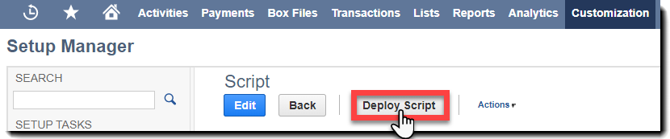
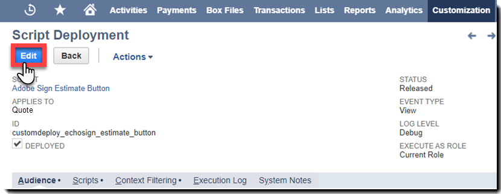

# [!DNL NetSuite] Guía de instalación y personalización (v4.0.4) {#install-customize-NetSuite}

## Información general {#overview}

Adobe Sign para [!DNL NetSuite] proporciona una integración completa de firma electrónica con [!DNL NetSuite]. Puede utilizar Adobe Sign para la integración [!DNL NetSuite] para enviar acuerdos como contratos, presupuestos y otros documentos, que requieren firmas electrónicas, a los destinatarios directamente desde [!DNL NetSuite]. Puede crear y enviar acuerdos de Adobe Sign desde registros de clientes, clientes potenciales, presupuestos y otros [!DNL NetSuite]. Adobe Sign actualiza [!DNL NetSuite] con el estado de los acuerdos y almacena los acuerdos con los [!DNL NetSuite] registros asociados una vez que se han ejecutado por completo. Puede ver el historial de todos los acuerdos enviados desde [!DNL NetSuite] dentro del producto.

Para obtener más información, consulte [Adobe Sign para [!DNL NetSuite] notas de la versión](https://experienceleague.adobe.com/docs/sign-integrations/using/netsuite/release-notes.html?lang=en).

## Instalar el paquete y configurar OAuth {#install}

Solo un administrador de [!DNL NetSuite] puede instalar o actualizar el paquete. Para configurar OAuth, el [!DNL NetSuite] administrador debe tener acceso de administrador a Adobe Sign. Antes de instalar el paquete en su cuenta de producción, debe instalar y probar el paquete en una cuenta de [!DNL NetSuite] Sandbox.

Consulte [Crear un acuerdo de Adobe Sign](#createagreement) para obtener más información sobre las pruebas.

>[!CAUTION]
>
>Los clientes que actualicen a la versión 4.0.4 NO deben eliminar su clave de API existente.
>
>Consulte [Configuración de preferencias personalizadas](#configure) para obtener más información sobre cómo se utiliza la clave API.

### Instalar el paquete por primera vez

1. Vaya a [!UICONTROL **Personalización > SuiteBundler > Buscar e instalar paquetes**].

1. En la página *Buscar e instalar paquetes*, introduzca **Adobe Sign** como palabra clave y seleccione **[!UICONTROL Buscar]**.

1. Seleccione el **nombre del paquete de Adobe Sign**.

   

1. En la página *[!UICONTROL Detalles del paquete]*, seleccione **[!UICONTROL Instalar]**.
1. En la página *[!UICONTROL Instalación del paquete de previsualización]*, seleccione **[!UICONTROL Instalar paquete]**.

   (No es necesario cambiar ninguno de los valores predeterminados de la página)

   

1. En el cuadro de diálogo Instalar que aparece, seleccione **[!UICONTROL Aceptar]** para continuar.

   Durante el proceso de instalación, el estado del paquete se muestra como *[!UICONTROL Pendiente]*.

   

1. Para mostrar un estado actualizado, seleccione **[!UICONTROL Actualizar]**.

   Una vez finalizada la instalación del paquete, *Adobe Sign para[!DNL NetSuite]* se muestra en la página *[!UICONTROL Paquetes instalados]*.

   

1. Si ya es una cuenta de cliente de Adobe Sign, siga los pasos para [Configurar OAuth después de instalar o actualizar](#oauth).

   Si no tiene una cuenta de Adobe Sign, puede [registrarse para obtener una versión de prueba de empresa](https://esign.adobe.com/adobe-sign-[!DNL NetSuite]-trial-registration.html) para probar el sistema. Siga los pasos de registro en línea para habilitar su cuenta de Adobe Sign.

## Configurar OAuth después de instalar o actualizar {#oauth}

Adobe Sign utiliza OAuth 2.0 para autenticar su cuenta de Adobe Sign en [!DNL NetSuite].

Este protocolo autoriza al paquete instalado [!DNL NetSuite] para comunicarse con Adobe Sign sin solicitar la contraseña. Como la información confidencial no se comparte directamente entre aplicaciones, la cuenta estará menos expuesta a riesgos.

Esta autenticación no afecta a su implementación, pero debe realizar una configuración de una sola vez después de instalar o actualizar el paquete en su cuenta de Producción o Sandbox.

El [!DNL NetSuite] administrador que configura OAuth también debe tener acceso de administrador de nivel de cuenta a Adobe Sign.

1. En [!DNL NetSuite], vaya a la página de lista *Adobe Sign Config*.

1. Busque **[!UICONTROL Adobe Sign Config]** (un tipo de registro personalizado) mediante el campo Buscar del encabezado.

1. En la página Resultados de búsqueda, seleccione **Ver** para el registro *Configuración de Adobe Sign*.

   .

1. En la página Adobe Sign Config List, seleccione **[!UICONTROL View]** para el *Using OAuth to Access Adobe Sign APIs* record.

   

1. En la página Adobe Sign Config, seleccione **[!UICONTROL Iniciar sesión con Adobe Sign]**

   

1. En la página de inicio de sesión de Adobe Sign que aparece, introduzca sus credenciales y seleccione **[!UICONTROL Iniciar sesión]**.

   

1. En la página Confirmar acceso (para OAuth) que se muestra, seleccione **[!UICONTROL Permitir acceso]**

   

1. Cuando se haya completado la autorización, se le redirigirá a la página Adobe Sign Config en [!DNL NetSuite], como se muestra a continuación.

   

   >[!NOTE]
   >
   >Al configurar OAuth en su cuenta de Sandbox, es posible que encuentre el error &quot;No se pudo determinar el Id. de composición del cliente&quot; cuando se completa la autorización.
   >
   >
   >Para continuar, debe cambiar la parte del dominio de cuenta de la URL (sistema).[!DNL NetSuite].com) en el navegador para volver al  [!DNL NetSuite] espacio aislado como se indica a continuación:
   >
   >
   >Cambiar:
   >
   >
   >sistema.[!DNL NetSuite].com/app/site/hosting/scriptlet.nl?script=745&amp;deploy=1&amp;web_access_point=https://echosign.com
   >
   >
   >Para:
   >
   >
   >sistema.**zona de pruebas.**[!DNL NetSuite].com/app/site/hosting/scriptlet.nl?script=745&amp;deploy=1&amp;web_access_point=https://echosign.com

## Actualizar el paquete (usuarios existentes)

[!DNL NetSuite] Adobe publica regularmente actualizaciones de paquetes. Los usuarios existentes del Adobe Sign para la integración [!DNL NetSuite] pueden actualizar al último paquete.

>[!CAUTION]
>
>Los clientes que actualicen a una versión más reciente NO deben eliminar su clave de API existente.
>
>Consulte [Configuración de preferencias personalizadas](#configure) para obtener más información sobre cómo se utiliza la clave API.

### Requisitos previos {#prerequisites}

El tiempo necesario para actualizar al paquete v4.0.4 depende del número de acuerdos que actualmente tienen el estado &quot;Enviado para firmar&quot;. Normalmente, la actualización de 100 acuerdos tarda entre 7 y 10 minutos. Anote el número de registros que estimará el tiempo de actualización.

Para determinar el número de acuerdos enviados para firmar:

1. Vaya a **[!UICONTROL Personalización > Listas, Registros y Archivos > Tipos de registro]** y, a continuación, localice *Acuerdo de Adobe Sign.*

   O busque Acuerdos de Adobe Sign en la barra de búsqueda.

1. Para el registro [!UICONTROL Acuerdos de Adobe Sign], seleccione **[!UICONTROL Buscar]**.

   

1. En la lista desplegable **[!UICONTROL Estado]**, seleccione **[!UICONTROL Enviado para firmar]** y, a continuación, seleccione **[!UICONTROL Enviar]**.

   

   Anote el número de registros que estimará el tiempo de actualización.

   

### Actualizar el paquete {#updating-the-bundle}

1. Vaya a **[!UICONTROL Personalización > SuiteBundler > Buscar e instalar > Lista]** y localice su paquete actual, como se muestra a continuación.

   >[!NOTE]
   >
   >Si hay una nueva versión del paquete, aparece un icono de signo de exclamación a la derecha del número *Version* del paquete actual.

1. En el menú desplegable Acción, seleccione **[!UICONTROL Actualizar]**.

   

1. En la página Actualización del paquete de previsualización, seleccione **[!UICONTROL Actualizar paquete]** sin cambiar ninguno de los valores predeterminados que se muestran en la página.

   Durante la instalación, el estado del paquete se muestra como *Pendiente*.

    del paquete.

   >[!NOTE]
   >
   >Al actualizar el paquete, puede que aparezca un mensaje de advertencia como se muestra a continuación. Si no ha personalizado sus [!DNL NetSuite] registros de firma electrónica, puede continuar. Si no está seguro, se recomienda instalar el paquete en una cuenta de Sandbox para probarlo primero antes de actualizar el paquete en una cuenta de producción.

   

1. Para mostrar un estado actualizado, seleccione **[!UICONTROL Actualizar]**.

   

   >[!NOTE]
   >
   >Si la actualización tarda mucho tiempo debido a varios acuerdos con un estado *Enviado para firmar*, puede comprobar la subficha **[!UICONTROL Registro de ejecución]** del script *Instalación del paquete de Adobe Sign* para determinar el progreso de la actualización. Consulte [Determinación del progreso de la actualización](#determineprogress) para obtener más información.

   Una vez completada la actualización del paquete, *Adobe Sign para[!DNL NetSuite]* se muestra en la página *Paquetes instalados*.

   

## Configurar el paquete {#configure}

### Configuración de preferencias personalizadas  {#set-custom-preferences}

Puede utilizar las preferencias personalizadas para especificar cómo se crean y almacenan los acuerdos en [!DNL NetSuite]. Además, la preferencia *Aprovisionamiento automático de usuario en Adobe Sign* le permite especificar si los usuarios [!DNL NetSuite] se aprovisionan automáticamente en los servicios de Sign al enviar acuerdos desde [!DNL NetSuite].

1. Vaya a **[!UICONTROL Configuración > Empresa > Preferencias generales]**.
1. Desplácese hacia abajo por la página y, a continuación, seleccione la subficha **[!UICONTROL Preferencias personalizadas]**.

   

1. Habilite y configure sus preferencias de Adobe Sign según sea necesario:

   * **Introduzca la clave API de EchoSign para su cuenta**: No añada ni edite ningún valor en este campo.
   * **Usar contacto de registro principal como firmante**: Si está activada, el contacto del registro principal se establece de forma predeterminada como primer firmante cuando se crean los acuerdos. El remitente puede eliminar o editar fácilmente al firmante predeterminado o añadir firmantes adicionales al acuerdo antes de enviarlo.
   * **Usar Trans. Póngase en contacto como firmante si está presente**: Esta preferencia solo es válida si la preferencia *Usar contacto de registro principal como firmante* también está habilitada. Si esta opción está habilitada, al generar un acuerdo a partir de un registro de transacciones (por ejemplo, Presupuesto), el contacto de transacción principal se establece de forma predeterminada como primer firmante. Consulte [Registros de transacciones](#transrecords) para obtener más información. Si no hay ningún contacto de transacción principal o si se envía desde [!DNL NetSuite] registro de objeto (por ejemplo, registro de cliente, registro de socio), el destinatario predeterminado es el contacto principal del correo electrónico del cliente. El remitente puede eliminar o editar fácilmente al firmante predeterminado o añadir firmantes adicionales al acuerdo antes de enviarlo.
   * **Permitir marcar destinatarios como aprobadores**: Si está activada, los remitentes pueden marcar a los destinatarios como aprobadores. Los destinatarios marcados como aprobadores pueden revisar y aprobar acuerdos, pero no es necesario que los firmen. Es posible que los aprobadores deban introducir datos en los campos durante el proceso de aprobación.
   * **Id** De Carpeta De Acuerdo Preferido: Se utiliza para especificar la carpeta en la que se almacenan los acuerdos firmados finales. Si no establece un valor para este campo, los acuerdos firmados finales se guardan en la misma carpeta que el archivo del documento original de forma predeterminada. El ID de carpeta debe ser un número.
   * **PDF** de transacciones de adición automática: Si está activada, los PDF de transacciones se adjuntan automáticamente a los acuerdos cuando se crean nuevos acuerdos a partir de registros de transacciones.
   * **Añadir PDF firmado como (archivo adjunto o vínculo)**: Si se selecciona  ** Lista en el menú desplegable, el PDF firmado se añade automáticamente como vínculo al archivo. Si *Datos adjuntos* está seleccionado en la lista desplegable, el PDF firmado se almacena en [!DNL NetSuite] como datos adjuntos en el registro del acuerdo.
   * **Incluir PDF de seguimiento de auditoría con acuerdo**: Si está activada, los PDF de seguimiento de auditoría se adjuntan automáticamente a los registros del acuerdo una vez que se han firmado los acuerdos.
   * **Método de verificación de identidad aplicable**: La activación de cualquiera de los métodos de verificación de la identidad dicta a quién se aplica el método de verificación de identificación. Las opciones son *Todos los firmantes, Solo firmantes externos* o *Solo firmantes internos*.

   **Métodos de verificación de la identidad** {#identity-verification-methods}

   Los métodos de verificación de identidad activados se pueden seleccionar al crear un acuerdo. Si hay más de un método de verificación de identidad activado aquí, la página del acuerdo de Adobe Sign muestra una opción **[!UICONTROL Verificar identidad del firmante]**.

   * **Habilitar contraseña necesaria para firmar**: Solicite a los firmantes que introduzcan una contraseña de un solo uso que especifique.

   * **Habilitar autenticación** basada en conocimientos: Solicite a los firmantes que proporcionen su nombre, dirección y, opcionalmente, los últimos cuatro dígitos de su SSN y, a continuación, respondan a una lista de preguntas que verifiquen la información que han proporcionado. Disponible solo en Estados Unidos.

   * **Habilitar autenticación** de identidad web: Solicite a los firmantes que verifiquen su identidad iniciando sesión en uno de los siguientes sitios: Facebook, Google, LinkedIn, Microsoft Live, Twitter o Yahoo!.

   * **Aprovisionamiento automático de usuarios en Adobe Sign**: Si está activada, los usuarios que envíen acuerdos  [!DNL NetSuite] se aprovisionan automáticamente con una cuenta de usuario de Adobe Sign.

1. Seleccione **[!UICONTROL Guardar]** para guardar sus preferencias.

## Configurar actualizaciones de estado automáticas {#asu}

El paquete de integración de Adobe Sign le permite recibir automáticamente actualizaciones en [!DNL NetSuite] relativas al estado de los acuerdos que se han enviado desde [!DNL NetSuite]. Cuando esta función está activada, [!DNL NetSuite] siempre refleja el estado de sus acuerdos. Puede activar las actualizaciones de estado automáticas de la siguiente manera:

1. Vaya a **[!UICONTROL Configuración > Empresa > Habilitar características].**
1. Seleccione la subficha **[!UICONTROL SuiteCloud]**.
1. Active las siguientes opciones:

   * En la sección SuiteBuilder, active la opción **[!UICONTROL Registros personalizados]**.

   * En la sección SuiteScript, habilite las opciones **[!UICONTROL Client SuiteScript]** y **[!UICONTROL Server SuiteScript]** y acepte los términos de servicio para ambos.

1. Seleccione **[!UICONTROL Guardar]**.

   Las opciones se definen como se muestra en la imagen.

   

## Objetos y tipos de registro {#objects}

El paquete de integración de Adobe Sign ya muestra el objeto Acuerdo de Adobe Sign con muchos objetos [!DNL NetSuite] estándar, entre ellos: Registros de cliente, estimación, posible cliente, oportunidad y socio. También puede utilizar el paquete de Adobe Sign con otros tipos de registros, incluidos los personalizados.

La ficha Acuerdo puede aparecer con dos tipos de [!DNL NetSuite] registros: Registros de entidades y transacciones. Suponemos que un registro de transacción es un registro (como un presupuesto) que se puede convertir en un documento de PDF; mientras que un registro de entidad no se puede convertir en un PDF.

## Registros de transacciones {#transrecords}

Si el acuerdo se crea a partir de un registro de transacción, el primer documento del registro del acuerdo es la versión PDF del registro del que procede y el primer destinatario es la dirección de correo electrónico del registro. Si no desea que el primer documento sea una versión PDF del registro del que procede, vaya a **[!UICONTROL Configuración > Empresa > Preferencias generales > Subficha Preferencias personalizadas]** y desactive la opción **[!UICONTROL Adjuntar automáticamente PDF de transacciones]**. Consulte [Configuración de preferencias personalizadas](#configure) para obtener más información.

En Preferencias personalizadas, también puede habilitar la **[!UICONTROL Usar trans. Póngase en contacto como preferencia Primer firmante]** si desea que el contacto principal de la transacción se agregue automáticamente como primer firmante. Cuando se asocia a un registro de transacción, muestra los botones **[!UICONTROL Acuerdos]** y **[!UICONTROL Send for Signature]**.

## Registros de entidades {#entity-records}

Si el acuerdo se crea a partir de un registro de entidad, el primer destinatario es la dirección de correo electrónico del registro. Cuando se asocia a un registro de entidad, solo se muestra la ficha Acuerdos.

## Personalizar el paquete {#customize}

La personalización del paquete incluye lo siguiente:

* Implementar las secuencias de comandos para la subficha Acuerdos y el botón Send for Signature para los tipos de registro adecuados.
* Configuración de permisos de función para los tipos de registro de Adobe Sign.
* Modificar permisos para conceder acceso a la subficha *Acuerdos* y al botón *Send for Signature*.

### Configurar acuerdos de Adobe Sign para tipos de registro adicionales  {#configuring-adobe-sign-agreements-for-additional-record-types}

Para implementar la subficha *Acuerdos* y el botón *Send for Signature* para los tipos de registro apropiados:

1. Vaya a **[!UICONTROL Personalización > Scripts > Scripts].**

1. En la página de lista *Scripts* que aparece, localice el script que debe implementar y, a continuación, seleccione ****[!UICONTROL View]****.

   * Para agregar el botón *Send for Signature*, seleccione el script **[!UICONTROL Adobe Sign Estimate Button]**.

   * Para agregar la ficha *Acuerdos*, seleccione **[!UICONTROL Adobe Sign Agreement Loader]** script.

1. En la página Script, seleccione **[!UICONTROL Implementar script]**.

   

1. En la página Implementación de script, haga lo siguiente:

   * En la lista *Se aplica a*, seleccione el tipo de registro.
   * Opcionalmente, introduzca el ID de implementación de script.

      Consulte el tema *Creación de un ID de implementación de script personalizado* en el Centro de ayuda [!DNL NetSuite] para obtener más información. Si no introduce un ID, se genera uno.

   * Marque la casilla **[!UICONTROL Implementado]**.

   

   * Establezca *Estado* en **[!UICONTROL Liberado]**.

      No debe especificar un *tipo de evento* o *nivel de registro*.

   * En el menú desplegable [!UICONTROL *Ejecutar como función]*, seleccione **[!UICONTROL Ejecutar como administrador]**.

   * Con la subficha **[!UICONTROL Audiencia]** activa (de forma predeterminada), seleccione las funciones o usuarios específicos a los que desea conceder acceso. Si desea conceder acceso a todos los roles y usuarios, habilite las opciones correspondientes **[!UICONTROL Seleccionar todas]**.

   * Seleccione **[!UICONTROL Guardar]**. Cuando se muestre la confirmación del cambio, seleccione **[!UICONTROL Volver]**.

1. seleccione **[!UICONTROL List]** en la parte superior de la página Implementación de script para volver a la página de lista *Scripts*.
1. Repita los pasos 2 y 3 anteriores para el otro script.

## Configuración de permisos de función para tipos de registros de Adobe Sign {#setting-role-permissions-for-adobe-sign-record-types}

La mayoría de las funciones [!DNL NetSuite] deben tener permiso para usar Adobe Sign sin personalización adicional. Sin embargo, puede conceder permisos para cualquier función personalizada adicional que se haya creado.

1. Vaya a **[!UICONTROL Personalización > Listas, registros y archivos > Tipos de registros]**.

   

   >[!NOTE]
   >
   >Si no ve el elemento *Tipos de registro*, vaya a **[!UICONTROL Configuración > Empresa > Habilitar características > ficha Suite Cloud]** y active la opción *Registros personalizados*.

1. En la página *Tipos de registro*, seleccione **[!UICONTROL Adobe Sign Agreement]** para seleccionarlo

   

1. En la página *Tipo de registro personalizado*, seleccione **[!UICONTROL Usar lista de permisos]** en la lista desplegable *Tipo de acceso*.

   

   >[!NOTE]
   >
   >El tipo de registro *Adobe Sign Agreement* es el único tipo de registro de Adobe Sign que requería el tipo de acceso *Use Permission List*.
   >
   >
   >Consulte el paso 6 para obtener instrucciones sobre la configuración del tipo de acceso para los otros tipos de registro de Adobe Sign.

1. Seleccione la subficha **[!UICONTROL Permisos]**.

   Se muestra la lista de funciones y permisos.

   

1. Establezca los permisos siguientes para las funciones personalizadas adicionales agregadas al tipo de registro &quot;[!UICONTROL Adobe Sign Agreement]&quot;.

   >[!NOTE]
   >
   >Consulte *[Configuración de una lista de permisos para un tipo de registro personalizado](https://system.[!DNL NetSuite].com/app/help/helpcenter.nl?fid=section_N2879931.html)* tema en el Centro de  [!DNL NetSuite] ayuda para obtener más información

   1. Seleccione la función en la lista *Función*.
   1. Establezca *Nivel* en **[!UICONTROL Completo]**.
   1. Establezca *Formulario predeterminado* en **[!UICONTROL Formulario de acuerdo personalizado de EchoSign]**.
   1. Seleccione la casilla de verificación **[!UICONTROL Restringir formulario]**.
   1. Seleccione **[!UICONTROL Agregar]** para guardar los cambios para la fila de roles.

   

   La nueva fila se muestra como se muestra a continuación:

   

   Repita los pasos a a e anteriores para todas las funciones personalizadas adicionales.

   * seleccione **[!UICONTROL Guardar]** en la página *Tipo de registro personalizado* cuando se hayan establecido permisos para todas las funciones.
   Se vuelve a mostrar la página *[!UICONTROL Tipo de registro de cliente]*.

1. Repita los pasos 1 a 3 anteriores para establecer el *Tipo de acceso* para todos los demás tipos de registros de Adobe Sign en

   **[!UICONTROL No Se Requiere] Permiso.** Esto se aplica a los siguientes tipos de registro:

   * Adobe Sign Config
   * Documento de Adobe Sign
   * Adobe Sign Event
   * Idioma de Adobe Sign
   * Errores de Adobe Sign Script
   * Acuerdo firmado por Adobe Sign
   * Adobe Sign Signer

### Conceder acceso a la ficha Acuerdo y al botón Send for Signature  {#granting-access-to-the-agreement-tab-and-send-for-signature-button}

El paquete de integración de Adobe Sign ya muestra el objeto Acuerdo de Adobe Sign con muchos objetos [!DNL NetSuite] estándar (Cliente, Estimación [Presupuesto], Candidato, etc.). La subficha *Acuerdo* se activa automáticamente para los siguientes tipos de objetos: Cliente, Candidato, Oportunidad, Asociado de Negocios, Prospecto, Presupuesto y Factura de Proveedor.

El botón *[!UICONTROL Send for Signature]* se activa automáticamente **o[!UICONTROL solo para el objeto Presupuesto]**.

[!DNL NetSuite] los administradores pueden ampliar la capacidad de crear acuerdos a otros objetos de CRM modificando los permisos para agregar la subficha  ** Acuerdo, el botón  *Enviar para* firmar o ambos a esos objetos.

#### Modificación de permisos para conceder acceso al botón Send for Signature  {#modifying-permissions-to-grant-access-to-the-send-for-signature-button}

1. Vaya a **[!UICONTROL Personalización > Scripts > Scripts]**.

   Se muestra la página de lista *Scripts*.

   * Si es necesario, utilice los filtros para localizar los scripts de Adobe Sign

1. En la página *Scripts*, busque el script *Adobe Sign Estimate Button* (controla el botón *Send for Signature*) y, a continuación, seleccione **View**.

   

1. En la página *Script*, haga lo siguiente:

   * seleccione la subficha **[!UICONTROL Implementaciones]**

   * En &quot;*Se aplica a*&quot;, seleccione el vínculo de la entidad que desea modificar.

      * **** Cita este ejemplo

   

   * seleccione el botón **[!UICONTROL Editar]** en la página *Implementación de script*

   

   * Con la subficha **[!UICONTROL Audiencia]** activa, seleccione las funciones o usuarios específicos a los que desea conceder acceso.

      * Si desea conceder acceso a todos los roles y usuarios, habilite las opciones correspondientes **[!UICONTROL Seleccionar todas]**
   * seleccionar **[!UICONTROL Guardar]**

   

#### Modificación de permisos para conceder acceso a la ficha Acuerdos  {#modifying-permissions-to-grant-access-to-the-agreements-tab}

1. Vaya a **[!UICONTROL Personalización > Scripts > Scripts]**.
1. En la página [!UICONTROL Scripts], localice el script *[!UICONTROL Adobe Sign Agreement Loader]* (controla la *ficha Acuerdos*) y, a continuación, seleccione **[!UICONTROL View]**.
1. En la página *Script*, haga lo siguiente:

   1. Seleccione la subficha **[!UICONTROL Implementaciones]**
   1. En &quot;*[!UICONTROL Se aplica a]*&quot;, seleccione el vínculo de la entidad para la que desea modificar el acceso.
   1. En la página *[!UICONTROL Implementación de script]*, seleccione el botón **[!UICONTROL Editar]**
   1. Con la subficha **[!UICONTROL Audiencia]** activa (está activa de forma predeterminada), seleccione las funciones o usuarios específicos a los que desea conceder acceso. Si desea conceder acceso a todos los roles y usuarios, habilite las opciones correspondientes **[!UICONTROL Seleccionar todas]**
   1. seleccionar **[!UICONTROL Guardar]**

## Uso del paquete Adobe Sign para [!DNL NetSuite]

Para enviar acuerdos desde [!DNL NetSuite] y recibir actualizaciones de dichos acuerdos, los usuarios deben tener el mismo ID de inicio de sesión (dirección de correo electrónico) en [!DNL NetSuite] y en Adobe Sign.

### Creación de un acuerdo de Adobe Sign

Después de instalar un nuevo paquete en una cuenta de Sandbox o Production, debe probar el paquete creando un nuevo acuerdo. Puede crear acuerdos de Adobe Sign a partir de un registro de entidad, de un registro de transacción o como un acuerdo independiente.

>[!NOTE]
>
>El proceso para crear un acuerdo varía ligeramente en función de cómo se cree. El proceso general implica especificar las opciones del acuerdo, agregar uno o más documentos del acuerdo y especificar los destinatarios. El proceso que se describe a continuación presupone que está creando el acuerdo desde un registro de cliente.

1. Seleccione o cree un registro de cliente desde el que desee enviar un acuerdo, o bien puede seleccionar otro tipo de registro [!DNL NetSuite] que tenga activada la ficha Acuerdos.

1. En el registro, seleccione la subficha **[!UICONTROL Acuerdos]**.
1. Seleccione **[!UICONTROL Nuevo acuerdo]**.

   

1. En la página *[!UICONTROL Adobe Sign Agreement]*, seleccione **[!UICONTROL Edit]**.

   

1. Especifique las opciones del acuerdo de la siguiente manera:

   * **Nombre**  del acuerdo: Introduzca un nombre para el acuerdo.
   * **Mensaje**: introduzca un mensaje personalizado para el destinatario.
   * **Tipo**  de firma: Seleccione el tipo de firma aceptada para el documento. Las opciones son *Firma electrónica* y *Firma por fax*.

   * **También debo firmar este acuerdo** : Active esta opción para indicar que el remitente también debe firmar el acuerdo.
   * **Orden** de firma: si la opción  *También debo firmar este* acuerdo está activada, seleccione el orden en el que el remitente y los destinatarios deben firmar. Las opciones son &quot;Yo firmo, luego los destinatarios firman&quot;, &quot;Los destinatarios firman, luego yo firmo&quot; y &quot;Ninguno&quot;.

   * **Vista previa de firmas de documento o posición (o campos de formulario)** : Active esta opción para permitir que los remitentes obtengan una vista previa del acuerdo y que puedan agregar campos (arrastrar y soltar firma, campos iniciales y otros campos de formulario) al acuerdo antes de enviarlo a los destinatarios.
   * **Verificar identidad**  del firmante: Active esta opción y, a continuación, seleccione una de las siguientes opciones de verificación de identidad

      * Esta opción solo se muestra cuando más de uno de los tres métodos de verificación de la identidad del firmante que se indican a continuación está activado en Preferencias personalizadas. (Consulte [Configuración de preferencias personalizadas](#customize) para obtener más información). Si solo está activada una preferencia, la opción **[!UICONTROL Verificar identidad del firmante]** no se muestra.

   **Métodos de verificación de la identidad**

   * **Contraseña necesaria para firmar** : Solicite a los firmantes que introduzcan una contraseña de un solo uso que especifique.
   * **Autenticación**  basada en conocimientos: Solicite a los firmantes que proporcionen su nombre, dirección y, opcionalmente, los últimos cuatro dígitos de su SSN y, a continuación, respondan a una lista de preguntas que verifiquen la información que han proporcionado. Disponible solo en Estados Unidos.
   * **Autenticación**  de identidad web: Solicite a los firmantes que verifiquen su identidad iniciando sesión en uno de los siguientes sitios: Facebook, Google, LinkedIn, Twitter, Yahoo! o Microsoft Live.
   * **Contraseña Necesaria Para Ver El PDF** : Active esta opción para que un destinatario escriba una contraseña antes de abrir un PDF del acuerdo o del acuerdo firmado. El archivo de PDF que se envía a todos está cifrado y requiere la contraseña para abrirlo. No pierda la contraseña porque no se puede recuperar. En caso de que pierda la contraseña, deberá eliminar esa transacción y volver a empezar.
   * **Contraseña/Confirmar contraseña** : Si está activada la opción  *Contraseña necesaria para ver* PDF, introduzca la contraseña que debe utilizarse para ver el acuerdo.
   * **Recordar a los destinatarios que firmen** : Especifique si se envían recordatorios a los destinatarios y con qué frecuencia. Las opciones son *Nunca*, *Diario* o *Semanal*.
   * **Idioma:** especifique el idioma en el que se muestran a los destinatarios la página de firma y las notificaciones por correo electrónico.
   * **Firma de host para el primer firmante** : Active esta opción para permitir que el remitente firme en persona para el primer firmante.
   * **Días hasta la fecha límite**  de firma: Introduzca un número entero para indicar la fecha límite de firma del acuerdo (Fecha actual + número de días).
   * **Registro**  principal: Si lo desea, seleccione un registro principal para vincularlo al acuerdo.

   

1. Seleccione la ficha **[!UICONTROL Documentos]**.

   

1. En la subficha *Documentos*, adjunte un documento existente del archivador de archivos mediante la lista desplegable *Documento de Adobe Sign* y, a continuación, seleccione **[!UICONTROL Adjuntar]**.

   O bien, haga clic en **[!UICONTROL Nuevo documento de Adobe Sign]** para acceder a la página *[!UICONTROL Documento de Adobe Sign]* y, a continuación, escriba el nombre de un documento en el archivador de archivos [!DNL NetSuite], seleccione los archivos del registro de transacciones (si corresponde) o adjunte un nuevo documento.

   Puede añadir varios documentos a un acuerdo.

1. Seleccione la subficha **[!UICONTROL Destinatarios]** y especifique el destinatario seleccionando en la lista de contactos o escribiendo una dirección de correo electrónico.

   

   Cada uno de los destinatarios se puede marcar como Firmante o CC. Si la preferencia personalizada *Permitir marcar destinatarios como aprobadores firmantes* está activada, los destinatarios también se pueden marcar como aprobadores. Consulte [Configuración de preferencias personalizadas](#customize) para obtener más información.

   * **** Los firmantes deben firmar el acuerdo.
   * **** Los aprobadores deben aprobar el acuerdo, pero no firmarlo, y, opcionalmente, pueden añadir datos a un acuerdo.
   * **Se notifica a** los destinatarios del acuerdo sobre las actualizaciones del acuerdo y cuándo se firma y completa. Los destinatarios de CC no son parte en el proceso de firma o aprobación.

      Si la preferencia personalizada *Usar contacto de registro principal como firmante* está habilitada sola o junto con la *Usar transacción. Póngase en contacto como preferencia Firmante*, el primer destinatario tiene el valor predeterminado, pero se puede cambiar.

1. Seleccione **[!UICONTROL Agregar]** después de introducir cada destinatario.

1. Seleccione **[!UICONTROL Guardar]** para guardar el acuerdo.

### Enviar acuerdos para su firma

Cuando el acuerdo esté listo para enviarse, seleccione el botón **[!UICONTROL Send for Signature]**.

* Si la opción *Vista previa de firmas de documento o posición* está activada, haga clic en **[!UICONTROL Send for Signature]**. En la ventana que se abre, previsualice el documento o arrastre los campos de formulario al documento antes de enviarlo. Seleccione **[!UICONTROL Enviar]** para enviar el acuerdo al destinatario.

* Si la opción *[!UICONTROL Firma de host para primer firmante]* está activada, haga clic en **[!UICONTROL Send for Signature]**. En la ventana que se abre, permita al firmante firmar el documento con el remitente presente.

   También aparece un vínculo *Firma de host para firmante actual* junto al campo *Firma de host para primer firmante*, al que se puede acceder hasta que se firme el documento. Utilice este vínculo para alojar la firma de acuerdos para varios firmantes o para volver a abrir la ventana emergente si se cierra accidentalmente.

Una vez enviado el acuerdo, los destinatarios reciben un correo electrónico en el que se les informa de los documentos pendientes de su firma.

Una vez que los destinatarios han firmado el documento, el remitente recibe una notificación por correo electrónico de que el documento se ha firmado.

#### Enviar desde un presupuesto

Adobe Sign tiene una integración directa con presupuestos en [!DNL NetSuite], de modo que un PDF del presupuesto se genera automáticamente y se adjunta al registro del acuerdo.

Al ver un presupuesto, seleccione **[!UICONTROL Send for Signature]**. Genera y muestra el presupuesto adjunto al acuerdo. También puede agregar el botón *Send for Signature* a otros tipos de registros de transacciones. Consulte [Objetos y tipos de registro](#objects) para obtener más información.

### Seguimiento del estado y envío de recordatorios

Después de enviar un acuerdo:

* El estado del documento cambia a *Enviado para firmar* en la sección Detalles del acuerdo
* El botón *Send for Signature* se sustituye por los tres botones siguientes:

   * **Estado**  de actualización: Para actualizar manualmente el estado si no se han configurado las actualizaciones de estado. Consulte [Configuración de actualizaciones de estado automáticas](#asu) para obtener más información.
   * **Enviar recordatorio** : Para enviar un recordatorio al firmante actual.
   * **Cancelar acuerdo** : Para cancelar un acuerdo. Un acuerdo se puede cancelar después de que se haya enviado para su firma si todos los destinatarios aún no lo han firmado.

En el registro del acuerdo se muestra una nueva subficha *Eventos*, donde puede realizar un seguimiento del estado del acuerdo.

Puede ver un historial de los eventos del acuerdo, que incluye información sobre cuándo se envió, vio y firmó el acuerdo.

Una vez firmado el acuerdo:

* Su estado cambia a *Firmado*.
* Puede volver al registro principal de este acuerdo mediante el vínculo.
* Puede utilizar los vínculos &quot;descargar&quot; en Documento firmado y Seguimiento de auditoría para acceder a estos documentos.
* Se muestra una subficha *Documento firmado* adicional para ver las miniaturas del documento firmado.

>[!NOTE]
>
>Una vez enviado un acuerdo para su firma, no puede editar el registro. Esto es para preservar el registro de eventos.

## Desinstalar el paquete

Para desinstalar el paquete, siga los pasos que se indican en la [!DNL NetSuite] Ayuda. Consulte el tema *[Desinstalación de un paquete](https://docs.oracle.com/cloud/latest/[!DNL NetSuite]cs_gs/NSBDL/NSBDL.pdf)* en el Centro de ayuda de [!DNL NetSuite] para obtener más información.

Al desinstalar el paquete, se eliminan los acuerdos sin firmar. Los acuerdos firmados y sus correspondientes archivos de PDF de auditoría no se ven afectados.

NO desinstale el paquete si debe conservar los acuerdos sin firmar.

## Solucionar problemas

### Determinar el progreso de la actualización

Si la actualización parece tardar más tiempo que, puede comprobar la subficha Registro de ejecución del script de instalación del paquete de Adobe Sign para determinar el progreso de la actualización de la siguiente manera:

1. Vaya a **[!UICONTROL Personalización > Scripts > Scripts]**.
1. En la página [!UICONTROL Scripts], localice el script *[!UICONTROL Adobe Sign Bundle Installation]* y, a continuación, seleccione **[!UICONTROL Edit]**.
1. En la página [!UICONTROL Scripts], seleccione la subficha **Registro de ejecución**.
1. seleccione **Actualizar**.

   El registro de ejecución se actualiza para reflejar el estado. La columna *Detalles* muestra el progreso de las actualizaciones de sus acuerdos.

   

### Resolver problemas de token de acceso

Puede aparecer un mensaje &quot;El token de acceso proporcionado no es válido o ha caducado&quot; al interactuar con los acuerdos.

Esto puede ocurrir por los siguientes motivos:

* El [!DNL NetSuite]/administrador de Adobe Sign que configuró OAuth ha revocado el token de acceso
* El token de acceso ha caducado porque no se han enviado acuerdos desde [!DNL NetSuite] en los últimos 60 días
* El administrador de [!DNL NetSuite]/Adobe Sign no ha completado correctamente la configuración inicial de OAuth

Para resolver este problema, vuelva a ejecutar el proceso de configuración de OAuth. Consulte [Configuración de OAuth después de instalar o actualizar](#oauth) para obtener más información.

### Resolver problemas de estado del documento {#resolvestatus}

Si se configuran [actualizaciones de estado automáticas](#asu) pero el estado del acuerdo no se actualiza después de enviar acuerdos, pruebe lo siguiente:

1. Compruebe el registro de ejecución de la implementación para el script *Adobe Sign External Update* para ver si está recibiendo llamadas de Adobe Sign de la siguiente manera:

   1. Vaya a **[!UICONTROL Personalización > Secuencias de comandos > Implementaciones de script]**.
   1. En la página *Implementaciones de script*, busque el script *Adobe Sign External Update* y, a continuación, seleccione **[!UICONTROL Editar]**
      1. En la página *[!UICONTROL Implementación de script]*, seleccione la subficha **[!UICONTROL Registro de ejecución]**.
      * Debe ver una entrada *Registro de acuerdo actualizado* para cada ID de acuerdo

1. Compruebe el registro de ejecución de la implementación para el script *Adobe Sign Update Agreements* para ver si hay errores de la siguiente manera:

   1. Vaya a **[!UICONTROL Personalización > Secuencias de comandos > Implementaciones de script]**.
   1. En la página [!UICONTROL Implementaciones de script], busque el script *[!UICONTROL Adobe Sign Update Agreements]* con el estado &quot;[!UICONTROL Programado]&quot; y, a continuación, seleccione **[!UICONTROL Editar]**.
   1. En la página [!UICONTROL Implementación de script], seleccione la subficha **[!UICONTROL Registro de ejecución]**.
   1. En [!UICONTROL Tipo], seleccione **[!UICONTROL Error]** para filtrar los resultados.

1. Por último, compruebe el registro de ejecución del script *Adobe Sign Manager* para buscar errores siguiendo las instrucciones del paso 2 anterior.

### Resolver errores de tipo MIME  {#resolving-mime-type-errors}

Si obtiene un error de tipo MIME al enviar un acuerdo, puede deberse a que el nombre del campo Nombre de archivo no coincide con el nombre de archivo y la extensión del archivo cargado. Si deja el campo Nombre de archivo en blanco, se rellena automáticamente con el nombre de archivo y la extensión correctos.

### Ver registros de secuencias de comandos {#viewing-script-logs}

También puede ver los registros de ejecución de la implementación para las secuencias de comandos que no están relacionadas con problemas de estado del documento. Consulte [Resolución de problemas de estado del documento](#resolvestatus) para obtener más información.

1. Vaya a **[!UICONTROL Personalización > Scripts > Scripts]**.

   Se muestra la página de lista *Scripts*. Si es necesario, utilice los filtros para localizar el script adecuado.

1. Seleccione **[!UICONTROL Ver]** para el script correspondiente.

1. Seleccione la subficha **[!UICONTROL Registro de ejecución]** en la página para mostrar el registro de script.

## Soporte {#support}

Vaya al [Portal de soporte de Adobe Sign](https://adobe.com/go/adobesign-support-center_es) para acceder a las preguntas frecuentes, la documentación y los artículos de la base de conocimientos, o para ponerse en contacto con Asistencia al Adobe.
