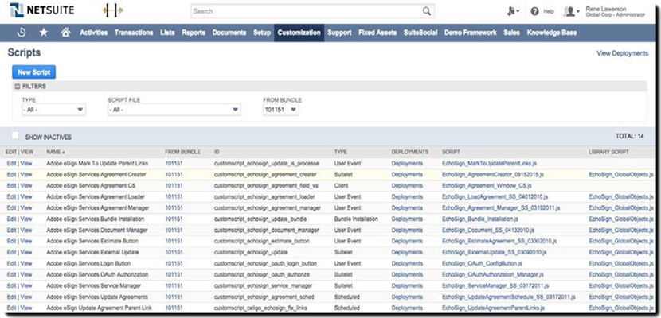
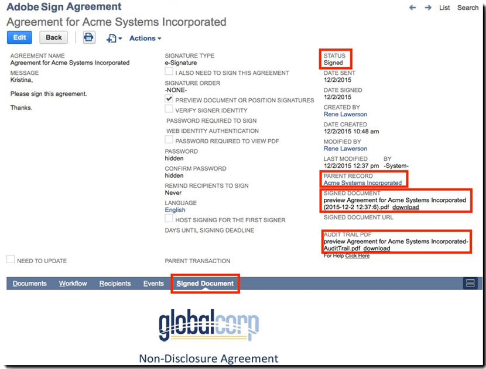

# [!DNL NetSuite] Guía de instalación y personalización (v4.0.4) {#install-customize-NetSuite}

## Resumen {#overview}

Adobe Sign para [!DNL NetSuite] proporciona una completa integración de firma electrónica con [!DNL NetSuite]. Puedes usar Adobe Sign para [!DNL NetSuite] para enviar acuerdos como contratos, presupuestos y otros documentos, que requieren firmas electrónicas, a los destinatarios directamente desde [!DNL NetSuite]. Puede crear y enviar acuerdos de Adobe Sign del cliente, cliente potencial, presupuesto y otros [!DNL NetSuite] registros. Actualizaciones de Adobe Sign [!DNL NetSuite] con el estado de acuerdos y almacena los acuerdos con los [!DNL NetSuite] una vez que se hayan ejecutado completamente. Puede ver el historial de todos los acuerdos enviados desde [!DNL NetSuite] desde dentro del producto.

Consulte la [Notas de la versión de Adobe Sign para NetSuite](https://experienceleague.adobe.com/docs/sign-integrations/using/netsuite/release-notes.html?lang=en) para obtener más información.

## Instalar el paquete y configurar OAuth {#install}

Sólo un [!DNL NetSuite] el administrador puede instalar o actualizar el paquete. Para configurar OAuth, el [!DNL NetSuite] El administrador debe tener acceso de administrador a Adobe Sign. Antes de instalar el paquete en su cuenta de producción, debe instalar y probar el paquete en un [!DNL NetSuite] Cuenta de espacio aislado.

Consulte [Crear un acuerdo de Adobe Sign](#createagreement) para obtener más información acerca de las pruebas.

>[!CAUTION]
>
>Los clientes que actualicen a la versión 4.0.4 NO deben eliminar su clave de API existente.
>
>Consulte [Configuración de preferencias personalizadas](#configure) para obtener más información sobre cómo se utiliza la clave de API.

### Instale el paquete por primera vez

1. Vaya a [!UICONTROL **Personalización > SuiteBundler > Buscar e instalar paquetes**].

1. En la *Buscar e instalar paquetes* , escriba **Adobe Sign** como palabra clave y seleccione **[!UICONTROL Buscar]**.

1. Seleccione la **Adobe Sign** nombre del paquete.

   

1. En la *[!UICONTROL Detalles del paquete]* página, seleccione **[!UICONTROL Instalar]**.
1. En la *[!UICONTROL Vista previa de instalación de paquete]* página, seleccione **[!UICONTROL Instalar paquete]**.

   (No es necesario cambiar ninguno de los valores predeterminados de la página)

   

1. En el cuadro de diálogo Instalar que aparece, seleccione **[!UICONTROL OK]** para continuar.

   Durante el proceso de instalación, el estado del paquete se muestra como *[!UICONTROL Pendiente]*.

   

1. Para mostrar un estado actualizado, seleccione **[!UICONTROL Actualizar]**.

   Una vez finalizada la instalación del paquete, *Adobe Sign para[!DNL NetSuite]* muestra en el *[!UICONTROL Paquetes instalados]* página.

   

1. Si ya es cliente de Adobe Sign, siga los pasos para  [Configurar OAuth después de instalar o actualizar](#oauth).

   Si no dispone de una cuenta de Adobe Sign, puede [registrarse para obtener una versión de prueba empresarial](https://esign.adobe.com/adobe-sign-netsuite-trial-registration.html) para probar el sistema. Siga los pasos de registro en línea para habilitar su cuenta de Adobe Sign.

## Configurar OAuth después de instalar o actualizar {#oauth}

Adobe Sign utiliza OAuth 2.0 para autenticar su cuenta de Adobe Sign en [!DNL NetSuite].

Este protocolo autoriza su [!DNL NetSuite] paquete para comunicarse con Adobe Sign sin solicitar la contraseña. Como la información confidencial no se comparte directamente entre las aplicaciones, es menos probable que su cuenta se vea comprometida.

Esta autenticación no afecta a su implementación, pero debe realizar una configuración única después de instalar o actualizar el paquete en su cuenta de producción o espacio aislado.

La [!DNL NetSuite] El administrador que configure OAuth también debe tener acceso de administrador de nivel de cuenta a Adobe Sign.

1. En [!DNL NetSuite], vaya al *Configuración de Adobe Sign* página de lista.

1. Buscar por **[!UICONTROL Configuración de Adobe Sign]** (un tipo de registro personalizado) mediante el campo Buscar del encabezado.

1. En la página Resultados de la búsqueda, seleccione **Ver** para el *Configuración de Adobe Sign* registro.

   

1. En la página Adobe Sign Config List, seleccione **[!UICONTROL Ver]** para el *Uso de OAuth para acceder a las API de Adobe Sign* registro.

   

1. En la página Configuración de Adobe Sign , seleccione **[!UICONTROL Iniciar Sesión Con Adobe Sign]**

   

1. En la página de inicio de sesión de Adobe Sign que aparece, introduzca sus credenciales y seleccione **[!UICONTROL Iniciar sesión]**.

   

1. En la página Confirmar acceso (para OAuth) que aparece, seleccione **[!UICONTROL Permitir acceso]**

   

1. Cuando se complete la autorización, se le redirigirá de nuevo a la página Configuración de Adobe Sign en [!DNL NetSuite], como se muestra a continuación.

   

   >[!NOTE]
   >
   >Al configurar OAuth en su cuenta de espacio aislado, puede aparecer el error &quot;No se ha podido determinar el ID de la composición del cliente&quot; cuando finalice la autorización.
   >
   >
   >Para continuar, debe cambiar la parte del dominio de cuenta de la dirección URL (system.netsuite.com) en el navegador para que apunte al [!DNL NetSuite] Espacio aislado de la siguiente manera:
   >
   >
   >Cambiar:
   >
   >
   >system.netsuite.com/app/site/hosting/scriptlet.nl?script=745&amp;deploy=1&amp;web_access_point=https://echosign.com
   >
   >
   >Para:
   >
   >
   >sistema.**espacio aislado.** netsuite.com/app/site/hosting/scriptlet.nl?script=745&amp;deploy=1&amp;web_access_point=https://echosign.com

## Actualizar el paquete (usuarios existentes)

[!DNL NetSuite] las actualizaciones de paquetes se publican regularmente por Adobe. Usuarios existentes de Adobe Sign para [!DNL NetSuite] puede actualizarse al paquete más reciente.

>[!CAUTION]
>
>Los clientes que actualicen a una versión más reciente NO deben eliminar su clave de API existente.
>
>Consulte [Configuración de preferencias personalizadas](#configure) para obtener más información sobre cómo se utiliza la clave de API.

### Requisitos previos {#prerequisites}

El tiempo necesario para actualizar al paquete v4.0.4 depende del número de acuerdos que actualmente tienen el estado &quot;Enviado para firmar&quot;. Por lo general, la actualización de 100 acuerdos tarda entre 7 y 10 minutos. Anote el número de registros para estimar la hora de actualización.

Para determinar el número de acuerdos que se van a firmar:

1. Vaya a **[!UICONTROL Personalización > Listas, registros y archivos > Tipos de registros]** y, a continuación, localice *Contrato Adobe Sign.*

   O busque Acuerdos de Adobe Sign en la barra de búsqueda.

1. Para el [!UICONTROL Acuerdos de Adobe Sign] registro, seleccionar **[!UICONTROL Buscar]**.

   

1. Desde el **[!UICONTROL Estado]** desplegable, seleccione **[!UICONTROL Enviado para firmar]** y, a continuación, seleccione **[!UICONTROL Enviar]**.

   

   Anote el número de registros para estimar la hora de actualización.

   

### Actualizar el paquete {#updating-the-bundle}

1. Vaya a **[!UICONTROL Personalización > SuiteBundler > Buscar e instalar > Lista]** y localice su paquete actual, como se muestra a continuación.

   >[!NOTE]
   >
   >Si hay una nueva versión del paquete, aparece un icono de signo de exclamación a la derecha del *Versión* número de su paquete actual.

1. En el menú desplegable Acción , seleccione **[!UICONTROL Actualizar]**.

   

1. En la página Actualización del paquete de vista previa, seleccione **[!UICONTROL Paquete de actualización]** sin cambiar ninguno de los valores predeterminados que se muestran en la página.

   Durante la instalación, el estado del paquete se muestra como *Pendiente*.

   .

   >[!NOTE]
   >
   >Al actualizar el paquete, puede que reciba un mensaje de advertencia, como se muestra a continuación. Si no ha personalizado su [!DNL NetSuite] Registros de firma electrónica; puede continuar. Si no está seguro, se recomienda que instale el paquete en una cuenta de espacio aislado para probarlo primero antes de actualizar el paquete en una cuenta de producción.

   

1. Para mostrar un estado actualizado, seleccione **[!UICONTROL Actualizar]**.

   

   >[!NOTE]
   >
   >Si la actualización tarda mucho tiempo debido a varios acuerdos con un *Enviado para firmar* estado, puede comprobar el **[!UICONTROL Registro de ejecución]** subpestaña de la *Instalación del paquete de Adobe Sign* para determinar el progreso de la actualización. Consulte [Determinar el progreso de la actualización](#determineprogress) para obtener más información.

   Una vez completada la actualización del paquete, *Adobe Sign para[!DNL NetSuite]* muestra en el *Paquetes instalados* página.

   

## Configurar el paquete {#configure}

### Configuración de preferencias personalizadas  {#set-custom-preferences}

Puede utilizar las preferencias personalizadas para especificar cómo se crean y almacenan los acuerdos en [!DNL NetSuite]. Además, la *Aprovisionamiento automático de usuarios en Adobe Sign* le permite especificar si [!DNL NetSuite] los usuarios se aprovisionan automáticamente en los servicios de Sign cuando envían acuerdos desde [!DNL NetSuite].

1. Vaya a **[!UICONTROL Configuración > Empresa > Preferencias generales]**.
1. Desplácese hacia abajo por la página y seleccione la **[!UICONTROL Preferencias personalizadas]** subpestaña.

   

1. Habilite y configure sus preferencias de Adobe Sign según sea necesario:

   * **Introduzca la clave de API de EchoSign para su cuenta**: No agregue ni edite ningún valor en este campo.
   * **Usar contacto de registro principal como firmante**: Si está activado, el contacto del registro principal se establece de forma predeterminada como el primer firmante cuando se crean los acuerdos. El remitente puede eliminar o editar fácilmente el firmante predeterminado o añadir firmantes adicionales al acuerdo antes de enviarlo.
   * **Use Trans. Contactar como firmante si existe**: Esta preferencia solo es válida si el *Usar contacto de registro principal como firmante* la preferencia también está activada. Si está activado, al generar un acuerdo desde un registro de transacción (por ejemplo, Presupuesto), el contacto de transacción principal se establece de forma predeterminada como el primer firmante. Consulte [Registros de transacciones](#transrecords) para obtener más información. Si no hay ningún contacto de transacción principal, o si se envía desde [!DNL NetSuite] registro de objeto (por ejemplo, registro Cliente o registro Partner), el destinatario predeterminado es el contacto principal del correo electrónico del cliente. El remitente puede eliminar o editar fácilmente el firmante predeterminado o añadir firmantes adicionales al acuerdo antes de enviarlo.
   * **Permitir marcar destinatarios como aprobadores**: Si se habilita, los remitentes pueden marcar a los destinatarios como aprobadores. Los destinatarios marcados como aprobadores pueden revisar y aprobar acuerdos, pero no están obligados a firmarlos. Es posible que los aprobadores deban introducir datos en los campos durante el proceso de aprobación.
   * **Id De Carpeta De Acuerdo Preferida**: Se utiliza para especificar la carpeta donde se almacenan los acuerdos firmados finales. Si no establece un valor para este campo, los acuerdos firmados finales se guardan de forma predeterminada en la misma carpeta que el archivo del documento original. El identificador de carpeta debe ser un número.
   * **Adjuntar automáticamente PDF de transacciones**: Si se habilita, los PDF de transacciones se adjuntan automáticamente a los acuerdos cuando se crean nuevos acuerdos a partir de registros de transacciones.
   * **Agregar PDF firmado como (archivo adjunto o vínculo)**: Si *Lista* Si se selecciona en la lista desplegable, el PDF firmado se añade automáticamente como vínculo al archivo. Si *Adjunto* se selecciona en la lista desplegable, el PDF firmado se almacena en [!DNL NetSuite] como archivo adjunto en el registro del acuerdo.
   * **Incluir PDF de seguimiento de auditoría con el acuerdo**: Si está activado, los PDF de seguimiento de auditoría se adjuntan automáticamente a los registros del acuerdo una vez que estos se han firmado.
   * **Método de verificación de identidad Se aplica a**: La activación de cualquiera de los métodos de verificación de la identidad determina a quién se aplica el método de verificación de la identidad. Las opciones son *Todos los firmantes, solo firmantes externos*, o *Solo firmantes internos*.

   **Métodos de verificación de identidad** {#identity-verification-methods}

   Se pueden seleccionar métodos de verificación de la identidad activados al crear un acuerdo. Si hay más de un método de verificación de identidad activado aquí, la página del acuerdo de Adobe Sign muestra una **[!UICONTROL Verificar la identidad del firmante]** opción.

   * **Habilitar contraseña necesaria para firmar**: Solicite a los firmantes que introduzcan la contraseña de un solo uso que especifique.

   * **Habilitar autenticación basada en conocimientos**: Solicite a los firmantes que proporcionen su nombre, dirección y, opcionalmente, los últimos cuatro dígitos de su SSN y, a continuación, respondan a una lista de preguntas para verificar la información que han proporcionado. Disponible solo en Estados Unidos.

   * **Habilitar autenticación de identidad web**: Solicite a los firmantes que verifiquen su identidad iniciando sesión en uno de los siguientes sitios: Facebook, Google, LinkedIn, Microsoft Live, Twitter o Yahoo!.

   * **Aprovisionamiento automático de usuarios en Adobe Sign**: Si está activada, los usuarios que envíen acuerdos en [!DNL NetSuite] se aprovisionan automáticamente con una cuenta de usuario de Adobe Sign.

1. Seleccionar **[!UICONTROL Guardar]** para guardar sus preferencias.

## Configurar actualizaciones de estado automáticas {#asu}

El paquete de integración de Adobe Sign le permite recibir actualizaciones automáticamente en [!DNL NetSuite] sobre el estado de los acuerdos que se han enviado desde [!DNL NetSuite]. Cuando esta función está activada, [!DNL NetSuite] refleja siempre el estado de sus acuerdos. Puede activar las actualizaciones de estado automáticas de la siguiente manera:

1. Vaya a **[!UICONTROL Configuración > Empresa > Activar funciones].**
1. Seleccione la **[!UICONTROL SuiteCloud]** subpestaña.
1. Active las siguientes opciones:

   * En la sección SuiteBuilder, habilite **[!UICONTROL Registros personalizados]** opción.

   * En la sección SuiteScript, habilite la **[!UICONTROL Client SuiteScript]** y **[!UICONTROL Server SuiteScript]** y aceptar las condiciones de servicio de ambas.

1. Seleccionar **[!UICONTROL Guardar]**.

   Las opciones se definen como se muestra en la imagen.

   

## Objetos y tipos de registro {#objects}

El paquete de integración de Adobe Sign ya expone el objeto Acuerdo de Adobe Sign con muchos estándares [!DNL NetSuite] objetos, incluidos: Registros de clientes, estimaciones, clientes potenciales, oportunidades y partners. También puede utilizar el paquete de Adobe Sign con otros tipos de registros, incluidos los personalizados.

La ficha Acuerdo puede aparecer con dos tipos de [!DNL NetSuite] registros: Registros de entidad y transacción. Por lo general, suponemos que un registro de transacción es un registro (como una cita) que se puede convertir en un documento de PDF; mientras que un registro de entidad no se puede convertir en un PDF.

## Registros de transacciones {#transrecords}

Si el acuerdo se crea a partir de un registro de transacción, el primer documento del registro del acuerdo es la versión del PDF del registro del que procede y el primer destinatario es la dirección de correo electrónico del registro. Si no desea que el primer documento sea una versión de PDF del registro del que procede, vaya a **[!UICONTROL Configuración > Empresa > Preferencias generales > Subficha Preferencias personalizadas]** y desactive la **[!UICONTROL Adjuntar automáticamente PDF de transacciones]** opción. Consulte [Configuración de preferencias personalizadas](#configure) para obtener más información.

En Preferencias personalizadas, también puede activar la **[!UICONTROL Use Trans. Contactar como primer firmante]** si desea que el contacto de transacción principal se agregue automáticamente como primer firmante. Cuando está asociado a un registro de transacción, muestra el **[!UICONTROL Acuerdos]** y el **[!UICONTROL Send for Signature]** botones.

## Registros de entidad {#entity-records}

Si el acuerdo se crea a partir de un registro de entidad, el primer destinatario es la dirección de correo electrónico del registro. Cuando se asocia a un registro de entidad, solo se muestra la pestaña Acuerdos .

## Personalizar el paquete {#customize}

La personalización del paquete incluye lo siguiente:

* Implementación de scripts para la subpestaña Acuerdos y el botón Send for Signature para los tipos de registro correspondientes.
* Establecer permisos de función para los tipos de registros de Adobe Sign.
* Modificar permisos para conceder acceso a la *Acuerdos* y el subseparador *Send for Signature* .

### Configurar acuerdos de Adobe Sign para tipos de registro adicionales  {#configuring-adobe-sign-agreements-for-additional-record-types}

Para implementar el *Acuerdos* y el subseparador *Send for Signature* para los tipos de registro adecuados:

1. Vaya a **[!UICONTROL Personalización > Scripts > Scripts].**

1. En la *Scripts* que aparece, busque el script que debe implementar y, a continuación, seleccione ****[!UICONTROL Ver]****.

   * Para agregar el *Send for Signature* botón, seleccionar **[!UICONTROL Botón Estimación de Adobe Sign]** script.

   * Para agregar el *Acuerdos* , seleccione **[!UICONTROL Cargador de acuerdos de Adobe Sign]** script.

1. En la página Script, seleccione **[!UICONTROL Implementar script]**.

   

1. En la página Implementación de script, haga lo siguiente:

   * Desde el *Se aplica a* , seleccione el tipo de registro.
   * Opcionalmente, introduzca el ID de implementación del script.

      Consulte la *Crear un ID de implementación de script personalizado* tema en el [!DNL NetSuite] Centro de ayuda para obtener más información. Si no introduce ningún ID, se genera uno.

   * Compruebe el **[!UICONTROL Implementado]** casilla de verificación.

   

   * Conjunto *Estado* para **[!UICONTROL Publicado]**.

      No debe especificar un *Tipo de evento* o *Nivel de registro*.

   * Desde el [!UICONTROL *Ejecutar como función]* desplegable, seleccione **[!UICONTROL Ejecutar como administrador]**.

   * Con el **[!UICONTROL Audiencia]** subficha active (activo de forma predeterminada), seleccione las funciones o usuarios específicos a los que desea conceder acceso. Si desea conceder acceso a todas las funciones y usuarios, habilite la **[!UICONTROL Seleccionar todo]** opciones.

   * Seleccionar **[!UICONTROL Guardar]**. Cuando aparezca la confirmación del cambio, seleccione **[!UICONTROL Volver atrás]**.

1. seleccionar **[!UICONTROL Lista]** en la parte superior de la página Implementación de script para volver a la *Scripts* página de lista.
1. Repita los pasos 2 y 3 anteriores para el otro script.

## Establecer permisos de funciones para tipos de registros de Adobe Sign {#setting-role-permissions-for-adobe-sign-record-types}

Más [!DNL NetSuite] Las funciones deben tener permiso para utilizar Adobe Sign sin personalización adicional. Sin embargo, debe conceder permisos para cualquier función personalizada adicional que se haya creado.

1. Vaya a **[!UICONTROL Personalización > Listas, registros y archivos > Tipos de registros]**.

   

   >[!NOTE]
   >
   >Si no ve el *Tipos de registro* elemento, vaya a **[!UICONTROL Configuración > Empresa > Habilitar funciones > pestaña Suite Cloud]** y activar el *Registros personalizados* opción.

1. En la *Tipos de registro* página, seleccione **[!UICONTROL Acuerdo de Adobe Sign]** para seleccionarlo

   

1. En la *Tipo de registro personalizado* página, seleccione **[!UICONTROL Usar lista de permisos]** de la *Tipo de acceso* desplegable.

   

   >[!NOTE]
   >
   >La *Acuerdo de Adobe Sign* tipo de registro es el único tipo de registro de Adobe Sign que requiere el *Lista de permisos de usuarios* tipo de acceso.
   >
   >
   >Consulte el paso 6 para obtener instrucciones sobre cómo configurar el tipo de acceso para los otros tipos de registros de Adobe Sign.

1. Seleccione la **[!UICONTROL Permisos]** subpestaña.

   Aparecerá una lista de funciones y permisos.

   

1. Defina los permisos de la siguiente manera para las funciones personalizadas adicionales añadidas a &quot;[!UICONTROL Acuerdo de Adobe Sign]&quot; tipo de registro.

   >[!NOTE]
   >
   >Consulte la *[Configurar una lista de permisos para un tipo de registro personalizado](https://system.netsuite.com/app/help/helpcenter.nl?fid=section_N2879931.html)* en el Centro de ayuda de NetSuite para obtener más información

   1. Seleccione el rol en el *Función* lista.
   1. Conjunto *Nivel* para **[!UICONTROL Completo]**.
   1. Conjunto *Formulario predeterminado* para **[!UICONTROL Formulario de acuerdo personalizado de EchoSign]**.
   1. Seleccionar **[!UICONTROL Restringir formulario]** casilla de verificación.
   1. Seleccionar **[!UICONTROL Añadir]** para guardar los cambios de la fila de roles.

   

   La nueva fila se muestra como se muestra a continuación:

   

   Repita los pasos de la a a la e anteriores para todas las funciones personalizadas adicionales.

   * seleccionar **[!UICONTROL Guardar]** en la *Tipo de registro personalizado* página cuando se han establecido permisos para todas las funciones.
   La *[!UICONTROL Tipo de registro de cliente]* se vuelve a mostrar.

1. Repita los pasos 1 a 3 anteriores para definir el *Tipo de acceso* para todos los demás tipos de registros de Adobe Sign a

   **[!UICONTROL No se requiere permiso].** Esto se aplica a los siguientes tipos de registro:

   * Configuración de Adobe Sign
   * Documento de Adobe Sign
   * Evento de Adobe Sign
   * Idioma de Adobe Sign
   * Errores de script de Adobe Sign
   * Acuerdo firmado de Adobe Sign
   * Adobe Sign Signer

### Conceder acceso a la pestaña Acuerdo y al botón Send for Signature  {#granting-access-to-the-agreement-tab-and-send-for-signature-button}

El paquete de integración de Adobe Sign ya expone el objeto Acuerdo de Adobe Sign con muchos estándares [!DNL NetSuite] objetos (cliente, estimación [Presupuesto], Candidato y más). La *Acuerdo* se activa automáticamente para los siguientes tipos de objetos: Cliente, Candidato, Oportunidad, Socio, Cliente Potencial, Presupuesto y Factura de Proveedor.

La *[!UICONTROL Send for Signature]* se activa automáticamente **o[!UICONTROL Sólo para el objeto Quote]**.

[!DNL NetSuite] los administradores pueden ampliar la capacidad de crear acuerdos en objetos de CRM adicionales modificando los permisos para agregar el *Acuerdo* subpestaña, *Send for Signature* o ambos a esos objetos.

#### Modificación de permisos para conceder acceso al botón Send for Signature  {#modifying-permissions-to-grant-access-to-the-send-for-signature-button}

1. Vaya a **[!UICONTROL Personalización > Scripts > Scripts]**.

   La *Scripts* se muestra la página de lista.

   * Si es necesario, utilice los filtros para localizar los scripts de Adobe Sign

1. En la *Scripts* , busque el *Botón Estimación de Adobe Sign* script (controla el *Send for Signature* ) y, a continuación, seleccione **Ver**.

   

1. En la *Script* , haga lo siguiente:

   * seleccione la **[!UICONTROL Implementaciones]** subpestaña

   * En &quot;*Se aplica a*&quot; seleccione el vínculo de la entidad que desee modificar.

      * **[!UICONTROL Presupuesto]** en este ejemplo

   

   * seleccione la **[!UICONTROL Editar]** del botón *Implementación de scripts* página

   

   * Con el **[!UICONTROL Audiencia]** subpestaña activa, seleccione las funciones o usuarios específicos a los que desea conceder acceso.

      * Si desea conceder acceso a todas las funciones y usuarios, habilite la **[!UICONTROL Seleccionar todo]** options
   * seleccionar **[!UICONTROL Guardar]**

   

#### Modificación de permisos para conceder acceso a la ficha Acuerdos  {#modifying-permissions-to-grant-access-to-the-agreements-tab}

1. Vaya a **[!UICONTROL Personalización > Scripts > Scripts]**
1. En la [!UICONTROL Scripts] , busque el *[!UICONTROL Cargador de acuerdos de Adobe Sign]* script (controla el *Pestaña Acuerdos*) y, a continuación, seleccione **[!UICONTROL Ver]**.
1. En la *Script* , haga lo siguiente:

   1. Seleccione la **[!UICONTROL Implementaciones]** subpestaña
   1. En &quot;*[!UICONTROL Se aplica a]*&quot; seleccione el vínculo de la entidad para la que desea modificar el acceso
   1. En la *[!UICONTROL Implementación de scripts]* , seleccione la **[!UICONTROL Editar]** botón
   1. Con el **[!UICONTROL Audiencia]** subficha activa (está activa de forma predeterminada), seleccione las funciones o usuarios específicos a los que desea conceder acceso. Si desea conceder acceso a todas las funciones y usuarios, habilite la **[!UICONTROL Seleccionar todo]** options
   1. seleccionar **[!UICONTROL Guardar]**

## Uso de Adobe Sign para [!DNL NetSuite] paquete

Para enviar acuerdos desde [!DNL NetSuite] y recibir actualizaciones sobre esos acuerdos, los usuarios deben tener el mismo ID de inicio de sesión (dirección de correo electrónico) en [!DNL NetSuite] y en Adobe Sign.

### Creación de un acuerdo de Adobe Sign

Después de instalar un nuevo paquete en un espacio aislado o una cuenta de producción, debe probar el paquete creando un nuevo acuerdo. Puede crear acuerdos de Adobe Sign a partir de un registro de entidad, de un registro de transacción o como un acuerdo independiente.

>[!NOTE]
>
>El proceso de creación de un acuerdo varía ligeramente en función de cómo se cree. El proceso general implica especificar las opciones del acuerdo, agregar uno o más documentos del acuerdo y especificar los destinatarios. El proceso que se describe a continuación presupone que está creando el acuerdo a partir de un registro de cliente.

1. Seleccione o cree un registro de cliente desde el que desee enviar un acuerdo o puede seleccionar otro [!DNL NetSuite] tipo de registro que tiene habilitada la ficha Acuerdos.

1. En el registro, seleccione la **[!UICONTROL Acuerdos]** subpestaña.
1. Seleccionar **[!UICONTROL Nuevo acuerdo]**.

   

1. En la *[!UICONTROL Acuerdo de Adobe Sign]* página, seleccione **[!UICONTROL Editar]**.

   

1. Especifique las opciones del acuerdo de la siguiente manera:

   * **Nombre del acuerdo** : introduzca un nombre para el acuerdo.
   * **Mensaje**-Introduzca un mensaje personalizado para el destinatario.
   * **Tipo de firma** — seleccione el tipo de firma aceptado para el documento. Las opciones son *Firma electrónica* y *Firma de fax*.

   * **También debo firmar este acuerdo** — Active esta opción para indicar que el remitente también debe firmar el acuerdo.
   * **Orden de firma**-Si el *También debo firmar este acuerdo* Si la opción está activada, seleccione el orden en el que el remitente y los destinatarios deben firmar. Las opciones son &quot;Firmo yo, luego los destinatarios firman&quot;, &quot;Los destinatarios firman y luego firmo yo&quot; y &quot;Ninguno&quot;.

   * **Obtener una vista previa del documento o colocar firmas (o campos de formulario)** — Active esta opción para permitir a los remitentes obtener una vista previa del acuerdo y añadir campos (firma de arrastrar y soltar, campos iniciales y otros campos de formulario) al acuerdo antes de enviarlo a los destinatarios.
   * **Verificar la identidad del firmante** — Active esta opción y, a continuación, seleccione una de las siguientes opciones de verificación de identidad

      * Esta opción solo se muestra cuando más de uno de los tres métodos de verificación de la identidad del firmante que se enumeran a continuación está activado en Preferencias personalizadas. (Consulte [Configuración de preferencias personalizadas](#customize) para obtener más información.) Si solo hay una preferencia habilitada, el **[!UICONTROL Verificar la identidad del firmante]** no se muestra.

   **Métodos de verificación de identidad**

   * **Contraseña necesaria para firmar** — Solicitar a los firmantes que introduzcan la contraseña de un solo uso que especifique.
   * **Autenticación basada en conocimientos** — Exigir a los firmantes que proporcionen su nombre, dirección y, opcionalmente, los últimos cuatro dígitos de su SSN y, a continuación, responder a una lista de preguntas para verificar la información que han facilitado. Disponible solo en Estados Unidos.
   * **Autenticación de identidad web** — Solicitar a los firmantes que verifiquen su identidad iniciando sesión en uno de los siguientes sitios: Facebook, Google, LinkedIn, Twitter, Yahoo! o Microsoft Live.
   * **Contraseña Necesaria Para Ver El PDF** — Active esta opción para solicitar que un destinatario introduzca una contraseña antes de abrir un PDF del acuerdo o del acuerdo firmado. El archivo de PDF que se envía a todos se cifra y requiere la contraseña para abrirlo. No pierda su contraseña, ya que no se puede recuperar. En caso de que pierda la contraseña, debe eliminar la transacción y comenzar de nuevo.
   * **Contraseña/Confirmar contraseña** — Si la *Contraseña Necesaria Para Ver El PDF* está activada, introduzca la contraseña que debe utilizarse para ver el acuerdo.
   * **Recordar a los destinatarios que firmen** — Especifique si se envían recordatorios a los destinatarios y con qué frecuencia. Las opciones son *Nunca*, *Diario* o *Semanal*.
   * **Idioma:** Especifique el idioma en el que se mostrarán a los destinatarios la página de firma y las notificaciones por correo electrónico.
   * **Firma de host para el primer firmante** — Active esta opción para permitir que el remitente aloje firmas en persona para el primer firmante.
   * **Días hasta la fecha límite de firma** — Introduzca un número entero para indicar la fecha límite de firma del acuerdo (la fecha actual + el número de días).
   * **Registro principal** — Si lo desea, seleccione un registro principal para vincularlo al acuerdo.

   

1. Seleccione la **[!UICONTROL Documentos]** .

   

1. En la *Documentos* subficha, adjunte un documento existente del archivador utilizando la *Documento de Adobe Sign* y, a continuación, seleccione **[!UICONTROL Adjuntar]**.

   O bien, haga clic en **[!UICONTROL Nuevo documento de Adobe Sign]** para acceder al *[!UICONTROL Documento de Adobe Sign]* y, a continuación, escriba el nombre de un documento en la [!DNL NetSuite] archivador, seleccione archivos de su registro de transacciones (si corresponde) o adjunte un nuevo documento.

   Puede añadir varios documentos a un acuerdo.

1. Seleccionar **[!UICONTROL Destinatarios]** y especifique el destinatario, ya sea seleccionándolo en la lista de contactos o escribiendo una dirección de correo electrónico.

   

   Cada uno de sus destinatarios puede marcarse como Firmante o CC. Si el *Permitir marcar destinatarios como aprobadores o firmantes* Si la preferencia personalizada está activada, los destinatarios también se pueden marcar como Aprobadores. Consulte [Configuración de preferencias personalizadas](#customize) para obtener más información.

   * **Firmantes** debe firmar el acuerdo.
   * **Aprobadores** debe aprobar el acuerdo, pero no firmarlo, y puede agregar datos a un acuerdo de forma opcional.
   * **Destinatarios en CC** se notifican las actualizaciones del acuerdo y cuándo se firma y se completa el acuerdo. Los destinatarios de CC no son parte del proceso de firma o aprobación.

      Si el *Usar contacto de registro principal como firmante* la preferencia personalizada se activa sola o junto con la *Use Trans. Contactar como firmante* , el primer destinatario se establece de forma predeterminada, pero se puede cambiar.

1. Seleccionar **[!UICONTROL Añadir]** después de introducir cada destinatario.

1. Seleccionar **[!UICONTROL Guardar]** para guardar el acuerdo.

### Enviar acuerdos para firmar

Cuando el acuerdo esté listo para enviarse, seleccione la **[!UICONTROL Send for Signature]** .

* Si el *Previsualizar firmas de documento o posición* está activada, haga clic en **[!UICONTROL Send for Signature]**. En la ventana que se abra, obtenga una vista previa del documento o arrastre los campos de formulario al documento antes de enviarlo. Seleccionar **[!UICONTROL Enviar]** para enviar el acuerdo al destinatario.

* Si el *[!UICONTROL Firma de host para primer firmante]* está activada, haga clic en **[!UICONTROL Send for Signature]**. En la ventana que se abra, permita que el firmante firme el documento con el remitente presente.

   A *Firma de host para el firmante actual* también aparece junto al vínculo *Firma de host para primer firmante* , a la que se puede acceder hasta que se firme el documento. Utilice este vínculo para alojar la firma de acuerdos para varios firmantes o para volver a abrir la ventana emergente si se cierra accidentalmente.

Una vez enviado el acuerdo, los destinatarios reciben un correo electrónico informándoles de los documentos pendientes de firma.

Una vez que los destinatarios han firmado el documento, el remitente recibe una notificación por correo electrónico de que el documento se ha firmado.

#### Enviar desde un presupuesto

Adobe Sign se integra directamente con Presupuestos en [!DNL NetSuite] para que un PDF del presupuesto se genere automáticamente y se adjunte al registro del acuerdo.

Al visualizar un presupuesto, seleccione **[!UICONTROL Send for Signature]**. Genera y muestra la oferta adjunta al acuerdo. También puede añadir el *Send for Signature* para otros tipos de registro de transacciones. Consulte [Objetos y tipos de registro](#objects) para obtener más información.

### Seguimiento del estado y envío de recordatorios

Después de enviar un acuerdo:

* El estado del documento cambia a *Enviado para firmar* en la sección Detalles del acuerdo
* La *Send for Signature* se sustituye por los tres botones siguientes:

   * **Actualizar estado** — Para actualizar manualmente el estado si no se han configurado actualizaciones de estado. Consulte [Configuración de actualizaciones de estado automáticas](#asu) para obtener más información.
   * **Enviar recordatorio** : para enviar un recordatorio al firmante actual.
   * **Cancelar acuerdo** — Para cancelar un acuerdo. Un acuerdo se puede cancelar después de que se haya enviado para firmar si todos los destinatarios aún no lo han firmado.

Una nueva *Eventos* en el registro del acuerdo aparece una subpestaña donde puede realizar un seguimiento del estado del acuerdo.

Puede ver un historial de los eventos del acuerdo, que incluye información sobre cuándo se envió, vio y firmó el acuerdo.

Después de firmar el acuerdo:

* Su estado cambia a *Firmado*.
* Puede volver al registro principal de este acuerdo mediante el vínculo.
* Puede utilizar los vínculos de &quot;descarga&quot; en Documento firmado y Seguimiento de auditoría para acceder a estos documentos.
* Un adicional *Documento firmado* se muestra una subpestaña para ver las miniaturas del documento firmado.

>[!NOTE]
>
>Después de enviar un acuerdo para su firma, no puede editar el registro. Esto es para preservar el registro de eventos.

## Desinstalar el paquete

Para desinstalar el paquete, siga los pasos que se indican en la [!DNL NetSuite] Ayuda. Consulte la *[Desinstalación de un paquete](https://docs.oracle.com/en/cloud/saas/netsuite/ns-online-help/section_N3400972.html)* tema en el [!DNL NetSuite] Centro de ayuda para obtener más información.

Al desinstalar el paquete, se eliminan los acuerdos sin firmar. Los acuerdos firmados y sus correspondientes archivos de PDF de auditoría no se ven afectados.

NO desinstale el paquete si debe conservar los acuerdos sin firmar.

## Solucionar problemas

### Determinar el progreso de la actualización {#determineprogress}

Si la actualización parece tardar más de, puede comprobar la subpestaña Registro de ejecución del script de instalación del paquete de Adobe Sign para determinar el progreso de la actualización de la siguiente manera:

1. Vaya a **[!UICONTROL Personalización > Scripts > Scripts]**.
1. En la [!UICONTROL Scripts] , busque el *[!UICONTROL Instalación del paquete de Adobe Sign]* script y, a continuación, seleccione **[!UICONTROL Editar]**.
1. En la [!UICONTROL Scripts] , seleccione la **Registro de ejecución** subpestaña.
1. seleccionar **Actualizar**.

   El registro de ejecución se actualiza para reflejar el estado. La *Detalles* muestra el progreso de las actualizaciones de los acuerdos.

   

### Resolver problemas del token de acceso

Es posible que aparezca el mensaje &quot;El token de acceso proporcionado no es válido o ha caducado&quot; al interactuar con los acuerdos.

Esto puede ocurrir por las siguientes razones:

* La [!DNL NetSuite]El administrador de Adobe Sign que configuró OAuth ha revocado el token de acceso
* El token de acceso ha caducado porque no se ha enviado ningún acuerdo desde [!DNL NetSuite] en los últimos 60 días
* La [!DNL NetSuite]El administrador de Adobe Sign no ha completado correctamente la configuración inicial de OAuth

Para resolver este problema, vuelva a ejecutar el proceso de configuración de OAuth. Consulte [Configuración de OAuth después de instalar o actualizar](#oauth) para obtener más información.

### Resolver problemas de estado del documento {#resolvestatus}

Si [actualizaciones de estado automáticas](#asu) están configurados, pero el estado del acuerdo no se actualiza después de enviar acuerdos. Pruebe una de las acciones siguientes:

1. Compruebe el registro de ejecución de la implementación para la *Actualización externa de Adobe Sign* para ver si está recibiendo llamadas de Adobe Sign de la siguiente manera:

   1. Vaya a **[!UICONTROL Personalización > Secuencias de comandos > Implementaciones de secuencias de comandos]**
   1. En la *Implementaciones de scripts* , busque el *Actualización externa de Adobe Sign* script y, a continuación, seleccione **[!UICONTROL Editar]**
      1. En la *[!UICONTROL Implementación de scripts]* , seleccione la **[!UICONTROL Registro de ejecución]** subpestaña.
      * Deberías ver una *Registro de acuerdo actualizado* entrada para cada ID de acuerdo

1. Compruebe el registro de ejecución de la implementación para la *Acuerdos de actualización de Adobe Sign* para ver si hay algún error de la siguiente manera:

   1. Vaya a **[!UICONTROL Personalización > Secuencias de comandos > Implementaciones de secuencias de comandos]**.
   1. En la [!UICONTROL Implementaciones de scripts] , busque el *[!UICONTROL Acuerdos de actualización de Adobe Sign]* con el símbolo &quot;[!UICONTROL Programado]&quot; y, a continuación, seleccione **[!UICONTROL Editar]**.
   1. En la [!UICONTROL Implementación de scripts] , seleccione la **[!UICONTROL Registro de ejecución]** subpestaña.
   1. Bajo [!UICONTROL Tipo], seleccione **[!UICONTROL Error]** para filtrar los resultados.

1. Por último, compruebe el registro de ejecución del *Adobe Sign Manager* para buscar errores, siga las instrucciones del paso 2 anterior.

### Solucionar errores de tipo MIME  {#resolving-mime-type-errors}

Si aparece un error de tipo MIME al enviar un acuerdo, puede deberse a que el nombre en el campo Nombre de archivo no coincide con el nombre de archivo y la extensión del archivo cargado. Si deja el campo Nombre de archivo en blanco, se rellena automáticamente con el nombre de archivo y la extensión correctos.

### Ver registros de script {#viewing-script-logs}

También puede ver los registros de ejecución de la implementación de secuencias de comandos que no están relacionadas con problemas de estado del documento. Consulte [Resolución de problemas de estado de documentos](#resolvestatus) para obtener más información.

1. Vaya a **[!UICONTROL Personalización > Scripts > Scripts]**.

   La *Scripts* se muestra la página de lista. Si es necesario, utilice los filtros para localizar el script adecuado.

1. Seleccionar **[!UICONTROL Ver]** para el script correspondiente.

1. Seleccione la **[!UICONTROL Registro de ejecución]** en la página para mostrar el registro de script.

## Asistencia {#support}

Vaya a la [Portal de asistencia de Adobe Sign](https://adobe.com/go/adobesign-support-center) para acceder a preguntas frecuentes, documentación, artículos de la base de conocimientos o para ponerse en contacto con el servicio de asistencia de Adobe.
