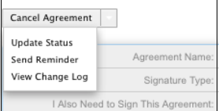

# [!DNL SugarCRM]  Guía de instalación {#sugarcrm-install-guide}

[Póngase en contacto con el Servicio de atención al cliente](https://adobe.com/go/adobesign-support-center_es)

Adobe [!DNL EchoSign] para [!DNL SugarCRM] es una solución líder de firma electrónica y contratación web que ofrece automatización de firma electrónica en [!DNL SugarCRM] para firmas electrónicas y firmas por fax. Los usuarios pueden enviar contratos directamente desde SugarCRM, ver el historial del contrato y guardar contratos firmados electrónicamente con cuentas, contactos, citas y mucho más.
Adobe [!DNL EchoSign] para [!DNL SugarCRM] está disponible para todas las versiones compatibles de SugarCRM, incluyendo 6.3 - 6.7 para soluciones a petición o locales.

Este documento es una guía para los administradores de [!DNL SugarCRM] para aprender a instalar y configurar Adobe [!DNL EchoSign] para el complemento [!DNL SugarCRM].

## Instalar este plugin {#install-plugin}

1. Obtenga el archivo de archivo de Adobe [!DNL EchoSign] para [!DNL SugarCRM] del [listado de SugarExchange](http://www.sugarexchange.com/product_details.php?product=1123).
1. Inicie sesión en [!DNL SugarCRM] con su cuenta de administrador.
1. Vaya a **[!UICONTROL Administración]** > **[!UICONTROL Cargador de módulos]**.

   

1. Para cargar el archivo de archivo del complemento Adobe [!DNL EchoSign] para [!DNL SugarCRM], seleccione **[!UICONTROL Examinar]**, luego seleccione el archivo de archivo y, a continuación, seleccione **[!UICONTROL Cargar]**.
1. Después de cargar el archivo de almacenamiento, seleccione **[!UICONTROL Instalar]** para iniciar la instalación.
1. Revise los términos y condiciones y, a continuación, seleccione **[!UICONTROL Aceptar]** > **[!UICONTROL Aprobar]**.
1. Si el complemento se instala correctamente, la barra de progreso indica un 100 % de éxito.  Si la barra de progreso no llega al 100 %, seleccione **[!UICONTROL Display Log]** para ver el error detectado por SugarCRM.

   

1. Después de la instalación, vaya a **[!UICONTROL Administración > Reparar]** y seleccione **[!UICONTROL Reparación y reconstrucción rápidas]**.

>[!NOTE]
>
>Si está instalando el complemento en [!DNL SugarCRM] OnDemand, presente un ticket de soporte con [!DNL SugarCRM] para quitar temporalmente las restricciones del inspector de paquetes para OnDemand de modo que el paquete pueda instalarse. Esto forma parte del proceso estándar.

## Actualizar el complemento {#upgrade-plugin}

Si está actualizando el complemento Adobe [!DNL EchoSign] para [!DNL SugarCRM] a una versión más reciente, debe instalar el complemento sin desinstalar la versión anterior.
Después de actualizar el complemento, vaya a **[!UICONTROL Administración]** > **[!UICONTROL Reparar]** y seleccione **[!UICONTROL Reparación y reconstrucción rápidas]**.

**Nota:** si desinstala un plugin anterior, no elimine las tablas durante la desinstalación. De lo contrario, puede perder los datos del acuerdo [!DNL EchoSign].

## Configurar el complemento {#configure-plugin}

1. Si ya es cliente de Adobe [!DNL EchoSign], continúe con el paso 2.

   Si no tiene una cuenta [!DNL EchoSign], [regístrese para obtener una versión de prueba GRATUITA de 14 días](https://sugarcrmintegration.echosign.com/public/login) y siga los pasos de registro en línea para habilitar su cuenta de Adobe [!DNL EchoSign].
1. Inicie sesión en la [cuenta de Echo Sign](http://www.echosign.com) y siga estos pasos:
   1. Seleccione la ficha **[!UICONTROL Cuenta]**.
   1. Seleccione **[!UICONTROL API de EchoSign]** en la parte inferior izquierda.
   1. Seleccione **[!UICONTROL Activar acceso a API]** y obtenga su clave de API de la página.

   

1. En SugarCRM, vaya a **[!UICONTROL Administración]** > **[!UICONTROL Configuración de Adobe EchoSign]** e introduzca la clave de API en el campo etiquetado como **[!UICONTROL Clave de API de EchoSign]**.
1. Opcionalmente, configure el complemento con los siguientes ajustes:

   1. Adjuntar PDF automáticamente al crear un acuerdo desde una oferta: Seleccione si desea adjuntar automáticamente un PDF del presupuesto si un usuario [!DNL SugarCRM] crea un acuerdo de EchoSign desde el módulo Comillas.
   1. Administrar lista de destinatarios: Seleccione qué módulos aparecen en el subpanel Destinatario en el módulo [!DNL EchoSign] Acuerdos. Esto también agrega el subpanel [!DNL EchoSign] Acuerdos a esos módulos.
   1. Añada los botones de envío a estos módulos: Seleccione esta opción si desea que el botón/acción Crear [!DNL EchoSign] acuerdo se incluya con las acciones principales del módulo Presupuesto.
   1. Seleccione **[!UICONTROL Guardar]** para almacenar la configuración.

**Nota:** El Adobe  [!DNL EchoSign] para el  [!DNL SugarCRM] plugin requiere la extensión [ SOAP de ](http://www.php.net/manual/en/book.soap.php)PHP. Para habilitar la compatibilidad con SOAP, configure PHP con enable-soap.

## Obtener actualizaciones del acuerdo (para [!DNL SugarCRM] versiones 6.3 o posteriores) {#get-agreement-updates}

Para la versión 6.3 y posteriores, puede utilizar las dos opciones siguientes para obtener actualizaciones del acuerdo. En versiones anteriores de SugarCRM, el complemento de forma predeterminada solo ofrecía el método de devolución de llamada (Opción 1).

### Opción 1: Configurar el método de devolución de llamada para enviar actualizaciones a EchoSign

Si su sitio web está orientado al público, puede hacer que Adobe EchoSign haga ping a su instancia [!DNL SugarCRM] siempre que se produzca un nuevo evento. [!DNL SugarCRM] a continuación, actualiza el estado del acuerdo, los eventos y descarga el documento firmado (si está firmado) automáticamente y en tiempo real. (Si está detrás de un firewall, debe incluir en la lista blanca las direcciones IP del servidor [!DNL EchoSign] o utilizar el método Trabajo programado para actualizar los acuerdos de EchoSign que se describe en la siguiente sección de esta guía).

1. Vaya a **[!UICONTROL Administración]** > **[!UICONTROL Configuración de Adobe EchoSign]**.
1. Marque la casilla **[!UICONTROL Usar el método de devolución de llamada de EchoSign]** para actualizar los eventos y estados de los acuerdos.
1. Seleccione **[!UICONTROL Guardar]**.

### Opción 2: Configurar un trabajo programado para [!DNL SugarCRM] instancias detrás de un firewall

El complemento [!DNL EchoSign] para [!DNL SugarCRM] también puede utilizar un trabajo programado para consultar [!DNL EchoSign] las actualizaciones de los acuerdos que se han enviado para firmar. Se puede utilizar el método de consulta de trabajo programado si hay una instalación local [!DNL SugarCRM] detrás de un firewall.

Para configurar:

1. Vaya a **[!UICONTROL Administración]** > **[!UICONTROL Programador]**.
1. En el menú desplegable de pestañas, seleccione **[!UICONTROL Crear programador]**.
1. Introduzca un nombre de trabajo.
1. Para el campo Trabajo, seleccione **[!UICONTROL Adobe EchoSign Status Updater]**.
1. Establezca el trabajo para que se ejecute con la frecuencia que sea necesaria. Le recomendamos que lo configure para que se ejecute cada 10 minutos, lo que significa que una vez abierto, leído o firmado un acuerdo, puede tardar hasta 10 minutos en actualizarse con [!DNL SugarCRM] esa información.

   **Nota:** Si tiene muchos acuerdos enviados para firmar, si se ejecuta con demasiada frecuencia, puede que el sistema se ralentice.

   

1. Vaya a **[!UICONTROL Administración]** > **[!UICONTROL Configuración de Adobe EchoSign]**.
1. Desmarque la casilla **[!UICONTROL Usar el método de devolución de llamada de EchoSign]** para actualizar los eventos y estados de los acuerdos.
1. Seleccione **[!UICONTROL Guardar]**.
Nota: Active Schedulers en [!DNL SugarCRM] para que esto funcione.

Para agregar acuerdos de EchoSign a otros [!DNL SugarCRM] módulos:

1. Vaya a **[!UICONTROL Administración]** > **[!UICONTROL Estudio]**.
1. En el árbol de carpetas de la columna izquierda, seleccione el módulo para agregar [!DNL EchoSign] acuerdos.
1. Seleccione **[!UICONTROL Relaciones]** **[!UICONTROL Agregar relaciones]**.
1. En el menú desplegable, seleccione Texto como **[!UICONTROL Uno a varios]** y Módulo como **[!UICONTROL Acuerdos de EchoSign]**.
1. Seleccione **[!UICONTROL Guardar e implementar]**.

   

   [!DNL EchoSign] Los acuerdos ahora aparecen en el módulo y allí se pueden crear y realizar un seguimiento de ellos.

   

**Otros pasos de configuración**

* **Ocultar  [!DNL EchoSign] módulos**: Puede ocultar los módulos  [!DNL EchoSign] Destinatarios y  [!DNL EchoSign] Eventos yendo a Administración&quot; Mostrar fichas y subpaneles del módulo y moviéndolos a la columna oculta.
* **Deshabilitando packageScan**: Si ha habilitado packageScan en su propio sistema, deberá desactivarlo durante la instalación. Si utiliza [!DNL SugarCRM] A petición, póngase en contacto con el soporte [!DNL SugarCRM] para deshabilitar packageScan por usted.

## Desinstalar el complemento {#uninstall-plugin}

1. Inicie sesión en [!DNL SugarCRM] con su cuenta de administrador.
1. Vaya a **[!UICONTROL Administración]** > **[!UICONTROL Cargador de módulos]**.
1. Seleccione **[!UICONTROL Desinstalar]** junto al complemento [!UICONTROL EchoSign para SugarCRM].
1. Seleccione **[!UICONTROL Aprobar]** para comenzar la desinstalación. También puede seleccionar quitar las tablas de base de datos creadas para el complemento.

   

   Si el complemento se desinstala correctamente, la barra de progreso indica un 100 % de éxito. Si la barra de progreso no llega al 100 %, seleccione [!UICONTROL Display Log] para ver el error detectado por SugarCRM.

   

## Usar Adobe [!DNL EchoSign] para [!DNL SugarCRM] {#use-echosign-for-sugarcrm}

Puede crear un acuerdo de Adobe [!DNL EchoSign] asociado a una cuenta, contacto, presupuesto u otros módulos [!DNL SugarCRM]. Puede adjuntar archivos, especificar destinatarios y enviarlos para su firma. Adobe [!DNL EchoSign] actualiza [!DNL SugarCRM] con el estado actual del acuerdo y almacena el contrato firmado en [!DNL SugarCRM] una vez que se ha ejecutado por completo.

### Crear y editar un acuerdo de Adobe [!DNL EchoSign] {#create-edit-agreements}

Puede crear acuerdos mediante el módulo [!DNL EchoSign] Acuerdos o mediante módulos configurados por un [!DNL SugarCRM] administrador.

1. En la lista [!UICONTROL Acciones] de la ficha [!UICONTROL Acuerdos de EchoSign], seleccione **[!UICONTROL Crear acuerdo de EchoSign]**.
1. En la sección principal del acuerdo [!DNL EchoSign], introduzca la siguiente información o seleccione una de las diversas opciones del acuerdo:

   1. **[!UICONTROL Nombre:]** introduzca un nombre para el acuerdo.
   1. **[!UICONTROL Tipo de firma:]** seleccione el tipo de firma aceptada para el documento. Las opciones son Firma electrónica y Firma por fax.
   1. **[!UICONTROL También necesito firmar este acuerdo:]** indique si el remitente también debe firmar el acuerdo.
   1. **[!UICONTROL Orden de firma:]** si la opción anterior Tengo que firmar este acuerdo está activada, también seleccione el orden en el que el remitente y los destinatarios deben firmar.
   1. **[!UICONTROL Recordar a los destinatarios que firmen:]** seleccione la frecuencia con la que se debe recordar a un destinatario que firme un documento. Las opciones son Diario o Semanal.
   1. **[!UICONTROL Días hasta la fecha límite de firma:]** especifique el número de días hasta que se debe firmar el acuerdo.
   1. **[!UICONTROL V. previa, pos. firm. o añadir campos d/form.:]**  seleccione esta opción para obtener una vista previa del acuerdo antes de enviarlo, o bien arrastre y suelte campos d/form., campos d/form., al acuerdo antes de enviarlo a los destinatarios. Una vez que haya previsualizado el documento o arrastrado los campos que desee al documento, recuerde seleccionar el botón Enviar para enviar el acuerdo al destinatario.
   1. **[!UICONTROL Firma de host para el primer firmante:]** indique si el remitente desea alojar la firma del acuerdo en persona.
      * **[!UICONTROL Mensaje:]** incluya un mensaje para el destinatario.
      * **[!UICONTROL Cuenta, Oportunidad, Presupuesto:]** seleccione o modifique la cuenta, la oportunidad o el presupuesto asociados a este acuerdo.
      * **[!UICONTROL Idioma:]** especifique el idioma en el que se muestran a los destinatarios la página de firma y las notificaciones por correo electrónico.

      

1. En la sección [!UICONTROL Opciones de seguridad] del [!UICONTROL Acuerdo de EchoSign], introduzca la siguiente información:

   a) **[!UICONTROL Contraseña necesaria para firmar:]** Indique si se debe introducir una contraseña antes de que un destinatario pueda firmar un documento.
b) **[!UICONTROL Contraseña necesaria para abrir:]** Indique si se debe introducir una contraseña antes de que un destinatario pueda abrir un PDF del acuerdo o del acuerdo firmado
c) **[!UICONTROL Contraseña:]** especifique la contraseña que se va a utilizar para firmar o abrir un documento.
d) **[!UICONTROL Confirmar contraseña:]** Confirme la contraseña que se usará para firmar o abrir un documento.

1. En la sección Otro del acuerdo [!DNL EchoSign], introduzca la siguiente información:

   a) **[!UICONTROL Usuario:]** Especifique un usuario [!DNL SugarCRM]. El valor predeterminado es el usuario que actualmente ha iniciado sesión en el sistema.
b) **[!UICONTROL Equipos:]** Para cambiar la asignación de equipo principal, escriba el nombre del nuevo equipo principal. Para asignar equipos adicionales al registro, haga clic en **[!UICONTROL Seleccionar]** y seleccione un equipo de la lista de equipos, o seleccione **[!UICONTROL Agregar a]** para agregar campos de equipo e introduzca los nombres de los equipos. Para obtener más información, consulte &quot;Asignación de registros a usuarios y equipos&quot; en la [!DNL SugarCRM] Guía de la aplicación.

1. Seleccione **[!UICONTROL Guardar]**.

### [!DNL EchoSign] vista de detalles del acuerdo {#agreement-detail-view}

Después de guardar un [!DNL EchoSign] acuerdo, la vista Detalle del acuerdo incluye los siguientes subpaneles:

* **[!UICONTROL Destinatarios:]** cualquier contacto que aparezca en este subpanel recibirá los documentos especificados en el subpanel Documentos. Debe agregar uno o más destinatarios antes de enviar el acuerdo.
* **[!UICONTROL Documentos:]** cargar un documento nuevo o seleccionar un documento que ya se ha cargado  [!DNL SugarCRM] para enviarlo a firmar.
* **[!UICONTROL Eventos:]** cualquier acción relacionada con el acuerdo, por ejemplo, cuando el acuerdo se envió para firmar, se vio o se firmó, se muestra en este subpanel.
Para editar un [!DNL EchoSign] acuerdo, seleccione el botón [!UICONTROL Editar] en la [!UICONTROL Vista Detalle] del acuerdo.

**Nota:** Después de enviar un acuerdo para su firma, el   botón Editar se elimina de la vista Detalle para conservar el registro de eventos. Sin embargo, puede activar el botón Editar. Para ello, vaya a [!UICONTROL Administrador] > [!UICONTROL Configuración de Adobe EchoSign] y desmarque la opción *[!UICONTROL Después de enviar un acuerdo para su firma, desactive la posibilidad de editar o eliminar]*.

### Agregar un documento a un acuerdo [!DNL EchoSign] {#add-document}

[!DNL SugarCRM] los usuarios pueden cargar un nuevo documento o seleccionar un documento que ya se haya cargado  [!DNL SugarCRM] mediante el subpanel Documentos de un registro de acuerdo de EchoSign.
Para cargar un documento, seleccione **[!UICONTROL Cargar documento]** en el subpanel [!UICONTROL Documentos].

Consulte la sección &quot;Módulo de documentos&quot; de la [!DNL SugarCRM] Guía de la aplicación para obtener más información sobre los campos individuales de ese formulario.

Para seleccionar un documento, haga clic en **[!UICONTROL Seleccionar]** en el subpanel Documentos. Consulte &quot;Ver y administrar información de registro&quot; en la [!DNL SugarCRM] Guía de la aplicación para obtener más información sobre cómo administrar información relacionada en subpaneles.

### Especificar un destinatario para un acuerdo [!DNL EchoSign] {#specify-recipient}

1. En el subpanel [!UICONTROL Destinatario] de un [!DNL EchoSign] Acuerdo, seleccione **[!UICONTROL Agregar destinatario]**.
1. Introduzca la siguiente información:
a) [!UICONTROL Destinatario:] Seleccione el tipo de destinatario en el menú desplegable. Escriba el nombre o la dirección de correo electrónico del destinatario en el campo de texto. [!DNL SugarCRM] busca el nombre a medida que escribe y ofrece una lista de selecciones. Seleccione un nombre si se encuentra una coincidencia. También puede seleccionar el icono de flecha para seleccionar un nombre en una ventana emergente. Para borrar el nombre del campo, seleccione el icono **[!UICONTROL X]**.
b) [!UICONTROL Función:] seleccione una función en el menú desplegable. Las opciones son Firmante, CC y Aprobador. Un aprobador no tiene que firmar el documento.
1. Seleccione Guardar.

### Enviar acuerdos para su firma {#send-for-signature}

Cuando los acuerdos estén listos para enviarse para su firma, seleccione **[!UICONTROL Send for Signature]** en el menú desplegable situado en la parte superior izquierda de la página. A continuación, los destinatarios recibirán un correo electrónico en el que se les informará de los documentos pendientes de su firma. Después de que los destinatarios firmen el documento, el remitente recibe una notificación por correo electrónico.
Si la opción [!UICONTROL Firma de host para primer firmante] está activada, puede seleccionar **[!UICONTROL Send for Signature]** para permitir que el firmante firme el documento con el remitente presente.

También aparece un vínculo **[!UICONTROL Firma de host para firmante actual]** junto al campo [!UICONTROL Firma de host para primer firmante], al que se puede acceder hasta que se firme el documento. Puede utilizar este vínculo para alojar la firma de acuerdos para varios firmantes o para volver a abrir la ventana emergente si se cierra accidentalmente.
Si la opción [!UICONTROL Vista previa, colocar firma o agregar campos de formulario] está activada, seleccione **[!UICONTROL Send for Signature]** para permitir que el remitente obtenga una vista previa del documento o arrastre los campos al documento antes de enviarlo. Debe seleccionar **[!UICONTROL Enviar]** en esa ventana para enviar el acuerdo al destinatario.

Figura 5: Seleccione Send for Signature para enviar un documento a un destinatario para que lo firme.

### Enviar desde un registro de presupuesto {#send-from-quote-record}

Adobe [!DNL EchoSign] tiene una integración directa con presupuestos en [!DNL SugarCRM], de modo que el PDF del presupuesto se genera automáticamente y se adjunta al registro del acuerdo.
Cuando visualice un presupuesto, seleccione **[!UICONTROL Crear acuerdo de EchoSign]** para generar el presupuesto y adjuntarlo automáticamente al acuerdo. El nuevo acuerdo también asocia automáticamente cualquier oportunidad, cuenta o presupuesto relacionados.

Para desactivar el adjuntado automático del PDF de presupuesto al acuerdo, vaya a **[!UICONTROL Administración]** > **[!UICONTROL Configuración de Adobe EchoSign]** y desmarque la casilla *[!UICONTROL Adjuntar PDF automáticamente al crear un acuerdo a partir de un presupuesto]*.

### Cancelar un acuerdo {#cancel-agreement}

Puede cancelar un acuerdo [!DNL EchoSign] después de que se haya enviado para firmar si todos los destinatarios aún no lo han firmado. Aparece un botón [!UICONTROL Cancelar acuerdo] en la vista Detalle de un acuerdo después de enviar un documento para su firma. Seleccione **[!UICONTROL Cancelar acuerdo]** para cancelar el acuerdo.

Nota: Si se envía un acuerdo [!DNL EchoSign] para su firma y se elimina el registro, deberá cancelarlo antes de eliminarlo.

### Seguir firmas {#track-signatures}

El subpanel [!UICONTROL Eventos] de un acuerdo [!DNL EchoSign] realiza un seguimiento del estado de los acuerdos que se envían para su firma. Para ver las actualizaciones más recientes de un [!DNL EchoSign] acuerdo, seleccione **[!UICONTROL Estado de actualización]**. El botón [!UICONTROL Actualizar estado] solo está disponible después de enviar un acuerdo para su firma.

### Enviar recordatorios {#send-reminders}

Para enviar un recordatorio al firmante actual después de enviar el acuerdo, seleccione **[!UICONTROL Enviar recordatorio]**. Envía inmediatamente un recordatorio por correo electrónico al firmante actual sobre el acuerdo que está esperando su firma.

