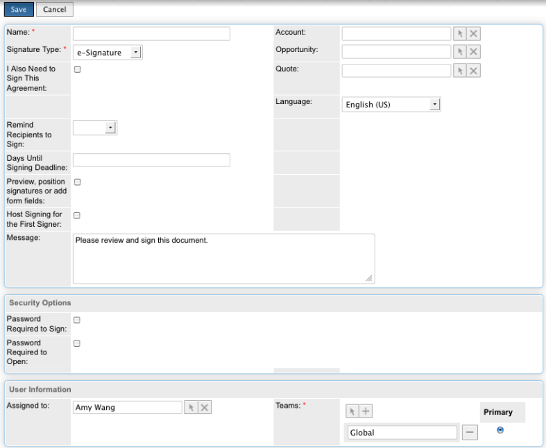

# [!DNL SugarCRM] Guía de instalación {#sugarcrm-install-guide}

[Contactar con Atención al cliente](https://adobe.com/go/adobesign-support-center)

Adobe [!DNL EchoSign] para [!DNL SugarCRM] es una solución líder en firma electrónica y contratación web que ofrece automatización de la firma electrónica en [!DNL SugarCRM] para firmas electrónicas y firmas de fax. Los usuarios pueden enviar contratos directamente desde SugarCRM, ver el historial de contratos y guardar contratos firmados electrónicamente con cuentas, contactos, presupuestos y mucho más asociados.
Adobe [!DNL EchoSign] para [!DNL SugarCRM] está disponible para todas las versiones compatibles de SugarCRM, incluidas las versiones 6.3 a 6.7 para soluciones locales o bajo demanda.

Este documento es una guía para [!DNL SugarCRM] para obtener información sobre cómo instalar y configurar Adobe [!DNL EchoSign] para [!DNL SugarCRM] plugin.

## Instalar este complemento {#install-plugin}

1. Obtener el Adobe [!DNL EchoSign] para [!DNL SugarCRM]  archivo de almacenamiento del [Lista de SugarExchange](http://www.sugarexchange.com/product_details.php?product=1123).
1. Iniciar sesión [!DNL SugarCRM] con su cuenta de administrador.
1. Vaya a **[!UICONTROL Administración]** > **[!UICONTROL Cargador de módulos]**.

   

1. Para cargar el archivo de almacenamiento del Adobe [!DNL EchoSign] para [!DNL SugarCRM] complemento, seleccionar **[!UICONTROL Examinar]**, seleccione el archivo de almacenamiento y, a continuación, seleccione **[!UICONTROL Cargar]**.
1. Después de cargar el archivo de almacenamiento, seleccione **[!UICONTROL Instalar]** para iniciar la instalación.
1. Revise los términos y condiciones y, a continuación, seleccione **[!UICONTROL Aceptar]** > **[!UICONTROL Confirmar]**.
1. Si el complemento se instala correctamente, la barra de progreso indica que se ha realizado el 100 % correctamente.  Si la barra de progreso no alcanza el 100 %, seleccione **[!UICONTROL Mostrar registro]** para ver el error encontrado por SugarCRM.

   

1. Después del montaje, vaya a **[!UICONTROL Administración > Reparar]** y Seleccionar **[!UICONTROL Reparación y reconstrucción rápidas]**.

>[!NOTE]
>
>Si va a instalar el complemento en [!DNL SugarCRM] A petición, presente un ticket de asistencia con [!DNL SugarCRM] para eliminar temporalmente las restricciones del inspector de paquetes para OnDemand, de forma que se pueda instalar el paquete. Esto forma parte del proceso estándar.

## Actualizar el complemento {#upgrade-plugin}

Si va a actualizar el Adobe [!DNL EchoSign] para [!DNL SugarCRM] plugin a una versión más reciente, debe instalar el plugin sin desinstalar la versión anterior.
Después de actualizar el plugin, vaya a **[!UICONTROL Administración]** > **[!UICONTROL Reparar]** y seleccione **[!UICONTROL Reparación y reconstrucción rápidas]**.

**Nota:** Si desinstala un plugin anterior, no elimine las tablas durante la desinstalación. Si no, puede perder el [!DNL EchoSign] datos del acuerdo.

## Configurar el complemento {#configure-plugin}

1. Si ya eres Adobe [!DNL EchoSign] cliente, continúe con el paso 2.

   Si no tiene una [!DNL EchoSign] cuenta, [regístrate para obtener una prueba gratis de 14 días](https://sugarcrmintegration.echosign.com/public/login) y siga los pasos de registro en línea para activar su Adobe [!DNL EchoSign] cuenta.
1. Iniciar sesión en [Cuenta de Echo Sign](http://www.echosign.com) y siga estos pasos:
   1. Seleccionar **[!UICONTROL Cuenta]** .
   1. Seleccionar **[!UICONTROL API de EchoSign]** en el lado inferior izquierdo.
   1. Seleccionar **[!UICONTROL Habilitar acceso a API]** y obtenga su clave de API de la página.

   

1. En SugarCRM, vaya a **[!UICONTROL Administración]** > **[!UICONTROL Configuración de Adobe EchoSign]** e introduzca la clave de API en el campo etiquetado **[!UICONTROL Clave de API de EchoSign]**.
1. Opcionalmente, configure el complemento con los siguientes ajustes:

   1. Adjuntar PDF automáticamente al crear un acuerdo a partir de una oferta: Seleccione si desea adjuntar automáticamente un PDF del presupuesto si un [!DNL SugarCRM] El usuario crea un acuerdo de EchoSign desde el módulo Presupuestos.
   1. Administrar lista de destinatarios: Seleccione los módulos que aparecen en el subpanel Destinatario del [!DNL EchoSign] Módulo Acuerdos. Esto también añade la [!DNL EchoSign] Subpanel Acuerdos de esos módulos.
   1. Añada los botones de envío a estos módulos: Seleccione esta opción si desea la opción Crear [!DNL EchoSign] Botón del acuerdo/acción que se va a incluir con las acciones principales del módulo Presupuesto.
   1. Seleccionar **[!UICONTROL Guardar]** para almacenar la configuración.

**Nota:** El Adobe [!DNL EchoSign] para [!DNL SugarCRM] plugin requiere el [Extensión PHP SOAP](http://www.php.net/manual/en/book.soap.php). Para habilitar la compatibilidad con SOAP, configure PHP con enable-soap.

## Obtener actualizaciones del acuerdo (para [!DNL SugarCRM] versiones 6.3 o posteriores) {#get-agreement-updates}

Para la versión 6.3 y posteriores, puede utilizar las dos opciones siguientes para obtener actualizaciones del acuerdo. En versiones anteriores de SugarCRM, el plugin solo ofrece de forma predeterminada el método de devolución de llamada (opción 1).

### Opción 1: Configurar el método de devolución de llamada para insertar actualizaciones en EchoSign

Si su sitio web es público, puede hacer que Adobe EchoSign haga ping a su [!DNL SugarCRM] siempre que se produzca un nuevo evento. [!DNL SugarCRM] a continuación, actualiza el estado del acuerdo, los eventos y descarga el documento firmado (si se ha firmado) de forma automática y en tiempo real. (Si está tras un firewall, debe incluir en la lista blanca el [!DNL EchoSign] direcciones IP del servidor o utilice el método de trabajo programado para actualizar acuerdos de EchoSign descrito en la siguiente sección de esta guía).

1. Vaya a **[!UICONTROL Administración]** > **[!UICONTROL Configuración de Adobe EchoSign]**.
1. Marque la casilla de verificación **[!UICONTROL Utilizar el método de devolución de llamada de EchoSign]** para actualizar eventos y estados de acuerdos.
1. Seleccionar **[!UICONTROL Guardar]**.

### Opción 2: Configurar una tarea programada para [!DNL SugarCRM] Instancias detrás de un cortafuegos

La [!DNL EchoSign] para [!DNL SugarCRM] El complemento también puede usar un trabajo programado para consultar [!DNL EchoSign] para obtener actualizaciones de los acuerdos enviados para firmar. El método de consulta de trabajo programado se puede utilizar si tiene un [!DNL SugarCRM] la instalación se realiza tras un firewall.

Para configurar:

1. Vaya a **[!UICONTROL Administración]** > **[!UICONTROL Planificador]**.
1. En el menú desplegable de pestañas, seleccione **[!UICONTROL Crear programador]**.
1. Introduzca un nombre de trabajo.
1. En el campo Trabajo, seleccione **[!UICONTROL Adobe EchoSign Status Updater]**.
1. Configure el trabajo para que se ejecute con la frecuencia necesaria. Sugerimos configurarlo para que se ejecute cada 10 minutos, lo que significa que, después de abrir, leer o firmar un acuerdo, puede tardar hasta 10 minutos en [!DNL SugarCRM] que se actualizarán con dicha información.

   **Nota:** Si tiene muchos acuerdos pendientes de firma, si esta ejecución se realiza con demasiada frecuencia, el sistema puede ralentizarse.

   

1. Vaya a **[!UICONTROL Administración]** > **[!UICONTROL Configuración de Adobe EchoSign]**.
1. Desmarque la casilla **[!UICONTROL Utilizar el método de devolución de llamada de EchoSign]** para actualizar eventos y estados de acuerdos.
1. Seleccionar **[!UICONTROL Guardar]**.
Nota: Activar los programadores en [!DNL SugarCRM] para que esto funcione.

Para agregar acuerdos de EchoSign a otros [!DNL SugarCRM] módulos:

1. Vaya a **[!UICONTROL Administración]** > **[!UICONTROL Studio]**.
1. En el árbol de carpetas de la columna izquierda, seleccione el módulo para añadir [!DNL EchoSign] Acuerdos.
1. Seleccionar **[!UICONTROL Relaciones]**> **[!UICONTROL Agregar relaciones]**.
1. En el menú desplegable, seleccione Escribir como **[!UICONTROL Uno a varios]** y Módulo como **[!UICONTROL Acuerdos de EchoSign]**.
1. Seleccionar **[!UICONTROL Guardar e implementar]**.

   

   [!DNL EchoSign] Los acuerdos aparecen ahora en el módulo y se pueden crear y realizar seguimientos allí.

   

**Otros pasos de configuración**

* **Ocultación [!DNL EchoSign] Módulos**: Puede ocultar el [!DNL EchoSign] Destinatarios y [!DNL EchoSign] Módulos de eventos yendo a Administración&quot; Mostrar fichas y subpaneles de módulos y moviéndolos a la columna oculta.
* **Deshabilitando packageScan**: Si ha activado packageScan en su propio sistema, deberá desactivarlo durante la instalación. Si está utilizando [!DNL SugarCRM] Bajo demanda, contacto [!DNL SugarCRM] para desactivar packageScan.

## Desinstalar el complemento {#uninstall-plugin}

1. Iniciar sesión [!DNL SugarCRM] con su cuenta de administrador.
1. Vaya a **[!UICONTROL Administración]** > **[!UICONTROL Cargador de módulos]**.
1. Seleccionar **[!UICONTROL Desinstalar]** junto a la [!UICONTROL Complemento EchoSign para SugarCRM].
1. Seleccionar **[!UICONTROL Confirmar]** para iniciar la desinstalación. También puede optar por eliminar las tablas de base de datos creadas para el complemento.

   

   Si el plugin se desinstala correctamente, la barra de progreso indica que se ha realizado el 100 % correctamente. Si la barra de progreso no alcanza el 100 %, seleccione [!UICONTROL Mostrar registro] para ver el error encontrado por SugarCRM.

   

## Usar Adobe [!DNL EchoSign] para [!DNL SugarCRM] {#use-echosign-for-sugarcrm}

Puede crear un Adobe [!DNL EchoSign] acuerdo asociado a una cuenta, contacto, presupuesto u otro [!DNL SugarCRM] módulos. Puede adjuntar archivos, especificar destinatarios y enviarlos para su firma. Adobe [!DNL EchoSign] actualizaciones [!DNL SugarCRM] con el estado actual del acuerdo y almacena el contrato firmado en [!DNL SugarCRM] una vez que se ejecute completamente.

### Creación y edición de un Adobe [!DNL EchoSign] acuerdo {#create-edit-agreements}

Puede crear acuerdos a través del [!DNL EchoSign] Módulo Acuerdos o mediante módulos configurados por un [!DNL SugarCRM] administrador.

1. Desde el [!UICONTROL Acciones] en la lista [!UICONTROL Acuerdos de EchoSign] , seleccione **[!UICONTROL Crear acuerdo de EchoSign]**.
1. En la sección principal del [!DNL EchoSign] Acuerdo, introduzca la siguiente información o seleccione una de las diferentes opciones del acuerdo:

   1. **[!UICONTROL Nombre:]** Introduzca un nombre para el acuerdo.
   1. **[!UICONTROL Tipo de firma:]** Seleccione el tipo de firma aceptado para el documento. Las opciones son Firma electrónica y Firma de fax.
   1. **[!UICONTROL También necesito firmar este acuerdo:]** Indique si el remitente también debe firmar el acuerdo.
   1. **[!UICONTROL Orden de firma:]** Si la opción anterior También necesito firmar este acuerdo está activada, seleccione también el orden en el que el remitente y los destinatarios deben firmar.
   1. **[!UICONTROL Recordar a los destinatarios que firmen:]** Seleccione la frecuencia con la que se le recordará a un destinatario que firme un documento. Las opciones son Diario o Semanal.
   1. **[!UICONTROL Días hasta la fecha límite de firma:]** Especifique el número de días hasta que se firme el acuerdo.
   1. **[!UICONTROL V. previa, pos. firm. o añadir campos d/form.:]**  Seleccione esta opción para obtener una vista previa del acuerdo antes de enviarlo, o bien arrastre y suelte campos de firma, campos iniciales u otros campos de formulario en el acuerdo antes de enviarlo a los destinatarios. Después de previsualizar el documento o arrastrar los campos que desee al documento, recuerde seleccionar el botón Enviar para enviar el acuerdo al destinatario.
   1. **[!UICONTROL Firma de host para el primer firmante:]** Indique si el remitente desea alojar el acuerdo firmando en persona.
      * **[!UICONTROL Mensaje:]** Incluir un mensaje para el destinatario.
      * **[!UICONTROL Cuenta, Oportunidad, Presupuesto:]** Seleccione o modifique la cuenta, la oportunidad o el presupuesto asociados a este acuerdo.
      * **[!UICONTROL Idioma:]** Especifique el idioma en el que se mostrarán a los destinatarios la página de firma y las notificaciones por correo electrónico.

      

1. En la [!UICONTROL Opciones de seguridad] sección de la [!UICONTROL Acuerdo de EchoSign], introduzca la siguiente información:

   a) **[!UICONTROL Contraseña necesaria para firmar:]** Indica si se debe introducir una contraseña para que un destinatario pueda firmar un documento.
b) **[!UICONTROL Contraseña necesaria para abrir:]** Indique si se debe introducir una contraseña para que un destinatario pueda abrir un PDF del acuerdo o del acuerdo firmado c) **[!UICONTROL Contraseña:]** Especifique la contraseña que desea utilizar para firmar o abrir un documento.
d) **[!UICONTROL Confirmar contraseña:]** Confirme la contraseña que desea utilizar para firmar o abrir un documento.

1. En la sección Otros de la [!DNL EchoSign] Acuerdo, introduzca la siguiente información:

   a) **[!UICONTROL Usuario:]** Especificar una [!DNL SugarCRM] usuario. El valor predeterminado es el usuario que tiene iniciada sesión en el sistema.
b) **[!UICONTROL Equipos:]** Para cambiar la asignación de equipo principal, introduzca el nombre del nuevo equipo principal. Para asignar equipos adicionales al registro, haga clic en **[!UICONTROL Seleccionar]** y seleccione un equipo de la Lista de equipos, o bien seleccione **[!UICONTROL Añadir a]** para agregar campos de equipo e introducir los nombres del equipo. Para obtener más información, consulte &quot;Asignación de registros a usuarios y equipos&quot; en el [!DNL SugarCRM] Guía de aplicaciones.

1. Seleccionar **[!UICONTROL Guardar]**.

### [!DNL EchoSign] vista detalle del acuerdo {#agreement-detail-view}

Después de un [!DNL EchoSign] Tras guardar el acuerdo, la vista Detalle del acuerdo incluye los siguientes subpaneles:

* **[!UICONTROL Destinatarios:]** Los contactos enumerados en este subpanel reciben los documentos especificados en el subpanel Documentos. Debe añadir uno o más destinatarios antes de enviar el acuerdo.
* **[!UICONTROL Documentos:]** Cargar un nuevo documento o seleccionar un documento ya cargado en [!DNL SugarCRM] para enviar para firmar.
* **[!UICONTROL Eventos:]** Cualquier acción relativa al acuerdo, como cuándo se envió para firmar, se visualizó o se firmó, se enumera en este subpanel.
Para editar un [!DNL EchoSign] Acuerdo, seleccione el [!UICONTROL Editar] del botón [!UICONTROL Vista de detalles] del acuerdo.

**Nota:** Después de enviar un acuerdo para su firma, el [!UICONTROL Editar] se elimina de la vista Detalle para conservar el registro de eventos. Sin embargo, puede habilitar el botón Editar. Para ello, vaya a [!UICONTROL Administrador] > [!UICONTROL Configuración de Adobe EchoSign] y desmarque la opción *[!UICONTROL Después de enviar un acuerdo para firmar, desactive la capacidad de editar o eliminar]*.

### Agregar un documento a un [!DNL EchoSign] acuerdo {#add-document}

[!DNL SugarCRM] los usuarios pueden cargar un nuevo documento o seleccionar uno que ya esté cargado en [!DNL SugarCRM] mediante el subpanel Documentos de un registro de acuerdo de EchoSign.
Para cargar un documento, seleccione **[!UICONTROL Cargar documento]** en el [!UICONTROL Documentos] subpanel.

Consulte la sección &quot;Módulo Documentos&quot; de la [!DNL SugarCRM] Guía de aplicación para obtener más información sobre los campos individuales de ese formulario.

Para seleccionar un documento, haga clic en **[!UICONTROL Seleccionar]** en el subpanel Documentos. Consulte &quot;Visualización y gestión de información de registros&quot; en el [!DNL SugarCRM] Guía de aplicación para obtener más información sobre cómo administrar información relacionada en los subpaneles.

### Especificar un destinatario para un [!DNL EchoSign] acuerdo {#specify-recipient}

1. Desde el [!UICONTROL Destinatario] subpanel de un [!DNL EchoSign] Acuerdo, seleccione **[!UICONTROL Añadir destinatario]**.
1. Introduzca la siguiente información: a) [!UICONTROL Destinatario:] Seleccione el tipo de destinatario en el menú desplegable. Escriba el nombre o la dirección de correo electrónico del destinatario en el campo de texto. [!DNL SugarCRM] busca el nombre mientras escribe y ofrece una lista de selecciones. Seleccione un nombre si se encuentra una coincidencia. También puede seleccionar el icono de flecha para seleccionar un nombre en una ventana emergente. Para borrar el nombre del campo, seleccione la **[!UICONTROL X]** icono.
b) [!UICONTROL Función:] Seleccione un rol en el menú desplegable. Las opciones son Firmante y CC y Aprobador. Un aprobador no tiene que firmar el documento.
1. Seleccione Guardar.

### Enviar acuerdos para firmar {#send-for-signature}

Cuando los acuerdos estén listos para enviarse para su firma, seleccione **[!UICONTROL Send for Signature]** en el menú desplegable situado en la parte superior izquierda de la página. A continuación, los destinatarios reciben un correo electrónico informándoles de los documentos pendientes de su firma. Después de que los destinatarios firmen el documento, el remitente recibe una notificación por correo electrónico.
Si el [!UICONTROL Firma de host para primer firmante] está marcada, puede seleccionar **[!UICONTROL Send for Signature]** para permitir que el firmante firme el documento con el remitente presente.

A **[!UICONTROL Firma de host para el firmante actual]** también aparece junto al vínculo [!UICONTROL Firma de host para primer firmante] , a la que se puede acceder hasta que se firme el documento. Puede utilizar este vínculo para alojar la firma de acuerdos para varios firmantes o para volver a abrir la ventana emergente si se cierra accidentalmente.
Si [!UICONTROL V. previa, pos. firm. o añadir campos d/form.] está marcada, seleccionar **[!UICONTROL Send for Signature]** para permitir que el remitente obtenga una vista previa del documento o arrastre campos al documento antes de enviarlo. Debe seleccionar **[!UICONTROL Enviar]** en esa ventana para enviar el acuerdo al destinatario.

Figura 5: Seleccione Send for Signature para enviar un documento a un destinatario para que lo firme.

### Enviar desde un registro de presupuesto {#send-from-quote-record}

Adobe [!DNL EchoSign] tiene una integración directa con Presupuestos en [!DNL SugarCRM] de forma que el PDF del presupuesto se genere automáticamente y se adjunte al registro del acuerdo.
Al visualizar un presupuesto, seleccione **[!UICONTROL Crear acuerdo de EchoSign]** para generar el presupuesto y adjuntarlo automáticamente al acuerdo. El nuevo acuerdo también asocia automáticamente cualquier oportunidad, cuenta o presupuesto relacionado.

Para desactivar la adición automática del PDF de presupuesto al acuerdo, vaya a **[!UICONTROL Administración]** > **[!UICONTROL Configuración de Adobe EchoSign]** y desmarque la casilla *[!UICONTROL Adjuntar PDF automáticamente al crear un acuerdo a partir de un presupuesto]*.

### Cancelar un acuerdo {#cancel-agreement}

Puede cancelar una [!DNL EchoSign] Acuerdo una vez enviado para firmar si todos los destinatarios aún no han firmado el documento. A [!UICONTROL Cancelar acuerdo] aparece en la vista Detalle de un acuerdo después de enviar un documento para su firma. Seleccionar **[!UICONTROL Cancelar acuerdo]** para cancelar el acuerdo.

Nota: Si un [!DNL EchoSign] El acuerdo se envía para su firma y se elimina el registro. Debe cancelar el acuerdo antes de eliminarlo.

### Seguimiento de firmas {#track-signatures}

La [!UICONTROL Eventos] subpanel de un [!DNL EchoSign] El acuerdo realiza un seguimiento del estado de los acuerdos que se envían para firmar. Para ver las actualizaciones más recientes de un [!DNL EchoSign] Acuerdo, seleccione **[!UICONTROL Actualizar estado]**. La [!UICONTROL Actualizar estado] solo está disponible después de enviar un acuerdo para su firma.

Después de enviar un acuerdo para su firma, seleccione **[!UICONTROL Actualizar estado]** para recuperar el estado más reciente.

### Enviar recordatorios {#send-reminders}

Para enviar un recordatorio al firmante actual después de enviar el acuerdo, seleccione **[!UICONTROL Enviar recordatorio]**. Envía inmediatamente un recordatorio por correo electrónico al firmante actual sobre el acuerdo pendiente de firma.

