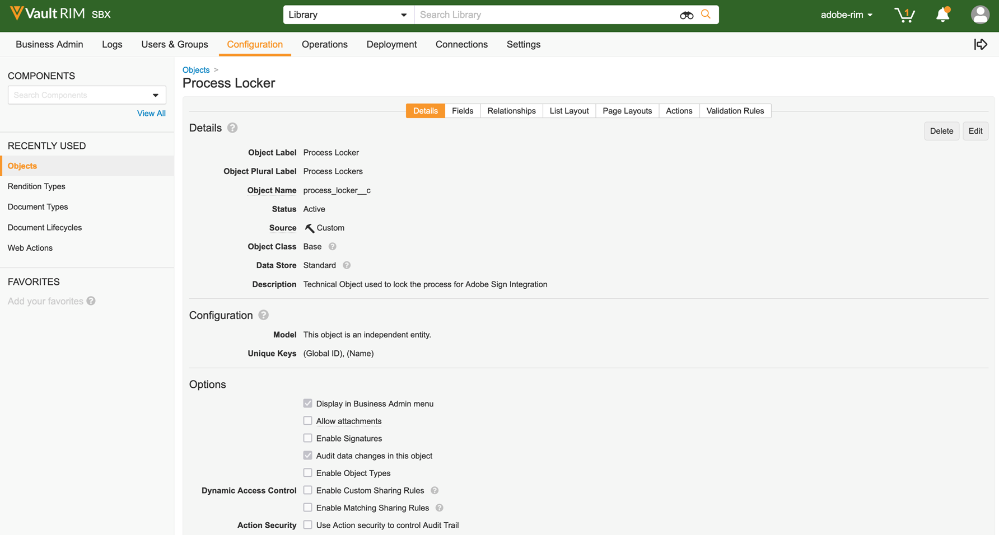
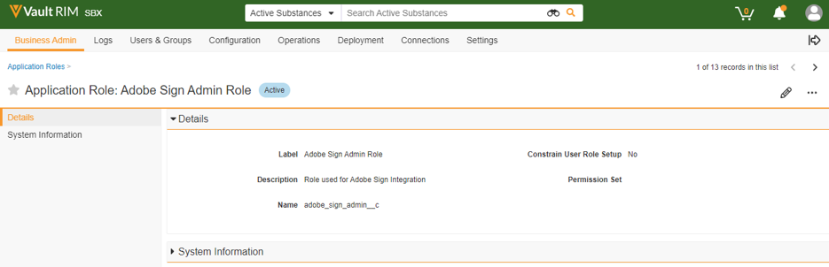

# [!DNL Veeva Vault] Guía de instalación{#veeva-installation-guide}

[**Contactar con el servicio de soporte técnico de Adobe Sign**](https://adobe.com/go/adobesign-support-center_es)

## Información general {#overview}

Este documento explica cómo establecer la integración de Adobe Sign con [!DNL Veeva Vault] para crear una plataforma. [!DNL Veeva Vault] es una plataforma de administración de contenido empresarial (ECM, Enterprise Content Management ) creada para ciencias biológicas. Un &quot;Vault&quot; es un repositorio de contenido y datos con uso típico para archivos de regulación, informes de investigación, solicitudes de subvenciones, contratación general y mucho más. Una sola empresa puede tener varias &quot;cámaras&quot; que se deben mantener por separado.

Los pasos de alto nivel para completar la integración son:

* Activar su cuenta administrativa en Adobe Sign (solo nuevos clientes)
* Cree objetos para realizar un seguimiento del historial de un ciclo de vida de un acuerdo en Vault.
* Cree un nuevo perfil de seguridad.
* Configure un grupo en Adobe Sign para mantener el [!DNL Veeva Vault] usuario de integración.
* Crear campos de documento y copias.
* Configure acciones web y actualice el ciclo de vida del documento.
* Crear configuración de usuario y función de usuario del tipo de documento.

>[!NOTE]
>
>El administrador de Adobe Sign debe realizar los pasos de configuración de Adobe Sign en Adobe Sign.

## Configure [!DNL Veeva Vault] {#configure-veeva}

Para configurar [!DNL Veeva Vault] para la integración con Adobe Sign, cree determinados objetos que ayuden a realizar un seguimiento del historial de un ciclo de vida de un acuerdo en Vault. Los administradores deben crear los siguientes objetos:

* Firma
* Firmante
* Evento de firma
* Almacén de procesos

### Crear objeto de firma  {#create-signature-object}

El objeto Signature se crea para almacenar información relacionada con el acuerdo. Un objeto Signature es una base de datos que contiene información en los siguientes campos específicos:

**Campos de objeto de firma**

| Campo | Etiqueta | Tipo | Descripción |
| --- | --- | ---| --- | 
| external_id__c | Id de acuerdo | Cadena (100) | Contiene el ID exclusivo del acuerdo de Adobe Sign |
| file_hash__c | Archivo hash | Cadena (50) | Contiene la suma de comprobación md5 del archivo que se ha enviado a Adobe Sign |
| name__v | Nombre | Cadena (128) | Contiene el nombre del acuerdo |
| sender__c | Remitente | Objeto (usuario) | Contiene la referencia al usuario de Vault que ha creado el acuerdo |
| signature_status__c | Estado de firma | Cadena (75) | Mantiene el estado del acuerdo en Adobe Sign |
| signature_type__c | Tipo de firma | Cadena (20) | Contiene el tipo de firma del acuerdo en Adobe Sign (ESCRITA o ESIGN) |
| start_date__c | Fecha de inicio | Fecha y hora | Fecha en que el acuerdo se ha enviado para su firma |
| cancelation_date__c | Fecha de cancelación | Fecha y hora | Mantiene la fecha en la que se ha cancelado el acuerdo. |
| complete_date__c | Fecha de finalización | Fecha y hora | Mantiene la fecha en la que se ha completado el acuerdo. |
| viewable_rendition_used__c | Versión visible utilizada | Booleano | Indicador que indica si se ha enviado una copia visible para su firma. (de forma predeterminada, es true) |

### Crear objeto de firma {#create-signatory-object}

El objeto firmante se crea para almacenar información relacionada con los participantes en un acuerdo. Contiene información en los siguientes campos específicos:

**Campos de objeto firmante**

| Campo | Etiqueta | Tipo | Descripción |
| --- | --- | ---| --- | 
| email__c | Correo electrónico | Cadena (120) | Contiene el ID exclusivo del acuerdo de Adobe Sign |
| external_id__c | ID de participante | Cadena (80) | Contiene el identificador de participante único de Adobe Sign |
| name__v | Nombre | Cadena (128) | Contiene el nombre del participante de Adobe Sign |
| order__c | Ordenar | Número | Contiene el número de pedido del participante en el acuerdo de Adobe Sign |
| role_c | Función | Cadena (30) | Mantiene la función de participante en el acuerdo de Adobe Sign |
| signature_c | Firma | Objeto (firma) | Contiene la referencia al registro principal de la firma. |
| signature_status__c | Estado de firma | Cadena (100) | Mantiene el estado del participante en el acuerdo de Adobe Sign |
| user_c | Usuario | Objeto (usuario) | Mantiene la referencia al registro de usuario del firmante si el participante es un usuario de Vault |

### Crear objeto de evento de firma  {#create-signature-event}

El objeto Evento de firma se crea para almacenar la información relacionada con los eventos de un acuerdo. Contiene información en los siguientes campos específicos:

| Campo | Etiqueta | Tipo | Descripción |
| --- | --- | ---| --- | 
| action_user_email__c | Correo electrónico del usuario activo | Cadena | Contiene el correo electrónico del usuario de Adobe Sign que realizó la acción que causó que se generara el evento |
| action_user_name__c | Nombre de usuario interino | Cadena | Contiene el nombre del usuario de Adobe Sign que realizó la acción que causó que se generara el evento |
| description__c | Descripción | Cadena | Contiene la descripción del evento de Adobe Sign |
| event_date__c | Fecha del evento | Fecha y hora | Mantiene la fecha y hora del evento de Adobe Sign |
| event_type__c | Tipo de evento | Cadena | Contiene el tipo del evento de Adobe Sign |
| name__v | Nombre | Cadena | Nombre de evento generado automáticamente |
| participant_comment__c | Comentario del participante | Cadena | Mantiene el comentario del participante en Adobe Sign, si lo hubiera |
| participant_email__c | Correo electrónico del participante | Cadena | Mantiene el correo electrónico del participante en Adobe Sign |
| participant_role__c | Función de participante | Cadena | Mantiene la función del participante en Adobe Sign |
| signature_c | Firma | Objeto (firma) | Contiene la referencia al registro principal de la firma. |

### Crear objeto Process Locker  {#create-process-locker}

Se crea un objeto Process Locker para bloquear el proceso de integración de Adobe Sign. No requiere campos personalizados.

## Crear perfiles de seguridad{#security-profiles}

Para lograr una integración satisfactoria de la caja fuerte, se ha creado un nuevo perfil de seguridad denominado *Perfil de integración de Adobe Sign* y su permiso está establecido para *Acciones de administración de Adobe Sign*. El perfil de integración de Adobe Sign está asignado a la cuenta del sistema y lo utiliza la integración al llamar a las API de Vault. Este perfil permite permisos para:

* API de Vault
* Lectura, creación, edición y eliminación: Firma, firma, eventos de firma y objetos de Cajero de procesos

Los perfiles de seguridad de los usuarios que requieren acceso al historial de Adobe Sign en Vault deben tener permisos de lectura para los objetos de firma, firma y evento de firma.

## Crear grupo {#create-group}

Para configurar Adobe Sign para [!DNL Vault], un nuevo grupo llamado *Adobe Sign Admin Group* se crea. Este grupo se utiliza para establecer la seguridad a nivel de campo del documento para los campos relacionados con Adobe Sign y debe incluir *Perfil de integración de Adobe Sign* de forma predeterminada.

## Crear usuario {#create-user}

El usuario de la cuenta del sistema Vault de la integración con Adobe Sign debe:

* Tener perfil de integración de Adobe Sign
* Tener un perfil de seguridad
* Tiene una directiva de seguridad específica que deshabilita la caducidad de la contraseña
* Sé miembro del Grupo de administración de Adobe Sign.

Para asegurarse de que el usuario de la cuenta del sistema pertenece al Grupo de administración de Adobe Sign para el ciclo de vida del documento específico, debe crear registros de configuración de función de usuario.

## Crear funciones de aplicación {#create-application-roles}

Debe crear la función de aplicación llamada *Función de administración de Adobe Sign*. Esta función se debe definir en el ciclo de vida de cada tipo de documento que cumpla los requisitos para la firma de Adobe. Para cada uno de los estados específicos del ciclo de vida de Adobe Sign, la función de administración de Adobe Sign se agrega y configura con los permisos adecuados.

## Crear campos de documento {#create-fields}

Para establecer la integración con Adobe Sign, los administradores deben crear los dos campos de documento compartido siguientes:

* Firma (signature__c)
* Permitir acciones de usuario de Adobe Sign (allow_adobe_sign_user_actions__c)

Estos campos compartidos deben agregarse a todos los tipos de documento que cumplen los requisitos para firmar con Adobe. Ambos campos deben tener una seguridad específica que permita que solo los miembros del grupo de administración de Adobe Sign actualicen sus valores.

Los administradores deben agregar el campo compartido existente *Deshabilitar superposiciones de almacén (disable_vault_overlays__v)* y establézcalo en Activo para todos los tipos de documento que cumplan los requisitos para firmar con Adobe. Opcionalmente, el campo puede tener una seguridad específica que permita que solo los miembros del grupo de administración de Adobe Sign actualicen su valor.

## Crear copias de documento {#create-renditions}

Los administradores deben crear un nuevo tipo de copia denominado *Adobe Sign Rendition (adobe_sign_rendition__c)*, que utiliza la integración de Vault para cargar documentos de PDF firmados en Adobe Sign. La copia de Adobe Sign debe declararse para cada tipo de documento que cumpla los requisitos para la firma de Adobe.

## Configurar acciones web {#web-actions}

La integración de Adobe Sign y Vault requiere la creación y configuración de dos acciones web:

* **Crear Adobe Sign**: Crea o muestra Adobe Sign Agreement.

   Tipo: Destino del documento: Mostrar en URL de almacén: <https://api.na1.adobesign.com/api/gateway/veevavaultintsvc/partner/agreement?docId=${Document.id}&majVer=${Document.major_version_number__v}&minVer=${Document.minor_version_number__v}&vaultid=${Vault.id}&useWaitPage=true>

* **Cancelar Adobe Sign**: Cancela un acuerdo existente en Adobe Sign y devuelve el estado de un documento al inicial.

   Tipo: Destino del documento: Mostrar en URL de almacén: : <https://api.na1.adobesign.com/api/gateway/veevavaultintsvc/partner/agreement/cancel?docId=${Document.id}&majVer=${Document.major_version_number__v}&minVer=${Document.minor_version_number__v}&vaultid=${Vault.id}&useWaitPage=true>

## Actualizar el ciclo de vida del documento {#document-lifecycle}

Para cada tipo de documento que cumple los requisitos para la firma de Adobe, el ciclo de vida del documento correspondiente debe actualizarse añadiendo nuevos estados y funciones del ciclo de vida.

### Función de ciclo de vida {#lifecycle-role}

La función de la aplicación de administración de Adobe Sign debe agregarse en todos los ciclos de vida utilizados por los documentos que cumplen los requisitos para la firma de Adobe. Esta función debe crearse con las siguientes opciones:

* Activar control de acceso dinámico
* Reglas de uso compartido de documentos que solo incluyen grupo de tipo de documento

### Estados del ciclo de vida {#lifecycle-states}

El ciclo de vida del acuerdo de Adobe Sign tiene los siguientes estados:

* BORRADOR
* AUTHORING o DOCUMENTS_NOT_YET_PROCESSED
* OUT_FOR_SIGNATURE o OUT_FOR_APPROVAL
* FIRMADO o APROBADO
* CANCELADA
* CADUCADO

Cuando se envía un documento de Vault a Adobe Sign, su estado debe corresponder al estado en el que se encuentra el acuerdo. Para ello, añada los siguientes estados en todos los ciclos de vida utilizados por los documentos aptos para firmar Adobe:

* **Antes de la firma de Adobe** (Revisado): Es un nombre de marcador de posición para el estado desde el que se puede enviar el documento a Adobe Sign. Según el tipo de documento, puede ser Borrador o Revisado. La etiqueta de estado del documento se puede personalizar según los requisitos del cliente. Antes de que el estado de firma de Adobe defina las dos acciones de usuario siguientes:

   * Acción que cambia el estado del documento a *En Adobe Sign Draft* estado. El nombre de esta acción de usuario debe ser el mismo para todos los tipos de documento para cualquier ciclo de vida. Si es necesario, los criterios para esta acción se pueden establecer en &quot;Permitir acciones de usuario de Adobe Sign es igual a Sí&quot;.
   * Acción que llama a la acción web &quot;Adobe Sign&quot;. Este estado debe tener seguridad que permita a la función de administración de Adobe Sign: ver el documento, ver el contenido, editar campos, editar relaciones, descargar el origen, administrar la representación visible y cambiar el estado.

      

* **En Adobe Sign Draft**: Es un nombre de marcador de posición para el estado que indica que el documento ya se ha cargado en Adobe Sign y que su acuerdo está en estado DRAFT. Es un estado obligatorio. Este estado debe definir las siguientes cinco acciones de usuario:

   * Acción que cambia el estado del documento a *En Adobe Sign Authoring* estado. El nombre de esta acción de usuario debe ser el mismo para todos los tipos de documento para cualquier ciclo de vida. Si es necesario, los criterios para esta acción se pueden establecer en &quot;Permitir acciones de usuario de Adobe Sign es igual a Sí&quot;.
   * Acción que cambia el estado del documento a *En el estado Firma de Adobe*. El nombre de esta acción de usuario debe ser el mismo para todos los tipos de documento para cualquier ciclo de vida. Si es necesario, los criterios para esta acción se pueden establecer en &quot;Permitir acciones de usuario de Adobe Sign es igual a Sí&quot;.
   * Acción que cambia el estado del documento a *Adobe Sign cancelado* estado. El nombre de esta acción de usuario debe ser el mismo para todos los tipos de documento para cualquier ciclo de vida. Si es necesario, los criterios para esta acción se pueden establecer en &quot;Permitir acciones de usuario de Adobe Sign es igual a Sí&quot;.
   * Acción que llama a la acción web &quot;Adobe Sign&quot; .
   * Acción que llama a la acción web &quot;Cancelar Adobe Sign&quot;. Este estado debe tener seguridad que permita a la función de administrador de Adobe Sign: ver el documento, ver el contenido, editar campos, editar relaciones, descargar el origen, administrar la representación visible y cambiar el estado.

      

* **En Adobe Sign Authoring**: Es un nombre de marcador de posición para el estado que indica que el documento ya se ha cargado en Adobe Sign y que su acuerdo está en estado AUTHORING o DOCUMENTS_NOT_YET_PROCESSED. Es un estado obligatorio. Este estado debe tener definidas cuatro acciones de usuario:

   * Acción que cambia el estado del documento al estado Cancelado de Adobe Sign. El nombre de esta acción del usuario debe ser el mismo para todos los tipos de documento, independientemente del ciclo de vida. Si es necesario, los criterios para esta acción se pueden establecer en &quot;Permitir acciones de usuario de Adobe Sign es igual a Sí&quot;.
   * Acción que cambia el estado del documento al estado Firma en Adobe. El nombre de esta acción del usuario debe ser el mismo para todos los tipos de documento, independientemente del ciclo de vida. Si es necesario, los criterios para esta acción se pueden establecer en &quot;Permitir acciones de usuario de Adobe Sign es igual a Sí&quot;.
   * Acción que llama a la acción web &quot;Adobe Sign&quot;
   * Acción que llama a la acción web &quot;Cancelar Adobe Sign&quot;. Este estado debe tener seguridad que permita a la función de administrador de Adobe Sign: ver el documento, ver el contenido, editar campos, editar relaciones, descargar el origen, administrar la representación visible y cambiar el estado.

      

* **Firma en Adobe**: Es un nombre de marcador de posición para el estado que indica que el documento se ha cargado en Adobe Sign y que su acuerdo ya se ha enviado a los participantes (estado OUT_FOR_SIGNATURE o OUT_FOR_APPROVAL). Es un estado obligatorio. Este estado debe tener definidas las cinco acciones de usuario siguientes:

   * Acción que cambia el estado del documento al estado Cancelado de Adobe Sign. El estado de destino de esta acción puede ser cualquier requisito del cliente y puede ser diferente para diferentes tipos. El nombre de esta acción del usuario debe ser el mismo para todos los tipos de documento, independientemente del ciclo de vida. Si es necesario, los criterios para esta acción se pueden establecer en &quot;Permitir acciones de usuario de Adobe Sign es igual a Sí&quot;.
   * Acción que cambia el estado del documento al estado Rechazado de Adobe Sign. El estado de destino de esta acción puede ser cualquier requisito del cliente y puede ser diferente para diferentes tipos. El nombre de esta acción del usuario debe ser el mismo para todos los tipos de documento, independientemente del ciclo de vida. Si es necesario, los criterios para esta acción se pueden establecer en &quot;Permitir acciones de usuario de Adobe Sign es igual a Sí&quot;.
   * Acción que cambia el estado del documento al estado Adobe firmado. El estado de destino de esta acción puede ser cualquier requisito del cliente y puede ser diferente para diferentes tipos. Sin embargo, el nombre de esta acción del usuario debe ser el mismo para todos los tipos de documento, independientemente del ciclo de vida. Si es necesario, los criterios para esta acción se pueden establecer en &quot;Permitir acciones de usuario de Adobe Sign es igual a Sí&quot;.
   * Acción que llama a la acción web *Adobe Sign*.
   * Acción que llama a Acción web *Cancelar Adobe Sign*. Este estado debe tener seguridad que permita a la función de administrador de Adobe Sign: ver el documento, ver el contenido, editar campos, editar relaciones, descargar el origen, administrar la representación visible y cambiar el estado.

      

* **Adobe firmado (aprobado)**: Es un nombre de marcador de posición para el estado que indica que el documento se ha cargado en Adobe Sign y que el acuerdo se ha completado (estado FIRMADO o APROBADO). Es un estado obligatorio y puede ser un estado de ciclo de vida existente, como Aprobado.
Este estado no requiere acciones del usuario. Este estado debe tener seguridad que permita a la función de administrador de Adobe Sign: ver documentos, ver contenido y editar campos.

En el siguiente diagrama se ilustran las asignaciones entre los estados del acuerdo de Adobe Sign y del documento Vault, donde el estado &quot;Antes de la firma de Adobe&quot; es Borrador.

## Configuración del grupo de tipo de documento y de función de usuario  {#document-type-group-user-role}

### Crear grupo de tipo de documento {#create-document-type-group}

Los administradores deben crear un nuevo registro de grupo de tipo de documento denominado &quot;Documento de Adobe Sign&quot;. Este grupo de tipos de documento se añade para todas las clasificaciones de documentos que cumplen los requisitos para el proceso de Adobe Sign. Dado que la propiedad de grupo de tipo de documento no se hereda de tipo a subtipo ni de subtipo a nivel de clasificación, debe establecerse para cada clasificación de documento que sea apta para Adobe Sign.

### Crear configuración de función de usuario {#create-user-role-setup}

Una vez que los ciclos de vida estén correctamente configurados, el sistema debe asegurarse de que el usuario administrador de Adobe Sign sea agregado por DAC para todos los documentos que sean aptas para el proceso de Adobe Sign. Para ello, se crea el registro de configuración de función de usuario adecuado que especifica:

* Grupo de tipos de documento como &quot;Documento de Adobe Sign&quot;,
* Función de aplicación como &quot;Función de administración de Adobe Sign&quot; y
* Usuario de integración.

>[!NOTE]
>
>Si el objeto Configuración de función de usuario no contiene el campo que hace referencia al objeto Grupo de tipo de documento, debe agregarse este campo.

## Conectar [!DNL Veeva Vault] a Adobe Sign mediante middleware {#connect-middleware}

Después de completar la configuración para [!DNL Veeva Vault] y la cuenta de administrador de Adobe Sign, el administrador debe crear una conexión entre las dos cuentas mediante el middleware. El [!DNL Veeva Vault] y la conexión de cuenta de Adobe Sign la inicia Adobe Sign Identity y, a continuación, se utiliza para almacenar la identidad de Veeva Vault.
Para la seguridad y estabilidad del sistema, el administrador debe utilizar un [!DNL Veeva Vault] cuenta de sistema/servicio/utilidad, como `adobe.for.veeva@xyz.com`, en lugar de una cuenta de usuario personal, como `bob.smith@xyz.com`.

Un administrador de cuentas de Adobe Sign debe seguir los pasos que se indican a continuación para conectarse [!DNL Veeva Vault] a Adobe Sign mediante middleware:

1. Vaya a [Adobe Sign para [!DNL Veeva Vault] Página principal](https://static.adobesigncdn.com/veevavaultintsvc/index.html).
1. Seleccionar **[!UICONTROL Inicio]** en la esquina superior derecha.

   

1. En la página de inicio de sesión de Adobe Sign que se abre, proporcione el correo electrónico y la contraseña del administrador de la cuenta y, a continuación, seleccione **[!UICONTROL Iniciar sesión]**.

   

   Después de iniciar sesión correctamente, la página muestra el ID de correo electrónico asociado y una ficha Configuración, como se muestra a continuación.

   

1. Seleccione el **[!UICONTROL Configuración]** .

   La página Configuración muestra las conexiones disponibles y no muestra ninguna en el caso de la primera configuración de conexión, como se muestra a continuación.

   

1. Seleccionar **[!UICONTROL Agregar conexión]** para agregar una nueva conexión.

1. En el cuadro de diálogo Agregar conexión que se abre, proporcione los detalles necesarios, incluido el [!DNL Veeva Vault] credenciales.

   Las credenciales de Adobe Sign se rellenan automáticamente desde el inicio de sesión inicial de Adobe Sign.

   

1. Seleccionar **[!UICONTROL Validar]** para validar los detalles de la cuenta.

   Si la validación se ha realizado correctamente, verá una notificación &quot;El usuario se validó correctamente&quot;, como se muestra a continuación.

   

1. Para restringir el uso a un grupo de Adobe Sign en particular, expanda el **[!UICONTROL Grupo]** y seleccione uno de los grupos disponibles.

   

1. Seleccionar **[!UICONTROL Guardar]** para guardar la nueva conexión.

   La nueva conexión aparece en la ficha Configuración y muestra una correcta integración entre [!DNL Veeva Vault] y Adobe Sign.

   

## Ciclo de vida de implementación {#deployment-lifecycle}

### Ciclo de vida de implementación general {#general-deployment}

**Paso 1.** Cree una nueva función de aplicación denominada &quot;Función de administración de Adobe Sign&quot;.

**Paso 2.** Cree un nuevo grupo de tipos de documento denominado &quot;Documento de Adobe Sign&quot;.

**Paso 3.** [Implementar el paquete](https://helpx.adobe.com/content/dam/help/en/PKG-AdobeSign-Integration.zip).

**Paso 4.** Cree un nuevo grupo gestionado por el usuario denominado &quot;Adobe Sign Admin Group&quot;.

**Paso 5.** Cree un perfil de usuario de integración con el perfil de seguridad &quot;Perfil de integración de Adobe Sign&quot; y asígnelo al grupo de administración de Adobe Sign.

**Paso 6.** Asigne permisos de lectura para todos los perfiles de seguridad a los objetos de firma, firma y evento de firma para los usuarios que necesiten acceder al historial de Adobe Sign en Vault.

**Paso 7.** Defina la función de administración de Adobe Sign en el ciclo de vida de cada tipo de documento que cumpla los requisitos para la firma de Adobe. Para cada estado del ciclo de vida específico de Adobe Sign, esta función se agrega y configura con los permisos adecuados.

**Paso 8.** Declare la representación de Adobe Sign para cada tipo de documento que cumpla los requisitos para la firma de Adobe.

**Paso 9.** Para cada tipo de documento que cumple los requisitos para la firma de Adobe, actualice el ciclo de vida del documento correspondiente agregando nuevos estados y funciones del ciclo de vida.

**Paso 10.** Añada el grupo de tipos de documento denominado &quot;Documento de Adobe Sign&quot; para todas las clasificaciones de documentos que sean elegibles para el proceso de Adobe Sign.

**Paso 11.** Una vez que se hayan completado todas las configuraciones, el sistema debe asegurarse de que el usuario administrador de Adobe Sign sea agregado por DAC para todos los documentos aptos para el proceso de Adobe Sign. Para ello, cree el registro de configuración de función de usuario adecuado que especifica el grupo de tipo de documento como &quot;Documento de Adobe Sign&quot;, la función de aplicación como &quot;Función de administración de Adobe Sign&quot; y un usuario de integración.

### Ciclo de vida de implementación específico {#specific-deployment}

**Paso 1.** Cree una nueva función de aplicación denominada &quot;Función de administración de Adobe Sign&quot;.

**Paso 2.** Cree un nuevo grupo de tipo de documento denominado &quot;Documento de Adobe Sign&quot;.

**Paso 3.** [Implementar el paquete](https://helpx.adobe.com/content/dam/help/en/PKG-AdobeSign-Integration.zip).

**Paso 4.** Cree un nuevo grupo gestionado por el usuario denominado &quot;Adobe Sign Admin Group&quot;.

**Paso 5.** Cree un perfil de usuario de integración con el perfil de seguridad denominado &quot;Perfil de integración de Adobe Sign&quot; y asígnelo al grupo de administración de Adobe Sign.
