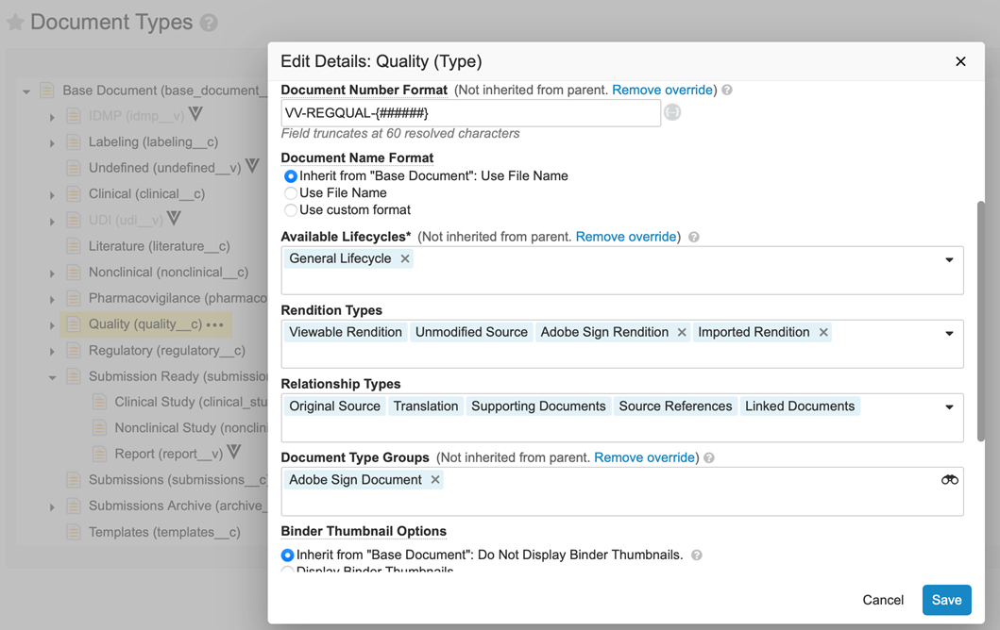
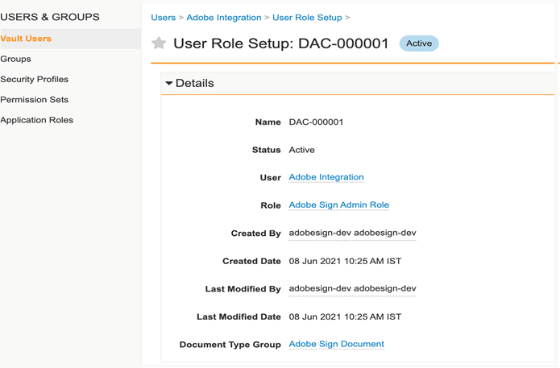
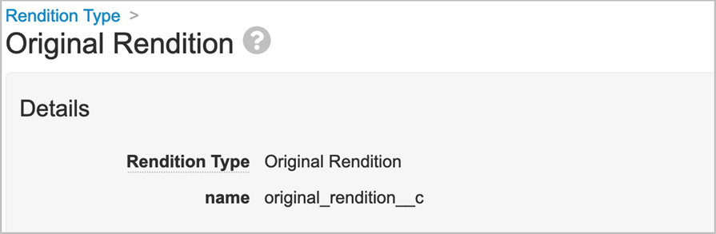
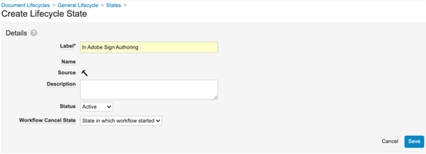

# [!DNL Veeva Vault] Guía de instalación{#veeva-installation-guide}

[**Contactar con el servicio de soporte técnico de Adobe Sign**](https://adobe.com/go/adobesign-support-center_es)

## Información general {#overview}

En este documento se explica cómo integrar Adobe Sign con [!DNL Veeva Vault] plataforma. [!DNL Veeva Vault] es una plataforma de gestión de contenido empresarial (ECM) creada para las ciencias biológicas. Una &quot;Caja fuerte&quot; es un repositorio de contenido y datos con un uso típico para solicitudes de normativas, informes de investigación, solicitudes de subvenciones, contratación general y mucho más. Una sola empresa puede tener varias &quot;cajas fuertes&quot; que deben mantenerse por separado.

Los pasos de alto nivel para completar la integración son:

* Active su cuenta administrativa en Adobe Sign (solo nuevos clientes).
* Cree objetos para realizar un seguimiento del historial de un ciclo de vida de acuerdo en Vault.
* Cree un nuevo perfil de seguridad.
* Configurar un grupo en Adobe Sign para que contenga la [!DNL Veeva Vault] usuario de integración.
* Cree copias y campos de documento.
* Configure acciones web y actualice el ciclo de vida del documento.
* Crear configuración de usuario y rol de usuario de tipo de documento.
* Conecte Veeva Vault a Adobe Sign mediante middleware.

>[!NOTE]
>
>El administrador de Adobe Sign debe realizar los pasos de configuración de Adobe Sign en Adobe Sign.

## Configure [!DNL Veeva Vault] {#configure-veeva}

Para configurar [!DNL Veeva Vault] para la integración con Adobe Sign, debe implementar los pasos que se indican a continuación.

### Paso 1. Crear grupo {#create-group}

Para configurar Adobe Sign para [!DNL Vault], un nuevo grupo denominado *Grupo de administradores de Adobe Sign* se crea. Este grupo se utiliza para establecer la seguridad de nivel de campo de documento para los campos relacionados con Adobe Sign y debe incluir *Perfil de integración de Adobe Sign* de forma predeterminada.

### Paso 2. Implementar el paquete {#deploy-package}

[Implementar el paquete](https://helpx.adobe.com/content/dam/help/en/PKG-AdobeSign-Integration.zip) y sigue los pasos. Una vez implementado, el paquete crea:

* Objetos personalizados: Objeto Signature, objeto Signatory, objeto Signature Event, objeto Process Locker
* Diseño de página de objeto de firma
* Diseño de página del objeto Evento de firma
* Diseño de página de objeto firmante
* Diseño de página de objeto de bloqueador de procesos
* Tipo de representación de Adobe Sign
* Tipo de copia original
* Campo compartido signature__c , allow_adobe_sign_user_actions__c
* Acción web de Adobe Sign
* Cancelar acción web de Adobe Sign
* Conjunto de permisos Acciones de administrador de Adobe Sign
* Perfil de seguridad de Adobe Sign Integration Profile
* Función de aplicación Función de administrador de Adobe Sign
* Grupo de tipos de documento &quot;Documento de Adobe Sign&quot;

#### Objeto Signature {#signature-object}

El objeto de firma se crea para almacenar información relacionada con el acuerdo. Un objeto Signature es una base de datos que contiene información en los siguientes campos específicos:

**Campos de objeto de firma**

| Campo | Etiqueta | Tipo | Descripción |
| --- | --- | ---| --- | 
| external_id__c | Id de acuerdo | Cadena (100) | Contiene el ID exclusivo del acuerdo de Adobe Sign |
| file_hash__c | Hash de archivo | Cadena (50) | Contiene la suma de comprobación md5 del archivo enviado a Adobe Sign |
| name__v | Nombre | Cadena (128) | Contiene el nombre del acuerdo |
| sender__c | Remitente | Objeto (usuario) | Contiene la referencia al usuario de Vault que ha creado el acuerdo |
| signature_status__c | Estado de firma | Cadena (75) | Mantiene el estado del acuerdo en Adobe Sign |
| signature_type__c | Tipo de firma | Cadena (20) | Mantiene el tipo de firma del acuerdo en Adobe Sign (ESCRITA o ESIGN) |
| start_date__c | Fecha de inicio | FechaHora | Fecha en la que el acuerdo se ha enviado para firmar |
| cancelation_date__c | Fecha de cancelación | FechaHora | Contiene la fecha en que se canceló el acuerdo. |
| completed_date__c | Fecha de finalización | FechaHora | Contiene la fecha en que se completó el acuerdo. |
| viewable_rendition_used__c | Representación visible utilizada | Booleano | Marca que indica si se ha enviado una copia visible para firmar. (de forma predeterminada, es true) |

#### Objeto Signatory {#signatory-object}

El objeto de firmante se crea para almacenar información relacionada con los participantes en un acuerdo. Contiene información en los siguientes campos específicos:

**Campos de objeto firmante**

| Campo | Etiqueta | Tipo | Descripción |
| --- | --- | ---| --- | 
| email__c | Correo electrónico | Cadena (120) | Contiene el ID exclusivo del acuerdo de Adobe Sign |
| external_id__c | ID de participante | Cadena (80) | Contiene el identificador único de participante de Adobe Sign |
| name__v | Nombre | Cadena (128) | Contiene el nombre del participante de Adobe Sign |
| order__c | Ordenar | Número | Conserva el número de pedido del participante del acuerdo de Adobe Sign |
| role_c | Función | Cadena (30) | Mantiene la función del participante del acuerdo de Adobe Sign |
| signature__c | Firma | Objeto (firma) | Contiene la referencia al registro principal de la firma |
| signature_status__c | Estado de firma | Cadena (100) | Mantiene el estado del participante del acuerdo de Adobe Sign |
| user__c | Usuario | Objeto (usuario) | Contiene la referencia al registro de usuario del firmante si el participante es un usuario de Vault |

#### Objeto Evento de firma {#signature-event}

El objeto Evento de firma se crea para almacenar la información relacionada con eventos de un acuerdo. Contiene información en los siguientes campos específicos:

| Campo | Etiqueta | Tipo | Descripción |
| --- | --- | ---| --- | 
| acting_user_email__c | Correo electrónico del usuario activo | Cadena | Contiene el correo electrónico del usuario de Adobe Sign que realizó la acción que provocó el evento que se generó |
| acting_user_name__c | Nombre de usuario interino | Cadena | Contiene el nombre del usuario de Adobe Sign que realizó la acción que provocó el evento |
| description__c | Descripción | Cadena | Contiene la descripción del evento de Adobe Sign |
| event_date__c | Fecha del evento | FechaHora | Celebra la fecha y hora del evento de Adobe Sign |
| event_type__c | Tipo de evento | Cadena | Realiza el tipo de evento de Adobe Sign |
| name__v | Nombre | Cadena | Nombre del evento generado automáticamente |
| participant_comment__c | Comentario del participante | Cadena | Contiene el comentario del participante de Adobe Sign, si lo hubiera |
| participant_email__c | Correo electrónico del participante | Cadena | Contiene el correo electrónico del participante de Adobe Sign |
| participant_role__c | Función de participante | Cadena | Tiene la función de participante en Adobe Sign |
| signature__c | Firma | Objeto (firma) | Contiene la referencia al registro principal de la firma |

#### Objeto de bloqueo de proceso {#process-locker}

Se crea un objeto de bloqueador de procesos para bloquear el proceso de integración de Adobe Sign. No requiere ningún campo personalizado.

Los objetos Signature, Signatory, Signature Event y Process Locker que forman parte del paquete de implementación tienen habilitada de forma predeterminada la propiedad &#39;Auditar cambios de datos para este objeto&#39;.

**Nota:** Puede hacer que Vault capture cambios de datos de registro de objeto en registros de auditoría habilitando la opción Auditar cambios de datos. Esta configuración está desactivada de forma predeterminada. Una vez que haya habilitado esta opción y creado registros, ya no podrá deshabilitarla. Si esta configuración está desactivada y existen registros, sólo un propietario del depósito puede actualizarla.

#### **Mostrar participantes e historial para el objeto de firma** {#display-participants-history}

El objeto Signature que viene como parte del paquete de implementación viene con la [Diseño de página de detalles de firma](https://vvtechpartner-adobe-rim.veevavault.com/ui/#admin/content_setup/object_schema/pagelayout?t=signature__c&amp;d=signature_detail_page_layout__c). El diseño de página tiene secciones para los participantes y el historial.

* La *Participantes* tiene la sección Objetos relacionados que está configurada como se muestra en la imagen siguiente.

   

* Puede editar las columnas que se mostrarán para los participantes, como se muestra a continuación.

   

* La *Historial* tiene la sección Objetos relacionados que está configurada como se muestra en la imagen siguiente.

   

* Puede editar las columnas que se mostrarán para el historial, como se muestra a continuación.

   

#### **Ver participantes e historial de auditoría del documento de Adobe Sign** {#view-participants-audit-history}

* Para ver los participantes y el historial de auditoría del documento de Adobe Sign, seleccione el vínculo en la sección &quot;Firma de Adobe&quot; del documento.

   

* La página que se abre muestra los participantes y el historial del documento de Adobe Sign, como se muestra a continuación.

   

* Consulte el seguimiento de auditoría para Firmar como se muestra a continuación.

   

### Paso 3. Configurar perfiles de seguridad {#security-profiles}

La implementación correcta del paquete en el paso 2 crea el perfil de integración de Adobe Sign. El perfil de integración de Adobe Sign se asigna a la cuenta del sistema y la utiliza la integración al llamar a las API Vault. Este perfil permite permisos para:

* API Vault
* Leer, crear, editar y eliminar: Firma, Firmante, Eventos de firma y Procesar objetos bloqueadores

Debe actualizar el grupo de administración de Adobe Sign (creado en el paso 1) configurando el perfil de seguridad incluido en Perfil de integración de Adobe Sign, como se muestra en la imagen siguiente.

### Paso 4. Crear usuario {#create-user}

El usuario de la cuenta del sistema Vault de la integración con Adobe Sign debe:

* Tener un perfil de integración de Adobe Sign
* Tener un perfil de seguridad
* Tener una política de seguridad específica que deshabilita el vencimiento de la contraseña
* Ser miembro del grupo de administración de Adobe Sign.

Para ello, siga estos pasos:

1. Cree un usuario de la cuenta del sistema Vault de la integración de Adobe Sign.

   

2. Añada el usuario al grupo de administradores de Adobe Sign.

   

### Paso 5. Configurar grupo de tipo de documento {#create-document-type-group}

Al implementar el paquete de Adobe Sign, se crea un registro de grupo de tipo de documento denominado &quot;Documento de Adobe Sign&quot;.

Debe agregar este grupo de tipos de documento para todas las clasificaciones de documentos que sean aptas para el proceso de Adobe Sign. Como la propiedad de grupo de tipo de documento no se hereda de tipo a subtipo ni de subtipo a nivel de clasificación, debe establecerse para cada clasificación de documento elegible para Adobe Sign.

**Nota:** Si el objeto Configuración de función de usuario no contiene el campo que hace referencia al objeto Grupo de tipo de documento, debe agregar el campo. Para ello, vaya a **[!UICONTROL Objeto]** > **[!UICONTROL Configuración de rol de usuario]** > **[!UICONTROL Fields]** y complete los pasos necesarios, como se muestra en la siguiente imagen.

### Paso 6. Crear configuración de funciones de usuario {#create-user-role-setup}

Una vez que los ciclos de vida se hayan configurado correctamente, el sistema debe asegurarse de que DAC añade el usuario administrador de Adobe Sign para todos los documentos que sean aptos para el proceso de Adobe Sign. Para ello, cree el registro de configuración de funciones de usuario adecuado que especifique:

* Grupo de tipos de documento como documento de Adobe Sign
* Función de aplicación como función de administrador de Adobe Sign
* Usuario de integración

### Paso 7. Configurar campos de documento {#create-fields}

La implementación del paquete crea dos nuevos campos de documento compartido que son necesarios para establecer la integración:

* Firma (signature__c)
* Permitir acciones de usuario de Adobe Sign (allow_adobe_sign_user_actions__c)

Para configurar los campos del documento:

1. Vaya a la pestaña Configuración y seleccione **[!UICONTROL Campos de documento]** > **[!UICONTROL Campos compartidos]**.
1. En el campo Mostrar sección, seleccione **[!UICONTROL Crear sección de visualización]** y asignar **[!UICONTROL Firma de Adobe]** como etiqueta Sección.

   

1. Para los dos campos de documento compartidos (signature__c y allow_adobe_sign_user_actions__c), actualice la sección de interfaz de usuario con **[!UICONTROL Firma de Adobe]** como etiqueta de sección.
1. Agregue los tres campos compartidos a todos los tipos de documento que puedan optar a la firma de Adobe. Para ello, en la página Documento base, seleccione **[!UICONTROL Añadir]** > **[!UICONTROL Campo compartido existente]** desde la esquina superior derecha.

   

   

   

1. Tenga en cuenta que ambos campos deben tener una seguridad específica que solo permita a los miembros del grupo de administración de Adobe Sign actualizar sus valores.

   

Desactivar superposiciones de depósito (disable_vault_overlays__v) es un campo compartido existente. Opcionalmente, el campo puede tener una seguridad específica que permita actualizar su valor solo a los miembros del grupo de administración de Adobe Sign.

### Paso 8. Declarar representaciones de documentos {#declare-renditions}

El nuevo tipo de copia denominado *Adobe Sign Rendition (adobe_sign_rendition__c)* Vault lo utiliza para cargar documentos firmados del PDF en Adobe Sign. Debe declarar la copia de Adobe Sign para cada tipo de documento que pueda optar a la firma de Adobe.

El nuevo tipo de copia denominado *Copia original (original_rendition__c)* lo utiliza la integración del almacén como nombre de la copia que se debe utilizar para almacenar la copia visible original si el documento firmado se importa como copia visible.

### Paso 9. Actualizar acciones web {#web-actions}

La integración de Adobe Sign y Vault requiere la creación y configuración de dos acciones web:

* **Crear Adobe Sign**: Crea o muestra el acuerdo de Adobe Sign.

   Tipo: Destino del documento: Visualización en las credenciales de almacén: Activar credenciales de publ. de sesión mediante URL de publ. de mensaje: <https://api.na1.adobesign.com/api/gateway/veevavaultintsvc/partner/agreement?docId=${Document.id}&majVer=${Document.major_version_number__v}&minVer=${Document.minor_version_number__v}&vaultid=${Vault.id}&useWaitPage=true>

   

* **Cancelar Adobe Sign**: Cancela un acuerdo existente en Adobe Sign y devuelve el estado de un documento al inicial.

   Tipo: Destino del documento: Visualización en las credenciales de almacén: Activar credenciales de publ. de sesión mediante URL de publ. de mensaje: : <https://api.na1.adobesign.com/api/gateway/veevavaultintsvc/partner/agreement/cancel?docId=${Document.id}&majVer=${Document.major_version_number__v}&minVer=${Document.minor_version_number__v}&vaultid=${Vault.id}&useWaitPage=true>

   

### Paso 10. Actualizar ciclo de vida del documento {#document-lifecycle}

Para cada tipo de documento que pueda optar a la firma de Adobe, debe actualizar el ciclo de vida del documento correspondiente agregando nuevos estados y funciones de ciclo de vida.

El ciclo de vida del acuerdo de Adobe Sign tiene los siguientes estados:

* BORRADOR
* AUTHORING o DOCUMENTS_NOT_YET_PROCESSED
* OUT_FOR_SIGNATURE o OUT_FOR_APPROVAL
* FIRMADO o APROBADO
* CANCELADA
* CADUCADO

Para actualizar el ciclo de vida del documento, siga estos pasos:

1. Agregar función de ciclo de vida. La función de aplicación de administrador de Adobe Sign se debe añadir a todos los ciclos de vida utilizados por los documentos que pueden optar a la firma de Adobe, como se muestra a continuación.

   

   La función de administrador debe crearse con las siguientes opciones:

   * Control dinámico de acceso habilitado.
   * Reglas de uso compartido de documentos que solo incluyen grupos de tipos de documento, como se muestra en la imagen siguiente.

   

2. Crear estados del ciclo de vida. Para ello, vaya a **[!UICONTROL Configuración]** > **[!UICONTROL Configuración]** > **[!UICONTROL Ciclos de vida del documento]** > **[!UICONTROL Ciclos de vida generales]** > **[!UICONTROL Estados]** > **[!UICONTROL Crear]**. A continuación, cree los siguientes estados:

   * En Adobe Sign Draft

   

   * En Adobe Sign Authoring

   

   * En la firma de Adobe

   

3. Añada acciones de usuario a los siguientes estados enumerados.

   Cuando se envía un documento de Vault a Adobe Sign, su estado debe corresponder al estado en el que se encuentra el acuerdo. Para ello, añada los siguientes estados en todos los ciclos de vida utilizados por los documentos que pueden optar a la firma de Adobe:

   * **Antes de la firma del Adobe** (Revisado): Es un nombre de marcador de posición para el estado desde el que se puede enviar el documento a Adobe Sign. Según el tipo de documento, puede ser Estado de borrador o Revisado. La etiqueta de estado del documento se puede personalizar según los requisitos del cliente. Antes del Adobe El estado de firma debe definir las dos acciones de usuario siguientes:

      * Acción que cambia el estado del documento a *En Adobe Sign Draft* estado. El nombre de esta acción de usuario debe ser el mismo para todos los tipos de documento de cualquier ciclo de vida. Si es necesario, los criterios para esta acción se pueden establecer en &quot;Permitir acciones de usuario de Adobe Sign es igual a Sí&quot;.
      * Acción que llama a la acción web &quot;Adobe Sign&quot;. Este estado debe tener una seguridad que permita a la función de administrador de Adobe Sign: ver documento, ver contenido, editar campos, editar relaciones, descargar origen, administrar representaciones visibles y cambiar estado.

      

   * **En Adobe Sign Draft**: Es un nombre de marcador de posición para el estado que indica que el documento ya está cargado en Adobe Sign y que su acuerdo está en estado BORRADOR. Es un estado obligatorio. Este estado debe definir las siguientes cinco acciones de usuario:

      * Acción que cambia el estado del documento a *En Adobe Sign Authoring* estado. El nombre de esta acción de usuario debe ser el mismo para todos los tipos de documento de cualquier ciclo de vida. Si es necesario, los criterios para esta acción se pueden establecer en &quot;Permitir acciones de usuario de Adobe Sign es igual a Sí&quot;.
      * Acción que cambia el estado del documento a *En estado de firma de Adobe*. El nombre de esta acción de usuario debe ser el mismo para todos los tipos de documento de cualquier ciclo de vida. Si es necesario, los criterios para esta acción se pueden establecer en &quot;Permitir acciones de usuario de Adobe Sign es igual a Sí&quot;.
      * Acción que cambia el estado del documento a *Adobe Sign cancelado* estado. El nombre de esta acción de usuario debe ser el mismo para todos los tipos de documento de cualquier ciclo de vida. Si es necesario, los criterios para esta acción se pueden establecer en &quot;Permitir acciones de usuario de Adobe Sign es igual a Sí&quot;.
      * Acción que llama a la acción web &quot;Adobe Sign&quot; .
      * Acción que llama a la acción web &quot;Cancelar Adobe Sign&quot;. Este estado debe tener una seguridad que permita a la función de administrador de Adobe Sign: ver documento, ver contenido, editar campos, editar relaciones, descargar origen, administrar representaciones visibles y cambiar estado.

      

   * **En Adobe Sign Authoring**: Es un nombre de marcador de posición para el estado que indica que el documento ya está cargado en Adobe Sign y que su acuerdo está en estado AUTHORING o DOCUMENTS_NOT_YET_PROCESSED. Es un estado obligatorio. Este estado debe tener definidas las siguientes cuatro acciones de usuario:

      * Acción que cambia el estado del documento a estado Cancelado de Adobe Sign. El nombre de esta acción de usuario debe ser el mismo para todos los tipos de documento, independientemente del ciclo de vida. Si es necesario, los criterios para esta acción se pueden establecer en &quot;Permitir acciones de usuario de Adobe Sign es igual a Sí&quot;.
      * Acción que cambia el estado del documento a En estado de firma de Adobe. El nombre de esta acción de usuario debe ser el mismo para todos los tipos de documento, independientemente del ciclo de vida. Si es necesario, los criterios para esta acción se pueden establecer en &quot;Permitir acciones de usuario de Adobe Sign es igual a Sí&quot;.
      * Acción que llama a la acción web &quot;Adobe Sign&quot;
      * Acción que llama a la acción web &quot;Cancelar Adobe Sign&quot;. Este estado debe tener una seguridad que permita a la función de administrador de Adobe Sign: ver documento, ver contenido, editar campos, editar relaciones, descargar origen, administrar representaciones visibles y cambiar estado.

      

   * **En la firma de Adobe**: Es un nombre de marcador de posición para el estado que indica que el documento está cargado en Adobe Sign y que su acuerdo ya se ha enviado a los participantes (estado OUT_FOR_SIGNATURE o OUT_FOR_APPROVAL). Es un estado obligatorio. Este estado debe tener definidas las siguientes cinco acciones de usuario:

      * Acción que cambia el estado del documento a estado Cancelado de Adobe Sign. El estado de destino de esta acción puede ser cualquiera que sea el requisito del cliente y puede ser diferente para diferentes tipos. El nombre de esta acción de usuario debe ser el mismo para todos los tipos de documento, independientemente del ciclo de vida. Si es necesario, los criterios para esta acción se pueden establecer en &quot;Permitir acciones de usuario de Adobe Sign es igual a Sí&quot;.
      * Acción que cambia el estado del documento a Rechazado de Adobe Sign. El estado de destino de esta acción puede ser cualquiera que sea el requisito del cliente y puede ser diferente para diferentes tipos. El nombre de esta acción de usuario debe ser el mismo para todos los tipos de documento, independientemente del ciclo de vida. Si es necesario, los criterios para esta acción se pueden establecer en &quot;Permitir acciones de usuario de Adobe Sign es igual a Sí&quot;.
      * Acción que cambia el estado del documento a estado Firmado en Adobe. El estado de destino de esta acción puede ser cualquiera que sea el requisito del cliente y puede ser diferente para diferentes tipos. Sin embargo, el nombre de esta acción de usuario debe ser el mismo para todos los tipos de documento, independientemente del ciclo de vida. Si es necesario, los criterios para esta acción se pueden establecer en &quot;Permitir acciones de usuario de Adobe Sign es igual a Sí&quot;.
      * Acción que llama a la acción Web *Adobe Sign*.
      * Acción que llama a Acción Web *Cancelar Adobe Sign*. Este estado debe tener una seguridad que permita a la función de administrador de Adobe Sign: ver documento, ver contenido, editar campos, editar relaciones, descargar origen, administrar representaciones visibles y cambiar estado.

      

      * **Adobe firmado (aprobado)**: Es un nombre de marcador de posición para el estado que indica que el documento se ha cargado en Adobe Sign y que su acuerdo se ha completado (estado FIRMADO o APROBADO). Es un estado obligatorio y puede ser un estado de ciclo de vida existente, como Aprobado.
Este estado no requiere acciones del usuario. Debe tener una seguridad que permita a la función de administrador de Adobe Sign: ver documentos, ver contenido y editar campos.

   El siguiente diagrama ilustra las asignaciones entre los estados del acuerdo de Adobe Sign y del documento de Vault, donde el estado &quot;Antes de la firma del Adobe&quot; es Borrador.

   

### Paso 11. Agregar etapa de Adobe Sign a Ciclo de vida general en grupos de etapa de ciclo de vida

### Paso 12. Establecer permisos para la función de usuario en el estado del ciclo de vida

Debe establecer los permisos adecuados para cada función de usuario en el estado del ciclo de vida, como se muestra en la imagen siguiente.

### Paso 13. Configurar la seguridad atómica en función del estado del documento y la función de usuario

### Paso 14. Crear mensajes de documento para Adobe Sign Cancelar

## Connect [!DNL Veeva Vault] a Adobe Sign mediante middleware {#connect-middleware}

Tras completar la configuración de [!DNL Veeva Vault] y la cuenta de administrador de Adobe Sign, el administrador debe crear una conexión entre las dos cuentas mediante el middleware. La [!DNL Veeva Vault] y la conexión de la cuenta de Adobe Sign la inicia Adobe Sign Identity y, a continuación, se utiliza para almacenar el[!DNL Veeva Vault]identidad.
Para la seguridad y estabilidad del sistema, el administrador debe utilizar un [!DNL Veeva Vault] sistema/servicio/cuenta de utilidad, como `adobe.for.veeva@xyz.com`, en lugar de una cuenta de usuario personal, como `bob.smith@xyz.com`.

Un administrador de cuentas de Adobe Sign debe seguir los pasos que se indican a continuación para conectarse [!DNL Veeva Vault] a Adobe Sign mediante middleware:

1. Vaya a la [Adobe Sign para [!DNL Veeva Vault] Página de inicio](https://static.adobesigncdn.com/veevavaultintsvc/index.html).
1. Seleccionar **[!UICONTROL Inicio de sesión]** en la esquina superior derecha.

   

1. En la página de inicio de sesión de Adobe Sign que se abre, proporcione el correo electrónico y la contraseña del administrador de la cuenta y, a continuación, seleccione **[!UICONTROL Iniciar sesión]**.

   

   Después de iniciar sesión correctamente, la página muestra el ID de correo electrónico asociado y una pestaña Configuración, como se muestra a continuación.

   

1. Seleccione la **[!UICONTROL Configuración]** .

   La página Configuración muestra las conexiones disponibles y *No hay conexiones disponibles* en el caso de la primera configuración de conexión, como se muestra a continuación.

   

1. Seleccionar **[!UICONTROL Agregar conexión]** para agregar una nueva conexión.

1. En el cuadro de diálogo Agregar conexión que se abre, proporcione los detalles necesarios, incluidos los [!DNL Veeva Vault] credenciales.

   Las credenciales de Adobe Sign se rellenan automáticamente desde el inicio de sesión inicial de Adobe Sign.

   

1. Seleccionar **[!UICONTROL Validar]** para validar los detalles de la cuenta.

   Cuando la validación se realice correctamente, aparecerá la notificación &quot;El usuario ha validado correctamente&quot;, como se muestra a continuación.

   

1. Para restringir el uso a un determinado grupo de Adobe Sign, expanda el **[!UICONTROL Grupo]** y seleccione uno de los grupos disponibles.

   

1. Para adjuntar un informe de auditoría a la copia firmada, seleccione la casilla de verificación **[!UICONTROL Adjuntar informe de auditoría a la copia firmada]**.

   

1. Para permitir el aprovisionamiento automático de usuarios en Adobe Sign, seleccione la casilla de verificación **[!UICONTROL Aprovisionamiento automático de usuarios de Sign]**.

   **Nota:** El aprovisionamiento automático de nuevos usuarios de Adobe Sign solo funciona si se ha habilitado en el nivel de cuenta de Adobe Sign en Adobe Sign, además de habilitar **[!UICONTROL Aprovisionamiento automático de usuarios de Sign]** para el[!DNL Veeva Vault]Integración con Adobe Sign como muestra el administrador de cuentas de Adobe Sign a continuación.

   

1. Para configurar Adobe Sign Rendition para que se muestre en Veeva en lugar de Original Rendition, seleccione la casilla de verificación **[!UICONTROL Mostrar representación de Adobe Sign]**.

   

1. Seleccionar **[!UICONTROL Guardar]** para guardar la nueva conexión.

   La nueva conexión aparece en la ficha Configuración y muestra la integración correcta entre [!DNL Veeva Vault] y Adobe Sign.

   

