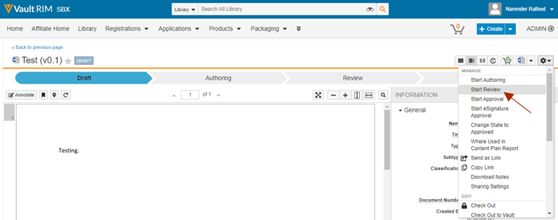
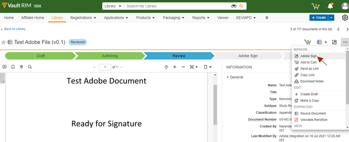
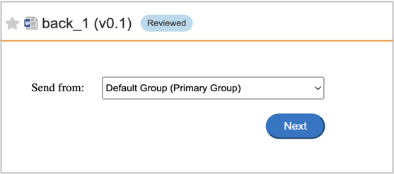
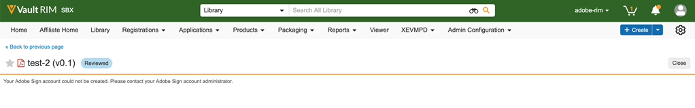

# Adobe Acrobat Sign para [!DNL Veeva Vault]: Guía del usuario {#veeva-vault-user-guide}

[**Contactar con Asistencia técnica de Adobe Acrobat Sign**](https://adobe.com/go/adobesign-support-center_es)

Este documento está diseñado para ayudar [!DNL Veeva Vault] los clientes aprenden a usar Adobe Acrobat Sign para [!DNL Veeva Vault] para enviar un acuerdo.

## Información general {#overview}

Integración de Adobe Acrobat Sign con [!DNL Veeva Vault] facilita el proceso de obtención de una firma o aprobación para cualquier documentación que requiera firmas legales o procesamiento de documentos auditables.

El proceso general de envío de documentos para su firma es similar al envío de un correo electrónico, por lo que es fácil de adoptar para la mayoría de los usuarios.

Integración de Adobe Acrobat Sign con [!DNL Veeva Vault] agiliza y agiliza tus flujos de trabajo de documentos y firmas. Al utilizar el flujo de trabajo de integración:

* Ahorra tiempo y recursos empleados en correos electrónicos, noches o faxes.
* Envía contratos para su firma electrónica o aprobación desde [!DNL Veeva Vault], acceder al historial de contratos en tiempo real y ver los contratos guardados.
* Realiza el seguimiento de los acuerdos en tiempo real en toda tu organización y obtén actualizaciones cuando se visualicen, firmen, cancelen o rechacen acuerdos.
* eSign en más de 20 idiomas y admite el servicio de fax en más de 50 configuraciones regionales de todo el mundo.
* Crear plantillas de acuerdo reutilizables para las opciones de envío.

## Enviar un acuerdo mediante Adobe Acrobat Sign para [!DNL Veeva Vault] {#send-sign-vault-agreement}

Para enviar un acuerdo con Adobe Acrobat Sign para Veeva:

1. Vaya a la [[!DNL Veeva Vault] página de inicio de sesión](https://login.veevavault.com/) y escriba su nombre de usuario y contraseña. Se abre la página de inicio de su Vault, como se muestra a continuación.

   

1. Seleccionar **[!UICONTROL Biblioteca]** y, a continuación, seleccione **[!UICONTROL Crear]** en la esquina superior derecha.

   

1. Seleccionar **[!UICONTROL Cargar y continuar]**.

1. Cargue cualquier documento de la unidad local.

1. En el cuadro de diálogo que aparece, seleccione **[!UICONTROL Tipo]** as *[!UICONTROL Clínico]* y, a continuación, seleccione una **[!UICONTROL Subtipo]** y **[!UICONTROL Clasificación]**, si es necesario.

   

1. Para cerrar el cuadro de diálogo, seleccione **[!UICONTROL Ok]**.

1. Seleccione **[!UICONTROL Siguiente]**.

1. En la ventana que aparece, rellene todos los campos obligatorios en la sección de metadatos y seleccione **[!UICONTROL Guardar]**.

   

1. Crea un documento de prueba en **[!UICONTROL Borrador]** estado, como se muestra a continuación.

   

1. En la esquina superior derecha, seleccione  menú desplegable y seleccione **[!UICONTROL Iniciar revisión]**.

   

1. Seleccione la **[!UICONTROL Revisor]** y **[!UICONTROL Fecha de vencimiento de revisión]**.

1. Seleccionar **[!UICONTROL Inicio]**. Cambia el estado del documento a [!UICONTROL EN REVISIÓN].

   

1. Completar la tarea asignada en nombre de los revisores. Una vez que haya terminado, cambia el Estado del documento a [!UICONTROL REVISADO].

   

1. Seleccionar  menú desplegable y seleccione **[!UICONTROL Adobe Sign]**.

   

1. Si la función UMG (Usuarios en varios grupos) está activada en la cuenta de Adobe Acrobat Sign y el remitente pertenece a varios grupos, verá un cuadro de diálogo como se muestra a continuación. En el cuadro de diálogo, seleccione el grupo y, a continuación, seleccione **[!UICONTROL Siguiente]**.

   

1. En la ventana iFrame que se abre en Vault, introduzca la dirección de correo electrónico del destinatario y seleccione **[!UICONTROL Siguiente]**.

   

   **Nota:** Si no existe una cuenta de usuario de Adobe Acrobat Sign para el correo electrónico del remitente, la ventana de iFrame muestra un mensaje, como se muestra a continuación. También envía al usuario un correo electrónico con las instrucciones para activar la cuenta.

   

   

   Sin embargo, si *Aprovisionamiento automático de usuarios de Sign* está desactivada, la creación de usuarios de Adobe Acrobat Sign falla y la ventana de iFrame muestra un mensaje que solicita al usuario que se ponga en contacto con su administrador de cuentas de Adobe Acrobat Sign. El administrador de cuentas de Adobe Acrobat Sign puede realizar una de las siguientes acciones:

   * Active la *Aprovisionamiento automático de usuarios de Sign* para la cuenta.
   * Cree el usuario en Adobe Acrobat Sign antes de utilizar la integración de Veeva Vault Adobe Acrobat Sign.

   

1. Una vez procesado el documento, arrastre y suelte los campos de firma del panel derecho y seleccione **[!UICONTROL Enviar]**.

   

1. Envía el documento a los destinatarios para que lo firmen. Una vez que el destinatario recibe el correo electrónico del documento, el estado del documento cambia de [!UICONTROL Revisado] para [!UICONTROL En la firma de Adobe].

   

1. Una vez que todas las firmas se capturan y se completan en Adobe Acrobat Sign, el estado del documento en Vault cambia a [!UICONTROL Approved].

1. Seleccionar **[!UICONTROL Archivos de documento]** y expanda la **[!UICONTROL Representaciones]** en Vault. Crea automáticamente una copia denominada &quot;Adobe Sign Rendition&quot; una vez que el documento se encuentra en el estado Aprobado.

   

1. Descargue Adobe Sign Rendition para validar la firma del destinatario.

   

## Cancelar un acuerdo con Adobe Acrobat Sign para [!DNL Veeva Vault] {#cancel-sign-vault-agreement}

1. Vaya a la [[!DNL Veeva Vault] página de inicio de sesión](https://login.veevavault.com/) y escriba su nombre de usuario y contraseña. Se abre la página de inicio de su Vault, como se muestra a continuación.

   

1. Seleccionar **[!UICONTROL Biblioteca]** y, a continuación, seleccione el documento. El estado del documento puede ser: [!UICONTROL En Adobe Sign Draft], [!UICONTROL En Adobe Sign Authoring], o [!UICONTROL En la firma de Adobe].

   

1. Seleccionar **[!UICONTROL Cancelar Adobe Sign]**.

   

1. Activa la acción Web y carga la ventana de iFrame en [!UICONTROL Vault].

   

1. El estado del documento cambia automáticamente a [!UICONTROL Revisión].

   

Cuando el estado del documento cambie a Revisar, podrá enviarlo de nuevo para que se firme.
