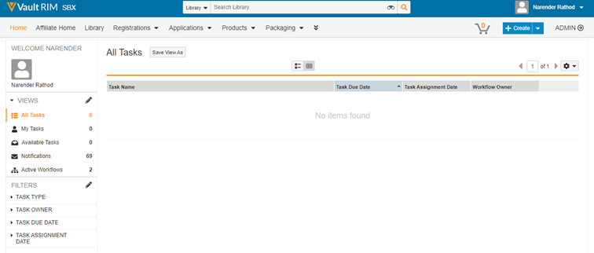
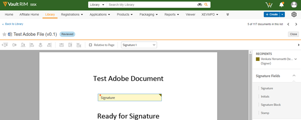

# Adobe Sign para [!DNL Veeva Vault]: Guía del usuario {#veeva-vault-user-guide}

[**Contactar con el servicio de soporte técnico de Adobe Sign**](https://adobe.com/go/adobesign-support-center_es)

Este documento está diseñado para ayudar a los clientes [!DNL Veeva Vault] a aprender a utilizar Adobe Sign para la integración [!DNL Veeva Vault] para enviar un acuerdo.

## Información general {#overview}

La integración de Adobe Sign con [!DNL Veeva Vault] facilita el proceso de obtención de una firma o aprobación para cualquier documentación que requiera firmas legales o procesamiento auditable de documentos.

El proceso general de enviar documentos para su firma es similar al de enviar un correo electrónico, por lo que resulta fácil de adoptar para la mayoría de los usuarios.

La integración de Adobe Sign con [!DNL Veeva Vault] simplifica y agiliza los flujos de trabajo de documentos y firmas. Mediante el flujo de trabajo de integración, puede:

* Ahorro de tiempo y recursos gastados en correo postal, sobrenoches y fax.
* Envíe contratos para su firma electrónica o aprobación desde [!DNL Veeva Vault], acceda al historial de contratos en tiempo real y vea contratos guardados.
* Realice un seguimiento de los acuerdos en tiempo real en toda la organización y obtenga actualizaciones cuando los acuerdos se visualicen, firmen, cancelen o rechacen.
* Inicie sesión en más de 20 idiomas y admita el servicio de fax en más de 50 idiomas de todo el mundo.
* Cree plantillas de acuerdo reutilizables para las opciones de envío.

## Enviar un acuerdo mediante Adobe Sign para [!DNL Veeva Vault] {#send-sign-vault-agreement}

Para enviar un acuerdo con Adobe Sign para Veeva:

1. Vaya a la [[!DNL Veeva Vault] página de inicio de sesión](https://login.veevavault.com/) e introduzca su nombre de usuario y contraseña. Se abre la página principal de su Vault, como se muestra a continuación.

   

1. Seleccione la ficha **[!UICONTROL Biblioteca]** y, a continuación, seleccione **[!UICONTROL Crear]** en la esquina superior derecha.

   

1. Seleccione **[!UICONTROL Cargar y continuar]**.

1. Cargue cualquier documento desde la unidad local.

1. En el cuadro de diálogo que aparece, seleccione **[!UICONTROL Tipo]** como *[!UICONTROL Clínico]* y, a continuación, seleccione un **[!UICONTROL Subtipo]** y **[!UICONTROL Clasificación]**, si es necesario.

   

1. Seleccione **[!UICONTROL Aceptar]** para cerrar el cuadro de diálogo.

1. Seleccione **[!UICONTROL Siguiente]**.

1. En la ventana que aparece, rellene todos los campos obligatorios de la sección de metadatos y seleccione **[!UICONTROL Guardar]**.

   

1. Crea un documento de prueba con el estado **[!UICONTROL Draft]**, como se muestra a continuación.

   

1. En la esquina superior derecha, seleccione el menú desplegable  y seleccione **[!UICONTROL Iniciar revisión]**.

   

1. Seleccione **[!UICONTROL Reviewer]** y **[!UICONTROL Fecha de vencimiento de revisión]**.

1. Seleccione **[!UICONTROL Inicio]**. Cambia el estado del documento a [!UICONTROL IN REVIEW].

   

1. Complete la tarea asignada en nombre de los revisores. Una vez que haya terminado, cambiará el estado del documento a [!UICONTROL REVISADO].

   

1. Seleccione el menú desplegable  y seleccione **[!UICONTROL Adobe Sign]**.

   

1. En la ventana iFrame que se abre en Vault, introduzca la dirección de correo electrónico del destinatario y seleccione **[!UICONTROL Siguiente]**.

   

1. Una vez procesado el documento, arrastre y suelte los campos de firma en el panel derecho y seleccione **[!UICONTROL Enviar]**.

   

1. Envía el documento al destinatario para su firma. Una vez que el destinatario recibe el correo electrónico del documento, el estado del documento cambia de [!UICONTROL Revisado] a [!UICONTROL En firma de Adobe].

   

1. Una vez que todas las firmas se capturan y completan en Adobe Sign, el estado del documento en Vault cambia a [!UICONTROL Aprobado].

1. Seleccione la opción **[!UICONTROL Archivos de documento]** y expanda la sección **[!UICONTROL Representaciones]** en Vault. Crea automáticamente una nueva representación denominada &quot;Rendición de Adobe Sign&quot; una vez que el documento está en estado Aprobado.

   

1. Descargue la representación de Adobe Sign para validar la firma receptora.

   

## Cancelar un acuerdo usando Adobe Sign para [!DNL Veeva Vault] {#cancel-sign-vault-agreement}

1. Vaya a la [[!DNL Veeva Vault] página de inicio de sesión](https://login.veevavault.com/) e introduzca su nombre de usuario y contraseña. Se abre la página principal de su Vault, como se muestra a continuación.

   

1. Seleccione la ficha **[!UICONTROL Biblioteca]** y, a continuación, seleccione el documento. El estado del documento puede ser: [!UICONTROL En Adobe Sign Draft], [!UICONTROL en Adobe Sign Authoring] o [!UICONTROL In Adobe Signing].

   

1. Seleccione **[!UICONTROL Cancelar Adobe Sign]**.

   

1. Activa la acción web y carga la ventana iFrame en [!UICONTROL Vault].

   

1. El estado del documento cambia automáticamente a [!UICONTROL Revisar].

   

Una vez que el estado del documento cambie a Revisar, puede enviarlo de nuevo para firmar.
