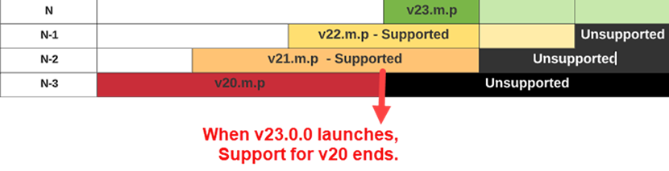

# Versiones de producto y ciclo de vida {#version}

La convención de versiones de Adobe Sign y el ciclo de vida de soporte para los servicios integrados se alinean con otros productos de Adobe con los que pueda estar familiarizado.

## Números de versión

La versión del paquete utiliza un sistema de numeración de tres partes para identificar el número de compilación secuencial de la versión publicada y la importancia relativa de la actualización en cuanto al contenido nuevo o modificado.

El número de versión sigue este patrón: N.m.p

Where, N = Versión principal; m = Versión menor; p = Versión con parches.

Por ejemplo, una versión de paquete de integración 23.2.1 indica un estado de cesión de:

* Versión principal: 23
* Versión secundaria: 2
* Versión del parche: 1

A medida que los ingenieros desarrollan nuevas &quot;compilaciones&quot; del paquete, incrementan el número de versión según la naturaleza de las actualizaciones del código.

* Los cambios más importantes de la versión implican una adición significativa de funciones o un cambio importante en los sistemas principales.
* Las actualizaciones de versiones menores incluyen actualizaciones de funciones más pequeñas y parches de seguridad. Adobe Sign puede requerir una actualización a la última versión revisada en caso de actualizaciones de seguridad o para abordar un elemento notificado.
* Las versiones de parches son casi exclusivamente correcciones de errores y ajustes en la interfaz de usuario.

>[!NOTE]
>
>Todas las versiones no se publican al público, ya que el producto se repite en el desarrollo. Por lo tanto, puede haber saltos significativos en la versión del parche entre las versiones.

Los administradores deben mantener su versión actualizada para garantizar que la cuenta tenga acceso completo a todas las funciones y que se corrijan todos los problemas de seguridad conocidos. Adobe Sign puede requerir una actualización a la última versión modificada en caso de problemas de seguridad o para solucionar un problema crítico del sistema.

## Ciclo de vida de soporte de versiones

El ciclo de vida de soporte de la versión de un producto de integración de Adobe Sign se define en función de la versión principal del paquete e indica el intervalo de tiempo durante el cual Adobe Sign está apoyando activamente la versión individual de la integración.

Adobe Sign admite la versión actual de un paquete y las dos versiones principales anteriores (incluidas todas las actualizaciones secundarias y de parches relacionadas). Las versiones principales se expresan de la siguiente manera:

* Versión actual (N): la versión principal más reciente del paquete
* Versión anterior (N-1): la versión principal anterior a la más reciente
* Última versión compatible (N-2): dos versiones principales por detrás de la versión actual

Por ejemplo, si la versión actual disponible del paquete es 23.2.1, entonces:

* La versión principal actual (N) es la 23
* La versión principal anterior (N-1) de este paquete es la 22
* La última versión principal compatible (N-2) de este paquete es la 21
* Las versiones principales anteriores a la 21.0.0 no serán compatibles

## Ciclo de vida del servicio de versiones

El ciclo de vida del servicio de la versión define el ámbito completo de cuándo se puede utilizar el servicio. La cronología coincide con el ciclo de vida de soporte de la versión con la adición de un período de gracia de 90 días que permite a los clientes completar su actualización.

* Durante el período de gracia de una versión no compatible, solo se proporciona soporte para actualizar a una versión más nueva, no para mantener una versión no compatible.
* Después del período de gracia, la versión deja de estar en servicio

* Adobe Sign no aceptará solicitudes de versiones que no estén en servicio
* Una vez que la integración se actualice a la versión actual, las comunicaciones entre Adobe Sign y la integración se reanudarán normalmente.

Si tiene cualquier pregunta, póngase en contacto con su distribuidor o con Asistencia al cliente.
