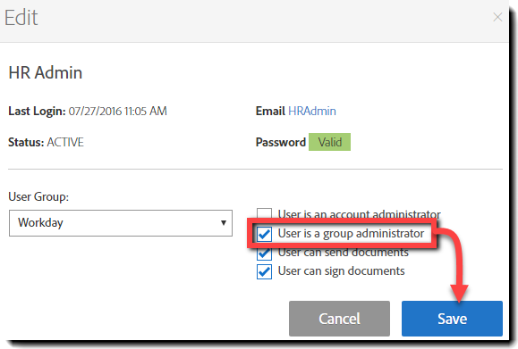

# [!DNL Workday] Guía de instalación{#workday-installation-guide}

[**Contactar con el servicio de soporte técnico de Adobe Sign**](https://adobe.com/go/adobesign-support-center_es)

## Información general {#overview}

Este documento explica cómo integrar Adobe Sign en su [!DNL Workday] inquilino. Para utilizar Adobe Sign dentro de [!DNL Workday], debe saber cómo crear y modificar [!DNL Workday] elementos como:

* Marco de procesos empresariales
* Configuración y configuración del inquilino
* Reporting and [!DNL Workday] integración de estudio

Los pasos de alto nivel para completar la integración son:

* Activar su cuenta administrativa en Adobe Sign (solo nuevos clientes)
* Configure un grupo en Adobe Sign para que retenga al usuario de integración [!DNL Workday]
* Establecer la relación de OAuth entre [!DNL Workday] y Adobe Sign

## Activar su cuenta de Adobe Sign {#activating-your-adobe-sign-account}

Los clientes existentes con cuentas establecidas pueden pasar al tema [Configurar Adobe Sign para [!DNL Workday]](#config).

Para los clientes que son nuevos en Adobe Sign y no tienen un inicio de sesión preexistente, un especialista en incorporación de Adobe aprovisiona su cuenta (en Adobe Sign) para [!DNL Workday]. Una vez completado, recibirá un correo electrónico de confirmación como se muestra a continuación.

Debe seguir las instrucciones del correo electrónico para inicializar su cuenta y acceder a su página de Adobe Sign [!UICONTROL Home].

## Configurar Adobe Sign para [!DNL Workday] {#config}

Para configurar Adobe Sign para [!DNL Workday], debe generar los dos objetos dedicados siguientes en el sistema Adobe Sign:

* **Un  [!DNL Workday] grupo**:  [!DNL Workday] requiere un &quot;grupo&quot; dedicado dentro de la cuenta de Adobe Sign para habilitar la funcionalidad de integración. El grupo de Adobe Sign se utiliza para controlar solo el [!DNL Workday] uso de Adobe Sign. Cualquier otro uso potencial, como Salesforce.com o Arriba, no se ve afectado. Las notificaciones por correo electrónico se suprimen en el grupo [!DNL Workday] de modo que los usuarios [!DNL Workday] solo reciban notificaciones dentro de su bandeja de entrada [!DNL Workday].

* **Un usuario de autenticación que contenga la clave** de integración: Un  [!DNL Workday] grupo solo debe tener un administrador de nivel de grupo, que es el titular autorizado de la clave de integración. Se recomienda que el administrador utilice una dirección de correo electrónico funcional, como `HR@MyDomain.com`, en lugar de un correo electrónico personal, para reducir el riesgo de que el usuario se desactive en el futuro y, por lo tanto, se desactive la integración.

### Crear un usuario y un grupo en Adobe Sign {#create-a-user-and-group-in-adobe-sign}

Para crear un usuario en Adobe Sign:

1. Inicie sesión en Adobe Sign como administrador de la cuenta..
1. Vaya a **[!UICONTROL Cuenta]** > **[!UICONTROL Usuarios]**.
1. Haga clic en la imagen de icono  para crear un nuevo usuario.

   

1. En el cuadro de diálogo que se abre, proporcione los detalles del nuevo usuario:

   * Proporcione un correo electrónico funcional al que pueda acceder.
   * Introduzca un valor de nombre y apellidos adecuado.
   * Seleccione **[!UICONTROL Crear un nuevo grupo para este usuario]** en el Grupo de usuarios.
   * Proporcione al **[!UICONTROL Nuevo nombre de grupo]** un nombre intuitivo como *[!DNL Workday]*.

   

1. Haga clic en **[!UICONTROL Guardar]**.

   Regresa a la página [!UICONTROL Usuarios] que muestra al nuevo usuario con el estado **[!UICONTROL CREADO]**.

   

Para verificar la dirección de correo electrónico del usuario con el estado &quot;Creado&quot;:

1. Inicie sesión en el correo electrónico del nuevo usuario.
2. Busque el correo electrónico &quot;Bienvenido a Adobe Sign&quot;.
3. Haga clic donde dice **[!UICONTROL Haga clic aquí para establecer su contraseña]**.
4. Establezca la contraseña.

Una vez que verifique la dirección de correo electrónico, el estado del usuario cambia de [!UICONTROL CREADO] a [!UICONTROL ACTIVO].

### Definir el usuario de autenticación {#define-the-authenticating-user}

Para promocionar al nuevo usuario en el grupo [!DNL Workday]:

1. Vaya a la página [!UICONTROL Usuarios] (si aún no está allí).
2. Haga doble clic en el usuario en el grupo [!DNL Workday].

   Se abre una página [!UICONTROL Editar] para los permisos de usuario.

3. Compruebe el **[!UICONTROL Administrador de grupo]**.
4. Haga clic en **[!UICONTROL Guardar]**.

## Configurar el inquilino [!DNL Workday] {#configure-workday}

Para completar la conexión entre el [!DNL Workday] inquilino y Adobe Sign, necesitamos establecer una relación de confianza entre los servicios. Una vez hecho esto, podemos agregar un paso Revisar documento que permita el proceso de firma a través de Adobe Sign.

>[!NOTE]
>
>Adobe Sign se marca como Adobe Document Cloud en todo el entorno [!DNL Workday].

Para establecer la relación de confianza:

1. Inicie sesión en [!DNL Workday] como administrador de cuenta.
1. Abra la página **[!UICONTROL Editar configuración del inquilino - Procesos empresariales]**.
1. Busque la sección [!UICONTROL Configuración de firma electrónica]:

   

1. Haga clic en **[!UICONTROL Autenticar con Adobe]**.

   Esto inicia la secuencia de autenticación de OAuth2.0.

1. Cuando se le solicite, proporcione las credenciales del administrador del grupo de Adobe Sign que haya creado anteriormente.
1. Apruebe el acceso a Adobe Sign.

>[!NOTE]
>
>Asegúrese de cerrar sesión por completo en cualquier otra instancia de Adobe Sign antes de continuar.

Una vez realizada la conexión, se activa la opción Configuración de Adobe habilitada y puede comenzar a usar Adobe Sign con [!DNL Workday].

### Configurar el paso Revisar documento {#configure-review}

El documento del paso Revisar documento puede ser uno de los siguientes:

* Un documento estático
* Documento generado por un paso Generar documento dentro del mismo proceso empresarial
* Informe con formato creado con el [!DNL Workday] Diseñador de informes

Puede agregar cualquiera de estos documentos con [etiquetas de texto de Adobe](https://adobe.com/go/adobesign_text_tag_guide_es) para controlar el aspecto y la posición de los componentes específicos de Firma de Adobe. El origen del documento debe especificarse dentro de la definición de procesos empresariales. No es posible cargar un documento específico mientras el proceso empresarial está en ejecución.

La capacidad de tener grupos de firmantes serializados es exclusiva del uso de Adobe Sign con un paso Revisar documento. Esto permite especificar grupos basados en roles que firman secuencialmente. Adobe Sign no admite grupos de firma paralelos.

Para obtener ayuda sobre la configuración del paso Revisar documento, consulte la [guía de inicio rápido](https://adobe.com//go/adobesign_workday_quick_start){target=&quot;_blank&quot;}.

## Soporte {#support}

### [!DNL Workday] soporte {#workday-support}

[!DNL Workday] es el propietario de la integración y debe ser el primer punto de contacto para plantear preguntas sobre el ámbito de la integración, solicitudes de funciones o problemas sobre el funcionamiento diario de la integración.

Puede consultar los siguientes [!DNL Workday] artículos de la comunidad sobre cómo solucionar problemas de integración y generar documentos:

* [Solución de problemas de integraciones de firma electrónica](https://doc.workday.com/#/reader/3DMnG~27o049IYFWETFtTQ/zhA~hYllD3Hv1wu0CvHH_g)
* [Paso Revisar documentos](https://doc.workday.com/#/reader/3DMnG~27o049IYFWETFtTQ/TboWWKQemecNipWgxLAjqg)
* [Generación dinámica de documentos](https://community.workday.com/saml/login?destination=/articles/176443)
* [Sugerencias para la generación de documentos](https://community.workday.com/node/183242)

### Asistencia técnica de Adobe Sign {#adobe-sign-support}

Adobe Sign es el socio de la integración y debe ponerse en contacto con el mismo si la integración no puede obtener firmas o si la notificación de firmas pendientes falla.

Los clientes de Adobe Sign deben ponerse en contacto con el administrador de satisfacción del cliente (CSM) para obtener asistencia. También puede ponerse en contacto con el servicio de asistencia técnica de Adobe por teléfono: llame al 1-866-318-4100, espere a la lista de productos y luego introduzca 4 y 2 (tal y como se lo pidan).

* [Adición de etiquetas de texto de Adobe a documentos](https://adobe.com/go/adobesign_text_tag_guide)
* [Revisar la configuración y los ejemplos del documento](https://www.adobe.com/go/adobesign_workday_quick_start)

## Preguntas habituales {#faq}

### ¿Por qué no se actualiza el estado en [!DNL Workday] incluso cuando el documento está completamente firmado? {#why-is-the-status-not-being-updated-within-workday-even-the-document-is-fully-signed}

Es posible que el estado del documento en [!DNL Workday] no refleje si el candidato no hace clic en el botón &#39;[!UICONTROL Enviar]&#39; después de iniciar sesión en Adobe Sign.

Según la tarea [!DNL Workday] Comprobar el estado de firma electrónica: Para iniciar el proceso, el usuario puede enviar la tarea Bandeja de entrada asociada.

Según [!DNL Workday] Desarrollo: La firma original finaliza el proceso solo si el usuario envía la tarea de bandeja de entrada después de firmar el documento. Después de firmar, el iframe se cierra y se redirige al usuario a la misma tarea, donde puede hacer clic en el botón [!UICONTROL Enviar] para completar el proceso.
