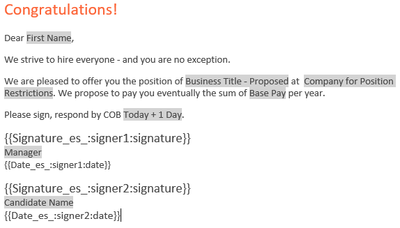

# [!DNL Workday] Guía de inicio rápido{#workday-quick-start-guide}

[**Contactar con el servicio de soporte técnico de Adobe Sign**](https://www.adobe.com/go/adobesign-support-center)

## Información general {#overview}

Este documento está diseñado para ayudar [!DNL Workday] los administradores entienden cómo personalizar el [!DNL Workday] Procesos empresariales para incluir Adobe Sign para obtener firmas electrónicas. Para usar Adobe Sign en [!DNL Workday], debe saber cómo crear y modificar [!DNL Workday] elementos como:

* [!UICONTROL Marco de proceso empresarial]
* Configuración y configuración del inquilino
* Informes y [!DNL Workday] Integración con Studio

## Acceso a Adobe Sign dentro de [!DNL Workday] {#access-adobe-sign}

[!UICONTROL Capacidad de firma electrónica de Adobe Sign] aparece como [!UICONTROL Paso Revisar documento] dentro del [!UICONTROL Business Process Framework (BPF)] y como tarea Distribuir documentos.

## [!UICONTROL Paso Review Document (Revisar documento)] {#review-document-step}

Adobe Sign para [!DNL Workday] se expone a través del [!UICONTROL Paso Revisar documento] que puede agregar a cualquiera de los más de 400 procesos empresariales dentro de [!DNL Workday], incluidos [!UICONTROL Oferta], [!UICONTROL Distribuir documentos y tareas], [!UICONTROL Proponer compensación]y mucho más.

Puede consultar la [[!DNL Workday] artículos de la comunidad [!UICONTROL Paso Revisar documento]](https://doc.workday.com/#/reader/3DMnG~27o049IYFWETFtTQ/TboWWKQemecNipWgxLAjqg).

Hay una relación 1:1 entre [!UICONTROL [!UICONTROL Paso Revisar documento]s] y facturables con Adobe Sign. Puede combinar varios documentos en una sola [!UICONTROL Paso Revisar documento] y se presentan como un único paquete para su firma.

**Nota**: Solo una *Dinámico* se puede hacer referencia al documento en un [!UICONTROL Paso Revisar documento].

Para definir una función [!UICONTROL Paso Revisar documento]:

1. Inserte un [!UICONTROL Paso Revisar documento].
1. Especifique los grupos (funciones) que pueden actuar en el [!UICONTROL Paso Revisar documento].

Para configurar el [!UICONTROL Paso Revisar documento]:

1. Especifique el *[!UICONTROL Tipo de integración de firma electrónica]* como *[!UICONTROL Firmar electrónicamente por Adobe]*.

1. Añada filas a la cuadrícula de firmas.

   * La cuadrícula de la firma especifica el orden en el que se enruta el documento para firmar. Cada fila puede contener uno o varios roles y cada fila representa un paso del proceso de firma..
   * Se notifica a cada miembro de la función en un paso determinado que un evento de firma está pendiente.
   * Una vez que una sola persona del rol firma, el paso de la fila se completa y el documento se mueve al siguiente paso de la fila.
   * Cuando se hayan firmado todas las filas, el [!UICONTROL Paso Revisar documento] se ha completado.

1. Especifique el documento que se va a firmar. Si el documento es un [!UICONTROL Oferta BP], puede utilizarla desde un paso Generar documento. De lo contrario, elija un documento o un informe existente.

1. Repita el paso 3 para todos los documentos que necesite..

   

1. De forma opcional, añada un &quot;usuario de redirección&quot; para capturar acciones de &quot;rechazar la firma&quot;. Cuando los usuarios declinan, [!DNL Workday] reenvía los documentos a un grupo de seguridad configurado para su revisión.

En el menú de acciones relacionadas de un [!UICONTROL Paso Revisar documento], seleccionar **[!UICONTROL Proceso empresarial]** > **[!UICONTROL Mantener redirección]**. A continuación, seleccione una de las siguientes opciones:

* **[!UICONTROL Enviar atrás]**: Para permitir que los miembros del grupo de seguridad envíen un paso atrás a un paso anterior del proceso empresarial. El proceso empresarial se reiniciará desde ese paso.
* **[!UICONTROL Mover al paso siguiente]**: Para permitir que los miembros del grupo de seguridad reenvíen un paso al siguiente paso del proceso empresarial.
* **[!UICONTROL Grupos de seguridad]**: Para redirigir pasos en el flujo del proceso empresarial. Los grupos de seguridad que se muestran en este mensaje se seleccionan en la directiva de seguridad del proceso empresarial en la sección Redireccionamiento.

## Notas del paso del proceso empresarial {#business-process-step-notes}

[!UICONTROL El marco del proceso empresarial] es potente; sin embargo, debe asegurarse de que:

* Cada proceso empresarial debe tener un paso de finalización, que es ideal al final del proceso empresarial.

* Se establece un paso de finalización en el menú de acciones relacionadas del icono de búsqueda. Esto solo es posible mientras se &quot;ve&quot; el proceso empresarial y no mientras se &quot;edita&quot;.

* Cada paso del proceso empresarial se ejecuta secuencialmente.

   Puede cambiar el orden de un paso cambiando el valor del orden. Por ejemplo, para insertar un paso entre los elementos &quot;c&quot; y &quot;d&quot;, especifique un nuevo elemento como &quot;ca&quot;.

### Ejemplo: oferta {#example-offer}

La oferta empresarial es un subproceso del [!UICONTROL Job Application Dynamic BP] que se debe configurar para ejecutar la oferta de proceso empresarial. Se activa cuando se mueve el estado Aplicación de trabajo a &quot;[!UICONTROL Oferta]&quot; o &quot;[!UICONTROL Hacer oferta]&quot;.

En el ejemplo siguiente, un [!UICONTROL Paso Revisar documento] está utilizando un paso Documento dinámico tanto para Norteamérica como para Japón.

![[!DNL Workday]Ejemplo de un proceso empresarial de ](images/bp-for-offersmaller-575.png)

Este proceso empresarial hace lo siguiente:

* Pide al iniciador del procedimiento empresarial que proponga una compensación para el candidato (paso b).
* Utiliza una condición de paso para comprobar si el país actual NO es Japón.

   Si es true, ejecuta el paso &quot;ba&quot; que utiliza un documento en inglés.

   Si es false, ejecuta el paso &quot;bb&quot; que utiliza un documento en japonés.

* Define el proceso de firma en el [!UICONTROL Paso Revisar documento] &quot;bc&quot;.
* Define el punto de decisión para realizar una oferta en el paso de finalización requerido &quot;d&quot;.

El documento dinámico generado en el paso “ba” se denomina [!UICONTROL Offer Letter] (Carta de la oferta) y contiene un solo bloque de texto denominado [!UICONTROL Rapid Offer] (Oferta rápida). Puede añadir varios bloques de texto, como encabezado, saludo, compensación, stock, cierre, términos y mucho más, según sea necesario.

![[!DNL Workday] ver página de documento](images/offer-letter-575.png)

La siguiente carta de oferta dinámica se crea en el [!DNL Workday] editor de texto enriquecido. Los elementos resaltados en *gris* son [!DNL Workday] proporciona objetos que hacen referencia a datos contextuales.

Los elementos entre {{corchetes}} son las [etiquetas de texto de Adobe](https://adobe.com/go/adobesign_text_tag_guide_es).

Dentro del [!UICONTROL Paso Revisar documento], se hace referencia al documento dinámico desde el paso anterior y define el proceso secuencial de firma mediante dos grupos de firma.

El comportamiento que se muestra a continuación enruta el documento generado dinámicamente primero al Administrador de contratación y, a continuación, al candidato.

![[!DNL Workday] grupos de firma definidos](images/configure-rd-stepsmaller-575.png)

### Ejemplo: Distribución de documentos {#example-distribute-documents}

Introducido en [!DNL Workday] 30. La tarea Distribuir documentos o tareas en masa se puede utilizar para enviar un solo documento a un grupo grande (&lt;20 000) de firmantes individuales. Dicha tarea está limitada a una única firma por documento. La creación de una distribución se realiza accediendo al[!UICONTROL Crear distribución de documentos o tareas]&#39; de la barra de búsqueda.

Ejemplo: Enviar un formulario de elección de equidad de empleado a todos los responsables con [!UICONTROL Servicios modernos globales]. Si lo desea, puede filtrarlo a administradores individuales.

También puede acceder al **Ver distribución de documentos o tareas** para realizar un seguimiento del progreso de la distribución.

### Ejemplo: Informe {#example-reporting}

[!DNL Workday] tiene una infraestructura de informes sofisticada. Para ver los detalles del proceso de Adobe Sign, examine los elementos del *Review Document Event* (Evento Revisar documento).

A continuación se muestra un informe personalizado sencillo que se puede ejecutar en todos los procesos empresariales que buscan transacciones de Adobe Sign y su estado.

![[!DNL Workday]Ejemplo de un informe personalizado de ](images/review-document-eventsmaller-575.png)

El siguiente informe se ha generado mediante la observación de los procesos empresariales Offer (Oferta), Onboarding (Inscripción) y Propose Compensation (Proponer compensación) dentro de un inquilino de la implementación.

Se pueden ver:

* Los documentos enviados para firmar
* El paso de procedimientos empresariales asociado
* La siguiente persona que espera su firma

![[!DNL Workday]Ejemplo de un informe de con tres objetos](images/workday-reportsmaller-575.png)

## Documentos firmados {#signed-documents}

El [!DNL Workday] el ciclo de firma suprime todas las notificaciones por correo electrónico de Adobe Sign. Se informa a los usuarios de las acciones pendientes dentro de sus [!DNL Workday] bandeja de entrada.

Una vez que todos los grupos de firmas han firmado un documento, se distribuye una copia del mismo a todos los miembros del grupo de firmas por correo electrónico.

Para suprimir este comportamiento, puede ponerse en contacto con su [!UICONTROL Adobe Sign Success Manager] o [Equipo de asistencia de Adobe Sign](https://adobe.com/go/adobesign-support-center).

Dentro [!DNL Workday], puede acceder a los documentos firmados en el registro de proceso completo. Puede encontrar:

* Documentos del trabajador en el perfil del trabajador y
* Documentos de candidatos (cartas de oferta) en el perfil de candidatos.

La siguiente imagen muestra una carta de oferta firmada para el candidato Chris Foxx.

![Ejemplo [!DNL Workday] carta de oferta](images/offer.png)

## Soporte {#support}

### [!DNL Workday] soporte {#workday-support}

[!DNL Workday] es el propietario de la integración y debe ser el primer punto de contacto para plantear preguntas sobre el ámbito de la integración, solicitudes de funciones o problemas sobre el funcionamiento diario de la integración.

El [!DNL Workday] community tiene varios buenos artículos sobre cómo solucionar problemas de integración y generar documentos:

* [Solución de problemas de integraciones de firma electrónica](https://doc.workday.com/#/reader/3DMnG~27o049IYFWETFtTQ/zhA~hYllD3Hv1wu0CvHH_g)
* [Paso Revisar documentos](https://doc.workday.com/#/reader/3DMnG~27o049IYFWETFtTQ/TboWWKQemecNipWgxLAjqg)
* [Generación dinámica de documentos](https://community.workday.com/node/176443)
* [Consejos para la configuración de generación de documentos](https://community.workday.com/node/183242)

### Asistencia técnica de Adobe Sign {#adobe-sign-support}

Adobe Sign es el socio de la integración y debe ponerse en contacto con el mismo si la integración no puede obtener firmas o si la notificación de firmas pendientes falla.

Los clientes de Adobe Sign deben ponerse en contacto con su gestor de satisfacción del cliente para obtener asistencia. Alternativamente, [!UICONTROL Asistencia técnica de Adobe] se puede contactar por teléfono: 1-866-318-4100, espere a la lista de productos y escriba: 4 y, a continuación, 2 (como se le solicite).

* [Adición de etiquetas de texto de Adobe a los documentos](https://www.adobe.com/go/adobesign_text_tag_guide)

<!--
[Download PDF](images/adobe-sign-for-workday-quick-start-guide-2016.pdf)
-->
