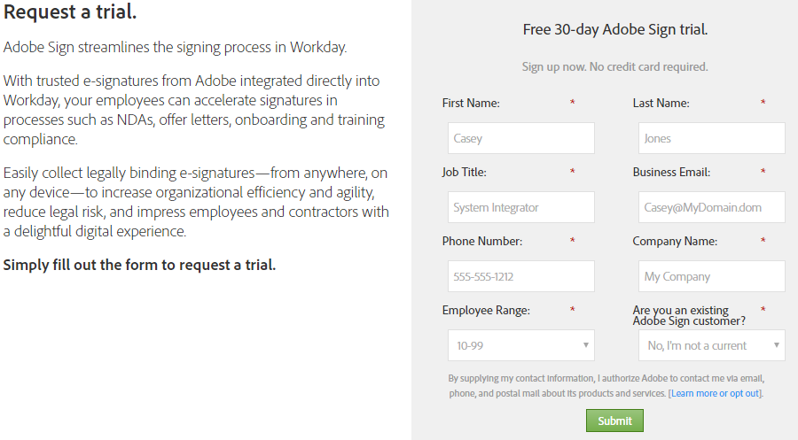

# [!DNL Workday] Instalación de la versión de prueba{#workday-trial-installation}

## Información general {#overview}

Este documento está diseñado para ayudar a los clientes [!DNL Workday] a aprender a activar una cuenta de prueba con Adobe Sign y luego integrarla en el inquilino [!DNL Workday]. Para utilizar Adobe Sign dentro de [!DNL Workday], debe saber cómo crear y modificar [!DNL Workday] elementos como:

* Marco de procesos empresariales
* Configuración y configuración del inquilino
* Integración de Reporting and [!DNL Workday] Studio

**Nota**: Si ya tiene una cuenta de Adobe Sign, no es necesario iniciar una versión de prueba. Puede ponerse en contacto con el administrador de éxito de clientes para solicitar la integración [!DNL Workday].

Los pasos de alto nivel para completar la integración son:

* Activar su cuenta de prueba con Adobe Sign
* Generar una clave de integración en Adobe Sign
* Instale la clave de integración en el [!DNL Workday] inquilino

## Activar la cuenta de prueba de Adobe Sign {#activate-sign-trial-account}

Para solicitar una versión de prueba de 30 días de Adobe Sign, debe rellenar este [formulario de registro](https://land.echosign.com/esign-trial-workday-registration.html).

**Nota**: Le recomendamos encarecidamente que utilice una dirección de correo electrónico funcional válida para crear la versión de prueba y no un correo electrónico temporal. Debe acceder a este correo electrónico para verificar la cuenta, por lo que la dirección debe ser válida.

En el plazo de un día hábil, un especialista en incorporación de Adobe Sign aprovisiona su cuenta (en Adobe Sign) para [!DNL Workday]. Una vez completado, recibirá un correo electrónico de confirmación como se muestra a continuación.

Siga las instrucciones del correo electrónico para inicializar su cuenta y acceder a su página de Adobe Sign [!UICONTROL Home].

## Generar una clave de integración {#generate-an-integration-key}

Para las nuevas instalaciones, debe generar una clave de integración en Adobe Sign y luego introducirla en [!DNL Workday]. Esta clave autentica los entornos Adobe Sign y [!DNL Workday] para confiar unos en otros y compartir contenido.

Para generar una clave de integración en Adobe Sign:

1. Inicie sesión en el administrador con Adobe Sign..
1. Vaya a **[!UICONTROL **Cuenta]** > **[!UICONTROL Preferencias personales]** > **[!UICONTROL Tokens de acceso**]**.
1. Haga clic en el icono **con un círculo más** en el lado derecho de la ventana.

   Abre la interfaz [!UICONTROL Crear clave de integración].

   

1. Proporcione un nombre intuitivo para la clave, como [!DNL Workday].

   La clave de integración debe tener los siguientes elementos activados:

   * agreement_read
   * agreement_write
   * agreement_send
   * widget_read
   * library_read

   

1. Haga clic en **[!UICONTROL Guardar]**.

   Aparece la página [!UICONTROL Tokens de acceso] que muestra las claves diseñadas en su cuenta.

1. Haga clic en la definición de clave creada para [!DNL Workday].

   El vínculo [!UICONTROL Clave de integración] se muestra en la parte superior de la definición.

1. Haga clic en el vínculo **[!UICONTROL Clave de integración.]**

   Muestra la clave de integración.

   

1. Copie esta clave y guárdela en un lugar seguro para el siguiente paso.
1. Haga clic en **[!UICONTROL Aceptar]**.

   

## Configurar el inquilino [!DNL Workday] {#configuring-the-workday-tenant}

### Instalar la clave de integración {#install-the-integration-key}

La instalación de la clave de integración en el inquilino [!DNL Workday] establece la relación de confianza con Adobe Sign. Una vez que la relación está establecida, cualquier proceso empresarial puede tener un [!UICONTROL paso de revisión de documento] agregado que permita el proceso de firma.

**Nota**[!DNL Workday]: Adobe Sign se comercializa como “Adobe Document Cloud” en el entorno de 

Para instalar la clave de integración:

1. Inicie sesión en [!DNL Workday] como administrador de cuenta.
1. Busque y abra la página **[!UICONTROL Editar configuración del inquilino - Procesos empresariales]**.

1. Proporcione información para los cuatro campos siguientes:

   * **[!UICONTROL Confirmación]** de Adobe Document Cloud: Confirmación de texto fijo de la integración.

   * **[!UICONTROL Clave]** de API de Adobe Document Cloud: Dónde se instala la clave de integración

   * **[!UICONTROL Dirección]** de correo electrónico del remitente de Adobe Document Cloud: La dirección de correo electrónico del administrador de nivel de grupo en Adobe Sign

   * **[!UICONTROL Quitar documentos pendientes de firma electrónica cuando el documento se haya cancelado]**: Configuración opcional que elimina documentos del ciclo de firma si se cancela un documento en  [!DNL Workday].

   

1. A continuación, complete la instalación:

   1. Pegue la clave de integración en el campo [!UICONTROL Clave de integración de API de Adobe Sign].
   1. Introduzca la dirección de correo electrónico del administrador de Adobe Sign en el campo [!UICONTROL Dirección de correo electrónico del remitente de Adobe Document Cloud].
   1. Haga clic en **[!UICONTROL Aceptar]**.

   

La funcionalidad de Adobe Sign ahora se puede agregar a cualquier proceso empresarial agregando un [!UICONTROL paso Revisar documento] y configurándolo para que utilice **[!UICONTROL eSign by Adobe]** como tipo de firma electrónica.

### Configurar el paso Revisar documento {#configure-the-review-document-step}

El documento del paso Revisar documento puede ser un documento estático; un documento generado por un paso Generar documento dentro del mismo proceso empresarial; o bien, un informe con formato creado con el [!DNL Workday] Diseñador de informes. Todos estos casos se puede aumentar con las [etiquetas de texto de Adobe](https://adobe.com/go/adobesign_text_tag_guide_es) para controlar el aspecto y la posición de los componentes específicos de Adobe Sign. El origen del documento debe especificarse dentro de la definición de procesos empresariales. No es posible cargar un documento ad hoc mientras se está ejecutando el proceso empresarial.

La capacidad de tener grupos de firmantes serializados es exclusiva del uso de Adobe Sign con un paso Revisar documento. Los grupos de firmantes le permiten especificar grupos basados en roles que firman en secuencia. Adobe Sign no admite grupos de firma paralelos.

Para obtener ayuda sobre la configuración del paso Revisar documento, consulte la [Guía de inicio rápido](https://adobe.com//go/adobesign_workday_quick_start){target=&quot;_blank&quot;}.

## Soporte {#support}

### [!DNL Workday] soporte {#workday-support}

[!DNL Workday] es el propietario de la integración y debe ser el primer punto de contacto para plantear preguntas sobre el ámbito de la integración, solicitudes de funciones o problemas sobre el funcionamiento diario de la integración.

La comunidad [!DNL Workday] tiene varios buenos artículos sobre cómo solucionar problemas de integración y generar documentos:

* [Solución de problemas de integraciones de firma electrónica](https://doc.workday.com/#/reader/3DMnG~27o049IYFWETFtTQ/zhA~hYllD3Hv1wu0CvHH_g)
* [Paso Revisar documentos](https://doc.workday.com/#/reader/3DMnG~27o049IYFWETFtTQ/TboWWKQemecNipWgxLAjqg)
* [Generación dinámica de documentos](https://community.workday.com/node/176443)

* [Consejos para la configuración de generación de documentos](https://community.workday.com/node/183242)

### Asistencia técnica de Adobe Sign {#adobe-sign-support}

Adobe Sign es el socio de la integración y debe ponerse en contacto con el mismo si la integración no puede obtener firmas o si la notificación de firmas pendientes falla.

Los clientes de Adobe Sign deben ponerse en contacto con el administrador de satisfacción del cliente (CSM) para obtener asistencia. También puede ponerse en contacto con el servicio de asistencia técnica de Adobe por teléfono: 1-866-318-4100; espere a que aparezca la lista de productos y, a continuación, introduzca: 4 y, a continuación, 2 (como se le solicite).

* [Adición de etiquetas de texto de Adobe a los documentos](https://adobe.com/go/adobesign_text_tag_guide)

* [Revisar la configuración del documento y los ejemplos](https://experienceleague.adobe.com/docs/dc-sign-integrations/using/workday/quick-start.html)

[**Contactar con el servicio de soporte técnico de Adobe Sign**](https://adobe.com/go/adobesign-support-center_es)
