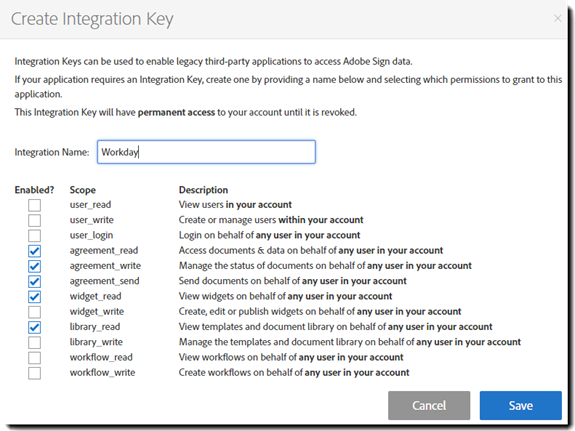

# [!DNL Workday] Instalación de la versión de prueba{#workday-trial-installation}

## Información general {#overview}

Este documento está diseñado para ayudar [!DNL Workday] los clientes aprenden a activar una cuenta de prueba con Adobe Sign y a integrarla en [!DNL Workday] inquilino. Para utilizar Adobe Sign en [!DNL Workday], debe saber cómo crear y modificar [!DNL Workday] elementos como:

* Marco del proceso empresarial
* Configuración del inquilino
* Informes y [!DNL Workday] Integración de Studio

**Nota**: Si ya tiene una cuenta de Adobe Sign, no es necesario iniciar una versión de prueba. Puede ponerse en contacto con su administrador de éxito de clientes para solicitar [!DNL Workday] integración.

Los pasos de alto nivel para completar la integración son:

* Activar su cuenta de prueba con Adobe Sign
* Generación de una clave de integración en Adobe Sign
* Instale la clave de integración en el [!DNL Workday] Inquilino

## Activar la cuenta de prueba de Adobe Sign {#activate-sign-trial-account}

Para solicitar una versión de prueba de 30 días de Adobe Sign, debe rellenar este [formulario registro](https://land.echosign.com/esign-trial-workday-registration.html).

**Nota**: Recomendamos encarecidamente que utilice una dirección de correo electrónico funcional válida para crear la versión de prueba, no un correo electrónico temporal. Debe acceder a este correo electrónico para verificar la cuenta, por lo que la dirección debe ser válida.

En el plazo de un día laborable, un especialista en incorporación de Adobe Sign aprovisiona su cuenta (en Adobe Sign) por [!DNL Workday]. Una vez completado el proceso, recibirá un correo electrónico de confirmación, como se muestra a continuación.

Para inicializar su cuenta y acceder a su Adobe Sign [!UICONTROL Inicio] , siga las instrucciones de la página de correo electrónico .

## Generar una clave de integración {#generate-an-integration-key}

Para instalaciones nuevas, debe generar una clave de integración en Adobe Sign y, a continuación, introducirla en [!DNL Workday]. Esta clave autentica el Adobe Sign y [!DNL Workday] para confiar en los demás y compartir contenido.

Para generar una clave de integración en Adobe Sign:

1. Inicie sesión en el administrador con Adobe Sign..
1. Vaya a **[!UICONTROL **Cuenta]** > **[!UICONTROL Preferencias personales]** > **[!UICONTROL Tokens de acceso**]**.
1. Haga clic en **icono más en un círculo** en el lado derecho de la ventana.

   Se abre el [!UICONTROL Crear clave de integración] interfaz.

   

1. Proporcione un nombre intuitivo para la clave, como [!DNL Workday].

   La clave de integración debe tener los siguientes elementos activados:

   * agreement_read
   * agreement_write
   * agreement_send
   * widget_read
   * library_read

   

1. Haga clic en **[!UICONTROL Guardar]**.

   Aparece la página [!UICONTROL Tokens de acceso] que muestra las claves diseñadas en su cuenta.

1. Haga clic en la definición de clave creada para [!DNL Workday].

   La [!UICONTROL Clave de integración] se muestra en la parte superior de la definición.

1. Haga clic en el vínculo **[!UICONTROL Clave de integración.]**

   Se muestra la clave de integración.

   

1. Copie esta clave y guárdela en un lugar seguro para el siguiente paso.
1. Haga clic en **[!UICONTROL OK]**.

   

## Configure el [!DNL Workday] inquilino {#configuring-the-workday-tenant}

### Instalar la clave de integración {#install-the-integration-key}

Instalar la clave de integración en el [!DNL Workday] establece la relación de confianza con Adobe Sign. Una vez establecida esa relación, cualquier proceso empresarial puede tener una [!UICONTROL Paso Revisar documento] añadido que habilita el proceso de firma.

**Nota**[!DNL Workday]: Adobe Sign se comercializa como “Adobe Document Cloud” en el entorno de 

Para instalar la clave de integración:

1. Inicie sesión en [!DNL Workday] como administrador de cuentas.
1. Busque y abra el **[!UICONTROL Editar configuración del inquilino: procesos empresariales]** página.

1. Proporcione información para los cuatro campos siguientes:

   * **[!UICONTROL Reconocimiento de Adobe Document Cloud]**: Una confirmación de texto fijo de la integración.

   * **[!UICONTROL Clave de API de Adobe Document Cloud]**: Dónde está instalada la clave de integración

   * **[!UICONTROL Dirección de correo electrónico del remitente de Adobe Document Cloud]**: La dirección de correo electrónico del administrador de nivel de grupo en Adobe Sign.

   * **[!UICONTROL Eliminar documentos pendientes de firma electrónica cuando el documento se cancela]**: Una configuración opcional que elimina documentos del ciclo de firma si un documento se cancela en [!DNL Workday].

   

1. A continuación, complete la instalación:

   1. Pegue la clave de integración en el [!UICONTROL Clave de integración de API de Adobe Sign] campo.
   1. Introduzca la dirección de correo electrónico del administrador de Adobe Sign en el [!UICONTROL Dirección de correo electrónico del remitente de Adobe Document Cloud] campo.
   1. Haga clic en **[!UICONTROL OK]**.

   

La funcionalidad de Adobe Sign ahora se puede agregar a cualquier proceso empresarial agregando un [!UICONTROL Paso Revisar documento] y configurarlo para su uso **[!UICONTROL Firmar electrónicamente por Adobe]** como tipo de firma electrónica.

### Configurar el paso Revisar documento {#configure-the-review-document-step}

El documento para el paso Revisar documento puede ser un documento estático; un documento generado por un paso Generar documento dentro del mismo proceso empresarial; o bien, un informe con formato creado con el [!DNL Workday] Diseñador de informes. Todos estos casos se puede aumentar con las [etiquetas de texto de Adobe](https://adobe.com/go/adobesign_text_tag_guide_es) para controlar el aspecto y la posición de los componentes específicos de Adobe Sign. El origen del documento debe especificarse dentro de la definición de procesos empresariales. No es posible cargar un documento ad hoc mientras se está ejecutando el proceso empresarial.

La capacidad de tener grupos de firmantes serializados es única en Adobe Sign con un paso Revisar documento. Los grupos de firmantes permiten especificar grupos basados en funciones que firman en secuencia. Adobe Sign no admite grupos de firma paralelos.

Si necesita ayuda para configurar el paso Revisar documento, consulte la [Guía de inicio rápido](https://adobe.com//go/adobesign_workday_quick_start){target=&quot;_blank&quot;}.

## Soporte {#support}

### [!DNL Workday] apoyo {#workday-support}

[!DNL Workday] es el propietario de la integración y debe ser el primer punto de contacto para plantear preguntas sobre el ámbito de la integración, solicitudes de funciones o problemas sobre el funcionamiento diario de la integración.

La [!DNL Workday] tiene varios artículos útiles sobre cómo solucionar problemas de integración y generar documentos:

* [Solución de problemas de integraciones de firma electrónica](https://doc.workday.com/#/reader/3DMnG~27o049IYFWETFtTQ/zhA~hYllD3Hv1wu0CvHH_g)
* [Paso Revisar documentos](https://doc.workday.com/#/reader/3DMnG~27o049IYFWETFtTQ/TboWWKQemecNipWgxLAjqg)
* [Generación dinámica de documentos](https://community.workday.com/node/176443)

* [Consejos para la configuración de generación de documentos](https://community.workday.com/node/183242)

### Compatibilidad con Adobe Sign {#adobe-sign-support}

Adobe Sign es el socio de la integración y debe ponerse en contacto con el mismo si la integración no puede obtener firmas o si la notificación de firmas pendientes falla.

Los clientes de Adobe Sign deben ponerse en contacto con el administrador de satisfacción del cliente (CSM) para obtener asistencia. También puede ponerse en contacto con el servicio de asistencia técnica de Adobe por teléfono: 1-866-318-4100; espere a la lista de productos y, a continuación, introduzca: 4 y, a continuación, 2 (si se solicita).

* [Adición de etiquetas de texto de Adobe a los documentos](https://adobe.com/go/adobesign_text_tag_guide)

* [Revisar la configuración del documento y los ejemplos](https://www.adobe.com//go/adobesign_workday_quick_start){target=&quot;_blank&quot;}

[**Contactar con el servicio de soporte técnico de Adobe Sign**](https://www.adobe.com/go/adobesign-support-center)
